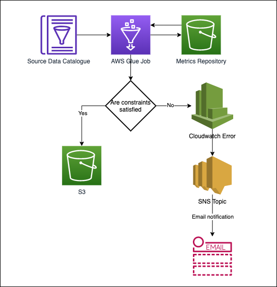

## Context

The Data Platform currently does not have a way to test the data quality of the outputs from Glue jobs

## Decision

Use a Python module; PyDeequ to calculate metrics on data, 
verify suggested data quality constraints as well as define custom constraints.
Once the data has been analysed, we would store the metrics in S3 in a
Metrics Repository.

Each time a Glue job runs, it would analyze the constraints 
and then compare this to the latest metrics from the metrics
repository in S3. If there are no results beyond our constraints
then the Glue job will proceed as normal and write the output to 
its target S3 location. Otherwise, the Glue job will fail, and the
failing constraint will be logged in the job's Cloudwatch error logs.
The error will be picked up by an SNS Topic which then sends an email
notification to a predetermined email.

## Considerations

Will need to have a formal review of acceptable constraints per dataset
consumed by a Glue job.
On the first run, metrics will be stored without analysing against constraints
to set a benchmark for future constraint analyses.

## Consequences

Users will have confidence that the data being consumed from a Glue job
is of high quality and that if there are any anomalies, then bad data is
fed down the chain to other Glue jobs and users will be notified via email.
