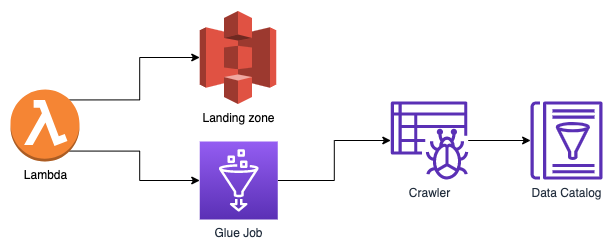

## Context

The Data Platform currently has no capacity to ingest data from external APIs

## Decision

Deploy a Lambda that will call the the required API and save the returned data
object into S3, once all the records have been downloaded the lambda will
trigger an AWS glue workflow that will convert JSON objects into parquet and
crawl the data enabling users to access that form a data catalogue in AWS Athena.

## Considerations

The first ingestion cycle would need to be run on a local machine as the first
data ingestion will take a lot longer than the maximum lambda execution time.
Subsequent ingestion workflows can be run daily to get records that were created
or updated after the last import.

## Consequences

Users will be able to run reports on data that was previously stored in external
APIs.
