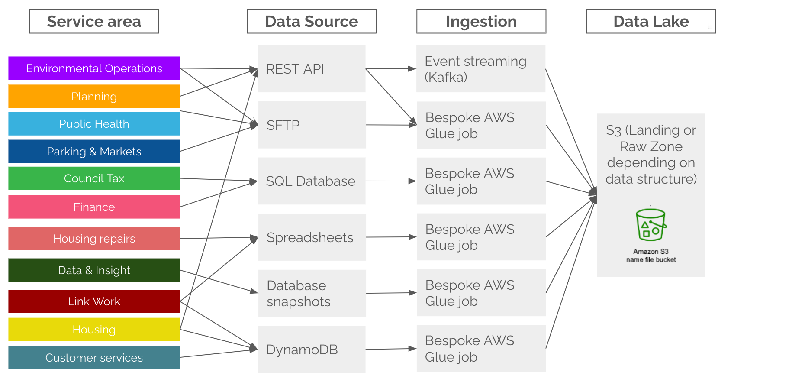

:::warning Archived

This page was archived in October 2026. It describes how the platform used to work and is kept as a record. Ingestion now runs through Airflow. See the [DAP⇨flow introduction](/dap-airflow/introduction).

:::

Due to the variety of data sources we have had to develop several different ingestion methods. These methods and the data being ingested are detailed in this section

