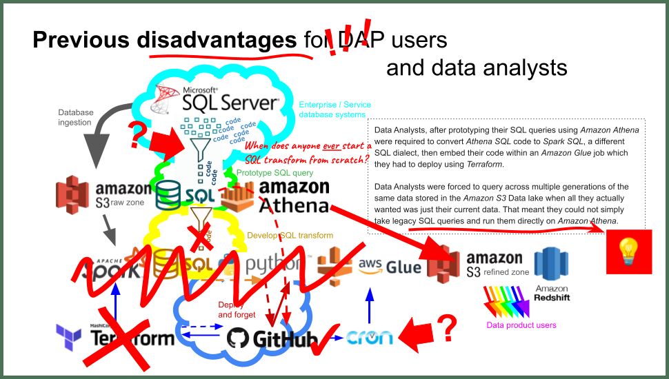

# 📚Introduction
  
## What is **DAP⇨flow**? 
**DAP⇨flow** is an integration of ***Apache Airflow*** with ***Amazon Athena*** built upon Hackney's ***Data Analytics Platform***. 

**DAP⇨flow** allows Data Analysts, in the simplest way possible, to develop and run data pipelines using their own service's data and create data products for their service and service users.

#### Building data pipelines used to be harder and more complex and time consuming. 

Data Analysts, after prototyping their SQL queries using ***Amazon Athena*** were required to convert *Athena SQL* code to *Spark SQL*, a different SQL dialect, then embed their code within an ***Amazon Glue ETL*** job which they had to deploy using ***Terraform***.  

Data Analysts were forced to query across multiple generations of the same data stored in the ***Amazon S3*** Data lake when all they actually wanted was just their current data. That meant they could not simply take legacy SQL queries and run them directly in ***Amazon Athena***.

- ##### PREVIOUSLY: Too hard + too complex = too time consuming...  

- ##### FIREBREAK: Deciding what we wanted to change...  

- ##### OUTCOME: DAP re-imagined using *Airflow* = **DAP⇨flow**...  

#### How **DAP⇨flow** solved our problems
* Firstly, Data Analysts no longer need to convert and re-test their prototype SQL transforms to run in the separate and more complex ***Amazon Glue ETL*** run-time environment. 

    Instead, ***Apache Airflow*** can use exactly the same ***Amazon Athena*** to transform data in production with the outputs going directly into data products. So that Data Analysts' prototype SQL transform queries, that they spent time on testing until they were working, can simply be reused instead of being discarded.  

    **That cuts development time by more than half while Data Analysts no longer need to context-switch between the two SQL dialects.**

* Secondly, Data Analysts no longer must adapt their legacy SQL queries to ***Amazon S3***'s Data Lake partitioning architecture. 

    Instead, ***Apache Airflow*** is configured to generate views of the underlying table data to present Data Analysts with current-only ingested service data, both in readiness for prototyping and testing, and for when the working transforms are subsequently deployed, being automated and run by Airflow.

    **That further cuts development time while Data Analysts can very easily take the legacy SQL code from their service database system and run it directly on *Amazon Athena* with few changes.**

    Data Analysts can also migrate their existing Athena SQL prototypes, previously adapted for the ***Amazon S3***'s Data Lake partitioning architecture, because the same table history is available to them, although the table names will now be suffixed "**_history**", which is more intuitive for new users.

* Lastly, Data Analysts no longer need to use ***Terraform*** for deploying their data pipeline jobs because ***Apache Airflow*** simply takes care of that as soon as they commit their transform queries to **DAP⇨flow**'s ***GitHub*** repository.

## 📚Onboarding

#### A series onboarding guides to help Data Analysts get started with **DAP⇨flow**

Anyone new to **DAP⇨flow** will start with [**📚Before you begin**](../dap-airflow/onboarding/begin) followed by [**📚Welcome!**](../dap-airflow/onboarding/welcome).

Thereafter, Data Analysts do not need to read every document in the order they are listed below, especially if they are already familiar with the ***AWS Management Console*** and have used ***Amazon Athena*** before.

Data Analysts are encouraged to think about what they need to do before deciding which document to read next. For example, if they have a ***legacy SQL query*** that they want to migrate to **DAP⇨flow**, they could jump straight to [**📚Prototype legacy transforms**](../dap-airflow/onboarding/prototype-legacy-transforms).

#### ***"We* ♡ *your feedback!"***
Your continuous feedback enables us to improve **DAP⇨flow** and our ***Data Analytics Platform*** service. Survey links are provided at the end of each onboarding document.

#### Below, is the full list of topics currently on offer...
More guides will be added when they are ready:

| **📚Onboarding** | **Guide** |
| --- | --- |
| [Before you begin](../dap-airflow/onboarding/begin)                                  | What must happen before I can begin **DAP⇨flow**?                                              |
| [Welcome!](../dap-airflow/onboarding/welcome)                                        | What are my **Service Terms`[]`**?                                                             |
| [AWS Console access](../dap-airflow/onboarding/access-the-AWS-Management-Console)    | How will I access the ***AWS Management Console***?                                            |
| [AWS region](../dap-airflow/onboarding/access-the-AWS-region)                        | How will I ensure I am in the correct **AWS region**?                                          |
| [Amazon Athena](../dap-airflow/onboarding/access-my-Amazon-Athena-database)          | How will I use ***Amazon Athena*** to access my database?                                      |
| [My current service data](../dap-airflow/onboarding/access-my-current-service-data)  | How will I access my `[service]`'s current data from ***Amazon Athena***?                      |
| [My service data history](../dap-airflow/onboarding/access-my-service-data-history)  | How will I access my `[service]`'s data history from ***Amazon Athena***?                      |
| [Query my service data](../dap-airflow/onboarding/query-my-service-data)             | How will I query and analyze my `[service]`'s data with ***Amazon Athena***?                   |
| [Prototype simple transforms](../dap-airflow/onboarding/prototype-simple-transforms) | How can I use ***Amazon Athena*** to prototype a simple table-join data transformation?        |
| [Prototype legacy transforms](../dap-airflow/onboarding/prototype-legacy-transforms) | How can I use ***Amazon Athena*** to prototype a legacy transformation?                        |
| [GitHub access](../dap-airflow/onboarding/github-access)                             | How do I set up my ***GitHub*** access for **DAP⇨flow**?                                       |
| [GitHub branching](../dap-airflow/onboarding/github-branch)                          | How do I create `[transform branch]` as my new working branch of **DAP⇨flow**'s repository?    |
| [Committing transforms](../dap-airflow/onboarding/github-commit-transform)           | How do I commit my working `[transform SQL]` to **DAP⇨flow**'s repository?                     |
| [GitHub pull requests](../dap-airflow/onboarding/github-pull-request)                | How do I raise a *"pull request"* to merge my `[transform branch]` into the `main` trunk of the **DAP⇨flow** repository? |

 [**Skip to the end**](#coming-soon) to discover what's coming next!

## 📚Migration onboarding

Users who had their SQL transforms migrated from ***Amazon Glue ETL*** to **DAP⇨flow**, now have their own series of onboarding guides. After migrating to **DAP⇨flow**, should start with [**📚Before you begin**](../dap-airflow/parking/begin) followed by [**📚Welcome!**](../dap-airflow/parking/welcome).

### ***Amazon Glue ETL***'s legacy...

We had the freedom to replace a large part of the code-base including the **Data Platform** data model in **DAP⇨flow**'s design. But that left us with the question of, how to migrate our ***Amazon Glue ETL*** users, who had already adapted their solutions around the old **Data Platform** table model. 

***Amazon Glue ETL*** users were used to incorporating generational subqueries in their SQL queries and as a result we had acquired a considerable legacy of transformations, which in turn, produced a considerable catalog of historical data, all bearing the original unsuffixed table naming convention. That, unfortunately clashed with **DAP⇨flow**'s preferred naming scheme for our new users. 

**DAP⇨flow**'s reason for changing our previous **Data Platform** table naming conventions was to allow users to quickly adapt the SQL brought across from their enterprise database systems. How could we adapt this for our ***Amazon Glue ETL*** users? 

For better or worse, we decided to leave those users' existing data and transformation logic intact and support the old **Data Platform** way that data was organized, including support for legacy queries in the presentation layer.

We did, however, find a reasonable compromise that would allow new transforms to be prototyped and deployed in a much simpler way. 

So, we continue to support around 80 legacy data transforms in this way and will continue to do so until the Enterprise Databases, that supply them with data, are eventually replaced or are otherwise decommissioned.

### 🚧Under construction

The guide contents below, represents the full list of topics currently on offer for users migrated to **DAP⇨flow** from ***Amazon Glue ETL***. 

These guides were released early, before the entire guide was finished, so that feedback could be incorporate directly into the next **Release #2:**
- **Release #1:** 🚧Under construction *= early feedback.*
- **Release #2:** 📚Migration onboarding *= guide complete.*
- **Release #3:** 📚Onboarding *retrofit = brought back up-to-date.*

More guides will be added when they are ready...

|  | **Guide** |
| --- | --- |
| [Before you begin](../dap-airflow/parking/begin)                                  | What must happen before I can begin **DAP⇨flow**?                                            |
| [Welcome!](../dap-airflow/parking/welcome)                                        | What are my **Service Terms`[]`**?                                                            |
| [AWS Console access](../dap-airflow/parking/access-the-AWS-Management-Console)    | How will I access the ***AWS Management Console***?                                           |
| [AWS region](../dap-airflow/parking/access-the-AWS-region)                        | How will I ensure I am in the correct **AWS region**?                                         |
| [Amazon Athena](../dap-airflow/parking/access-my-Amazon-Athena-database)          | How will I use ***Amazon Athena*** to access my database?                                     |
| [My service data history](../dap-airflow/parking/access-my-service-data-history)  | How will I access my `[service]`'s data history from ***Amazon Athena***?                     |
| [My current service data](../dap-airflow/parking/access-my-current-service-data)  | How will I access my `[service]`'s current data from ***Amazon Athena***?                     |
| [Query my service data](../dap-airflow/parking/query-my-service-data)             | How will I query and analyze my `[service]`'s data with ***Amazon Athena***?                  |
| [Prototype simple transforms](../dap-airflow/parking/prototype-simple-transforms) | How can I use ***Amazon Athena*** to prototype a simple table-join data transformation?       |
| [Migrating transforms](../parking/migrating-transforms)                           | How was my ***Amazon Glue*** *ETL job's Spark SQL query* migrated to **DAP⇨flow**?         🚧|
| [GitHub access](../dap-airflow/parking/github-access)                             | How do I set up my ***GitHub*** access for **DAP⇨flow**?                                     |
| [GitHub branching](../dap-airflow/parking/github-branch)                          | How do I create `[transform branch]` as my new working branch of **DAP⇨flow**'s repository?  |
| [Committing transforms](../dap-airflow/parking/github-commit-transform)           | How do I commit my working `[transform SQL]` to **DAP⇨flow**'s repository?                 🚧|
| [Orchestrating transforms](../dap-airflow/parking/github-orchestrate-transform)   | How do I orchestrate my `[transform].sql` in the **DAP⇨flow** repository?                  🚧|
| [GitHub pull requests](../dap-airflow/parking/github-pull-request)                | How do I raise a *"pull request"* to merge my `[transform branch]` into the `main` trunk of the **DAP⇨flow** repository? |

## 📚Coming soon...
The following guides are due for completion:

| **🚧** | **Guide** |
| --- | --- |
| **Merging branches** | How do i complete the merge of `[transform branch]` into the main trunk of **DAP⇨flow**'s repository? | 
| **Airflow** | How will I monitor my data transforms running in ***Airflow***? |
| **Adding tables to the raw-zone** | How do i add a new table ingestion to my `[service raw-zone]` database? |

## 📚Suggested for later...
The following guides are in our backlog:

| **🚧** |
| --- |
|Refined-zone views|
|External access to **DAP⇨flow** products|
|Removing transforms and products from the `[service refined-zone]` database|
|Removing tables from my `[service raw-zone]` database|

 

  

 

  

 

  

