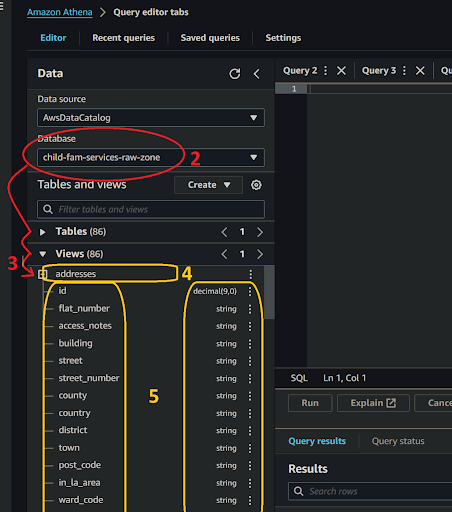
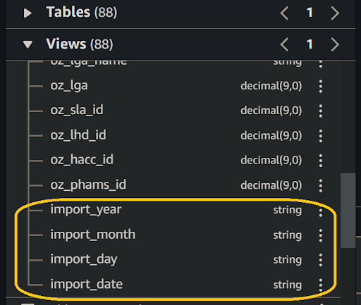

# Access my current service data from Amazon Athena

1. **Access Amazon Athena:**   
   In your web browser, log in to your AWS account, navigate to the AWS Management Console, and open Amazon Athena. 
   
   * Users new to Amazon Athena should start here ►  
   **[DAP⇨flow📚Amazon Athena](https://playbook.hackney.gov.uk/Data-Platform-Playbook/dap-airflow/onboarding/access-my-Amazon-Athena-database)** 

2. **Select your database:**   
   Ensure that you have selected `[my service raw zone]` from the list box under the "**Database**" section on the left side of the Athena interface.

3. **Explore the views in your database:**   
   Beneath the "**Database**" section on the left of the Athena interface and below the “**▼ Tables**” section (collapsed when clicking **▼**→“**► Tables**”), expand  the “**► Views**" section (clicking **►**→“**▼ Views**”) to find a list of views based on tables available from `[my service raw zone]` database.

   * In **DAP⇨flow**'s implementation, Athena was configured to present views of the underlying history tables to only show the current generation of data. So users can ignore the history in the S3 data lake and write much simpler transformations directly based on queries from the original `[my service raw zone]` database.

   * In this implementation, the names of the views should exactly represent the original table names in  `[my service raw zone]` database.

    

4. **Expand each view:**   
   Click on each view name to expand it and observe the complete list of columns for that view.

5. **Verify the views and columns:**   
   Compare the views and their columns with the equivalent tables from `[my service database]` to ensure they match, including the column names and their respective data types.

   * Occasionally the automatic data type translation will yield unexpected results. The critical need for manually checking these columns is to ensure there will never be any data lost. For example, if integer precision is lost.

   * Always be aware of date translation. Dates can be transmitted in specialized date formats, various numerical formats, or various textual formats. If we’re unlucky these might need some coded reconciliation afterwards to make them properly useful again.

6. **Observe the partition columns:**  
   Scroll to the bottom of the column list to find the partition scheme derived from the underlying history table. This will comprise four or more columns shown with the partition data type alongside eg. *string.* But unlike its table counterpart in the section above, the view will actually not show “***(Partitioned)***”.

      

   * Later on when we come to query these views we will observe data fetched from just a single most current **generation** of data, when we study the output from those partition columns, in particular, “**import\_date**”.  