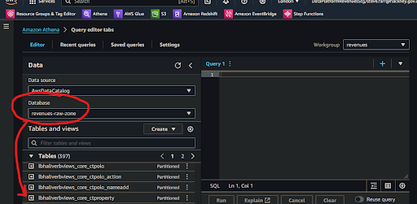
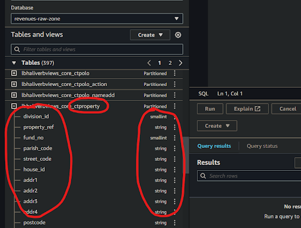
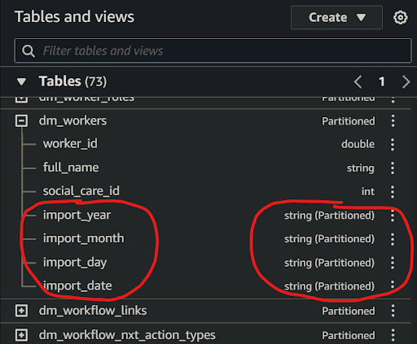

# How will I access my service data history from Amazon Athena?

### 1. Access Amazon Athena
**`🖱`** In your web browser, log in to your AWS account, navigate to the AWS Management Console, and open Amazon Athena. 
   
👉 First time Amazon Athena users should **start here ►** **[DAP⇨flow📚Amazon Athena](../onboarding/access-my-Amazon-Athena-database)** 

### 2. Selecting and understanding your database
**`🖱`** Ensure that you have selected `[my service raw zone]` from the list box under the "**Database**" section on the left side of the Athena interface.

**`Fig. 2 & 3`** 

* Athena’s databases are actually catalogs of the data stored in the AWS S3 storage buckets and folders, which we collectively call a **data lake.** From the top level, data lakes are divided by zone, then by service, then by service database. 

* The service database folders are represented by **databases** in Athena which which are labeled in the reverse “***service*\-*database*\-*zone” format***. The zone suffix labeling has the following meaning:  
   * “-**raw-zone**" for databases where data tables arrive after they are ingested from a service database and whose specification depends upon the source of that data.  
   * “-**refined-zone**" for databases where data goes whenever it is transformed and whose specification is implemented by data analysts and engineers when developing their data pipelines.  
   * “-**trusted-zone**" for databases containing the product tables whose specification is developed and agreed upon by data analysts and engineers in collaboration with their data users.

👉 For more information on how Amazon S3 organizes data, go ►[**here**](https://docs.aws.amazon.com/AmazonS3/latest/userguide/organizing-objects.html)

### 3. Explore the tables in your database
**`🖱`** Beneath the "**Database**" section on the left of the Athena interface, expand the "**► Tables**" section to find the list of tables available from `[my service raw zone]` database.

* This is how Athena presents tables from the S3 data lake. In S3’s folder structure, tables are represented by folders below the service database folder.

* In this implementation, the table names were all suffixed with “**\_history**” to remind us that each table contains several daily generations of data traveling back in time.  

### 4. Expand each table
**`🖱`** Click on each table name to expand it and observe the complete list of columns for that table.

**`Fig. 4 & 5`** 

### 5. Verify the views and columns
**`👁`** Compare each table and its columns with the equivalent table and columns from `[my service database]` to observe how their names and data types match up with their counterparts.

* Occasionally the automatic data type translation will yield unexpected results. Always check columns to ensure there will never be any data lost. For example, if integer precision is lost.

* Be specially aware of **date** translations. Dates are sometimes transmitted in specialized formats, possibly numerical or possibly textual. If we’re unlucky these might need some coded reconciliation afterwards to make them both readable and useful in computations, especially used in comparison, or when joined to date columns from tables elsewhere.

### 6. Observe the partition columns
**`🖱`** Scroll to the bottom of the column list to find the partition scheme. This will comprise four or more partition columns shown with the partition data type alongside eg. ***string (Partitioned).***

**`Fig. 6`** 

It helps to become familiar with the fundamental differences between a traditional database and a data lake that records the entire history of our data.

* Because tables are ingested or otherwise transformed daily (the most common frequency), each table folder, in the S3 data lake, must be subdivided by it's **generation**, so the underlying technology of the data platform can quickly access either current data, or specified previous data, needed for transformations. 

* Generations are organized hierarchically using S3 folders represented by the following partition column strings:   
   * ***Year*** eg. “**import\_year**” eg. ‘2024’ (the current year)  
   * ***Month*** eg. “**import\_month**” eg. ‘06’ (the current month eg. June)  
   * ***Day*** eg. “**import\_day**” eg. ‘05’ (5th day of the current month)  
   * ***Date*** eg. “**import\_date**” eg. “20240605” (5th June 2024\)  

   We might see alternatives to "**import\_**…" column prefixes such as “**transform\_**…” or “**generation\_**…”, or observe combinations of generation the prefixes, to indicate data imported and transformed at different times.

* We may observe other non-generational partition types, for example, we might want to subdivide the data after it is ingested in some other useful way, eg. by currency or historicity to facilitate data governance management and optimize our data pipelines even further. 

👉 So that Data Analysts are not overwhelmed by data partitioning, and can avoid using generational sub-queries in their transformations, a solution was developed which is **documented here ►** **[DAP⇨flow📚My current service data](../onboarding/access-my-current-service-data)** 

---
## ***"We* ♡ *your feedback!"***
  
:::tip UX  
👉 Please use **this link ►** [**DAP⇨flow** `UX` **Feedback / access-my-service-data-history**](https://docs.google.com/forms/d/e/1FAIpQLSdqeNyWIPMNBHEr-YSyxnXQ4ggTwJPkffMYgFaJ4hGEhIL6LA/viewform?usp=pp_url&entry.339550210=access-my-service-data-history)  
- Your feedback enables us to improve **DAP⇨flow** and our Data Analytics Platform service.  
- We encourage all our users to be generous with their time, in giving us their recollections and honest opinions about our service.  
- We especially encourage our new users to give feedback at the end of every **📚Onboarding** task because the quality of the onboarding experience really matters.  
☝ **Please use this link to help us understand your user experience!**  

:::

#### UX Criteria
:::info ABILITY  
* Hackney **AWS Management Console** user  
* `[my service]` Data Analyst
* `[my service database]` user

:::

:::note BEHAVIOR  
**Measures** the behavior of **Amazon Athena** while the user explores `[my service raw zone]` database tables and columns.  

**Given** I have selected `[my service raw zone]` database in the Amazon Athena interface  
**When** I explore the list below “**Tables**”  
**~and** expand each table name to list its columns  
**Then** I should find table names equivalent to tables from `[my service database]` with the suffix “**_history**” added  
**~and** find equivalent column names with their respective equivalent data types  
**~and** I should observe every table has partition columns added, eg. “import_date”.  

**Scale** of 3 **~and** flow features.  
:::
