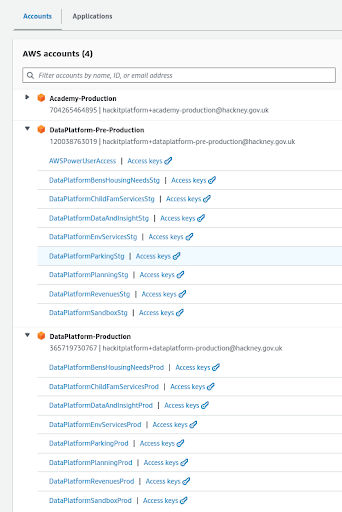
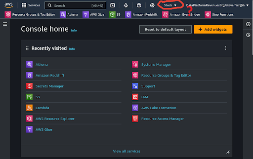

#  How will I access the ***AWS Management Console***?
  

## 1. Log into your **Hackney Council** Google Account
**`🖱`** Always start by logging into your **Hackney Council** Google account.

## 2. Open the AWS access portal
**`🖱`** In your web browser, navigate to the **[AWS access portal](https://d-936715b9ec.awsapps.com/start\#/)**.

## 3. Expand the AWS accounts
**`🖱`** If you were granted access to **Hackney Council's** ***AWS Management Console*** then you should be able to locate and fully expand the "**DataPlatform-Pre-Production**" section under “**AWS accounts**”.  

**`Fig. 3 & 4`** 

## 4. Locate Your service role
**`🖱`** Below "**DataPlatform-Pre-Production**", find your `[service role]` listed.  

:::info REMINDER
👉  Your **Service Terms`[]`** are defined in the ***welcome*** document stored in your [**`[service access group]`** ***Google Drive subfolder***](https://drive.google.com/drive/folders/1k30M7Hh8WLttL5T5JVGbnKvSLNX7lVSg?usp=drive_link).
:::

## 5. Access the ***AWS Management Console***
**`🖱`** Click on your `[service role]` to access the Data Platform AWS Management Console.  
* You may need to accept cookies and respond to service messages.  
* You may see errors caused by the AWS region not set correctly.  

**`Fig. 5`**   

👉 To fix the AWS region, **check here ►** **[DAP⇨flow📚AWS region](../onboarding/access-the-AWS-region)** 

  
   

---

## ***"We* ♡ *your feedback!"***
  
:::tip UX  
### 👉 Please use **this link ►** [**DAP⇨flow** `UX` **Feedback / access-the-AWS-Management-Console**](https://docs.google.com/forms/d/e/1FAIpQLSdqeNyWIPMNBHEr-YSyxnXQ4ggTwJPkffMYgFaJ4hGEhIL6LA/viewform?usp=pp_url&entry.339550210=access-the-AWS-Management-Console)  

- Your feedback enables us to improve **DAP⇨flow** and our Data Analytics Platform service.  
- We encourage all our users to be generous with their time, in giving us their recollections and honest opinions about our service.  
- We especially encourage our new users to give feedback at the end of every **📚Onboarding** task because the quality of the onboarding experience really matters.  

    ☝ **Please use this link to help us understand your user experience!**  
:::

## 📚`UX` Criteria
:::info ABILITY  
* Hackney **Google Workspace** user  
:::

:::note BEHAVIOR  
###  How will I access the ***AWS Management Console***?
**Measures** the ***AWS Management Console*** behavior:  

**Given** in my web browser, I am logged into my **Hackney Council Google account**  
**~and** I was granted access to the **Hackney Council's** ***AWS Management Console***  

**When** I open the [**AWS access portal**](https://d-936715b9ec.awsapps.com/start\#/)  
**~and** fully expand the **DataPlatform-Pre-Production** under **AWS Accounts**  

**Then** below **DataPlatform-Pre-Production**, I should see my `[service role]` listed  
**~and** clicking on it should give me access to the **AWS Management Console**.  

**Scale** of 2 to 3 **~and** flow features.  
:::
