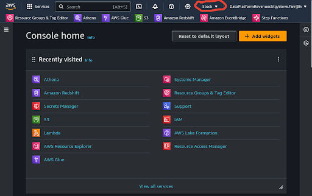
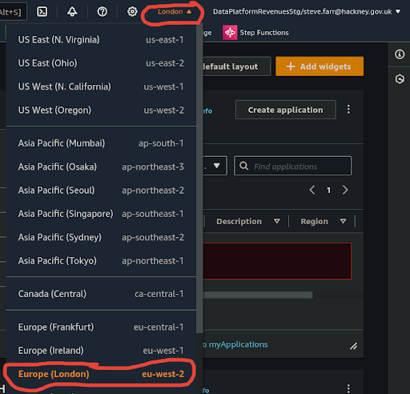

#  How will I ensure I am in the correct AWS region?

You will need to check the region you are in, usually the first time you access the AWS Management Console. Thereafter your web browser will remember the region you last used, so the good news is, you won't need to check this very often.

### 1. Access the AWS Management Console
**`🖱`** In your web browser, log in to your AWS account to access the AWS Management Console.  
   
👉 First time AWS Users should **start here ►** **[DAP⇨flow📚AWS Console access](../onboarding/access-the-AWS-Management-Console)** 

### 2. Locate the Region Selector
**`🖱`** At the top of the console, find the region selector "**▼**".

**`Fig. 2`** 

### 3. Select Your Region
**`🖱`** Click on the arrow to open the region menu. Then from the list, choose "**Europe (London) eu-west-2.**"

**`Fig. 3 & 4`** 

### 4. Verify the Selected Region
**`🖱`** After selecting, you should see "**London ▼**" displayed at the top of the console, confirming that you have successfully changed the region.
