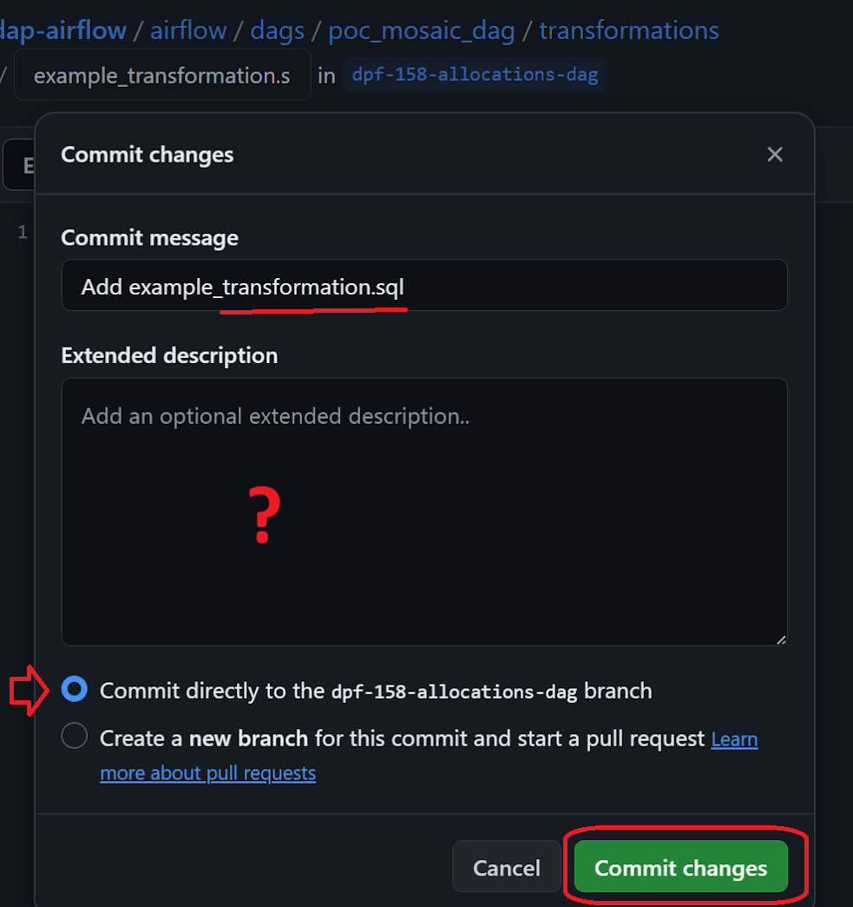

# How do I commit my working transform query to **DAP⇨flow**'s `[dap-airflow]` repository?
  

### 1. Access ***Amazon Athena*** and workgroup

**`🖱`** In your web browser, log in to your AWS account, navigate to the AWS Management Console, and open Amazon Athena. 

**`🖱`** Ensure you have selected your `[service workgroup]` from the list box next to “**Workgroup**”.  

### 2. Prepare and make ready your SQL query
**`🖱`** Ensure you have already created, tested and saved your `[transform SQL]` as a working, fully functional Athena SQL query. 

👉 If you want reminding how to do any of that, see **here** or **here ►**  
* **[DAP⇨flow📚Prototype simple transforms](../dap-airflow/onboarding/prototype-simple-transforms)**  
* **[DAP⇨flow📚Prototype legacy transforms](../dap-airflow/onboarding/prototype-legacy-transforms)**

**`🖱`**  Open your `[transform SQL]` in the ***Amazon Athena*** query editor and keep it open in a web browser tab.
 
### 3. Access the `dap-airflow` repository in ***GitHub***

**`🖱`** Use another tab in your web browser to log into your ***GitHub*** account using your ***Hackney email address*** with two-factor authentication.
 
👉 Users without a ***GitHub*** account or existing ***GitHub*** users without membership of the **[London Borough of Hackney](https://github.com/LBHackney-IT) organization,** should **start here ►** **[DAP⇨flow📚GitHub access](../onboarding/github-access)** 

**`🖱`** Open the **[`dap-airflow`](https://github.com/LBHackney-IT/dap-airflow)** repository in your web browser.

### 4. Open your `[service dags]/transformations` subfolder on a your `[transform branch]`

**`🖱`** Ensure you have created your ![][branch]`[transform branch]` and have it selected.  
**`Fig. 4`** 

👉  For how to create a branch, **see here ►** **[DAP⇨flow📚GitHub branching](../onboarding/github-branch)**  
    
**`🖱`** In the DAP Airflow repository, navigate to your `dap-airflow/airflow/dags/` **`[service dags]/transformations`** service sub-folder. You can use ***GitHub***’s left-hand navigation pane as follows:  
* Click on the **`airflow`** folder  
* Inside the `airflow` folder, click on the **`dags`** folder  
* Inside the `dags` folder, click on your **`[service dags]`** folder  
* Inside the  `[service dags]` folder, click on the **`transformations`** subfolder

**`Fig. 4b & 5a`** 

### 5. Create your new `[transform].sql` file in ***GitHub***

**`🖱`** At the top right region of the page, click the "**Add file**" button and select "**Create new file**"  

**`🖮`** In the box following the **`transformations/`** subfolder, enter your `[transform].sql`.  

**`Fig. 5b`** 

**`🖱`** Keep this ***Github*** code editor and it's web browser tab open for later on.

### 6. Copy your `[transform SQL]` code from ***Amazon Athena***
**`🖱`** Switch back to the ***Amazon Athena*** tab in your web browser, with your `[transform SQL]` still in the query editor.  
**`🖱`** Select the entire code of `[transform SQL]` open in the Athena query editor.  
**`Fig. 6`**   
**`🖱`** Use the right-click menu to "*Copy*" the selected code to your computer’s clipboard.  

### 7. Paste your `[transform SQL]` code into ***GitHub***
**`🖱`** Switch back to the ***GitHub*** tab in your web browser, with `[transform].sql` currently empty in the code editor.  
**`🖱`** In the editor window beneath where it says “**Edit**”, use the right-click menu to "*Paste*" the entire `[transform SQL]` code from your computer’s clipboard.  
**`Fig. 7 & 8`**   

### 8. Review and adjust your `[transform SQL]` code
**`🖱`** Scroll to the bottom of the editor window.  
**`👁 🖱`** Check for and remove any `limit` clause (e.g., `limit 100`), leaving just the final **`;`** semi-colon at the very end.  

### 9. Commit your `[transform].sql` file  
**`🖱`** Click the "**Commit changes**" button to open a dialogue box.  
**`Fig. 9`**   
**`🖮`** Enter a short commit message, Eg. `Add ... [transform].sql`.  
**`🖮`** Enter a longer description if wanted.  
**`🖱`** Select the option “**Commit directly to the `[transform branch]`**”.  
**`🖱`** Click the "**Commit changes**" button.  

### 10. Verify the Commit  
**`👁`**You should see a message confirming your `[transform].sql` was successfully committed directly to your `[transform branch]`.

  
   

---
## ***"We* ♡ *your feedback!"***
  
:::tip UX  
👉 Please use **this link ►** [**DAP⇨flow** `UX` **Feedback / github-commit-transform**](https://docs.google.com/forms/d/e/1FAIpQLSdqeNyWIPMNBHEr-YSyxnXQ4ggTwJPkffMYgFaJ4hGEhIL6LA/viewform?usp=pp_url&entry.339550210=github-commit-transform)  
- Your feedback enables us to improve **DAP⇨flow** and our Data Analytics Platform service.  
- We encourage all our users to be generous with their time, in giving us their recollections and honest opinions about our service.  
- We especially encourage our new users to give feedback at the end of every **📚Onboarding** task because the quality of the onboarding experience really matters.  
☝ **Please use this link to help us understand your user experience!**
:::

#### UX Criteria
:::info ABILITY  
* Hackney **Google Workspace** user 
* `[my service]` Data Analyst
* ***Amazon Athena*** user  
* ***GitHub*** user  
:::

:::note BEHAVIOR  
**Measures** the behavior of ***GitHub*** and ***Amazon Athena***.  

**Given** in my web browser, I have logged into my AWS account  
**~and** I accessed ***Amazon Athena***  
**~and** I have selected my `[service workgroup]`  
**~and** I have created and saved my `[transform SQL]` as a working fully functional Athena SQL query  
**~and** I have my `[transform SQL]` kept open in the Athena query editor in a web browser tab  
**~and** in another tab in my web browser, I am logged on to my ***GitHub*** account using my ***Hackney email address*** with two-factor authentication  
**~and** I am granted membership of the **[London Borough of Hackney](https://github.com/LBHackney-IT) organization** on ***GitHub*** incorporating the [`dap-airflow`](https://github.com/LBHackney-IT/dap-airflow) private repository  
**~and** I have accessed the [`dap-airflow`](https://github.com/LBHackney-IT/dap-airflow) repository  
**~and** I previously created my **`[transform branch]`**  

**When** I select my **`[transform branch]`** as my working branch  
**~and** I navigate to my `dap-airflow/airflow/dags/` **`[service dags]/transformations`** service subfolder  
**~and** at the top right region of the page, click the "**Add file**" button and select "**Create new file**"  
**~and** in the box following the **`transformations/`** subfolder, I enter my `[transform].sql`  
**~and** back in the ***Amazon Athena*** web browser tab, I select the entire code of my `[transform SQL]` in the Athena query editor before *copying* it into my computer’s clipboard   
**~and** back in the ***GitHub*** web browser tab, in the editor window, beneath where it says “**Edit**”, I *paste* the entire code of my  `[transform SQL]` from my computer’s clipboard   
 **~and** I scroll to the bottom of the editor window to check and remove any `limit` clause (eg. `limit 100`), leaving just the `;` semi-colon at the very end  
**~and** I click the "**Commit changes**" button to open up a dialogue box  
**~and** I enter a short commit message, Eg. `Add ... [transform].sql`   
**~and** I enter a longer description if I want to  
**~and** I select the option “**Commit directly to my `[transform branch]`**  
**~and** I click the "**Commit changes**" button  

**Then** I should see a message telling me, my `[transform].sql` was successfully committed directly to my `[transform branch]`.

**Scale** of 11 to 19 **~and** flow features.
:::

[branch]: <data:image/png;base64,iVBORw0KGgoAAAANSUhEUgAAAA8AAAAPCAYAAAA71pVKAAAAAXNSR0IArs4c6QAAAU9JREFUOE+tk79Pg1AQx99bHPwf+k8URxJ2VngdtaTGMEDC4iqv0s2FxA4tjUl1fbzJiXSiOiKhy+s/wayDCWfbCKG/UBNveMPdffK9u3eH0bcRQmTbtl+EEJemaT6U/nrccZxr3/fvGGOvaz9eP+Px2JrNZveyLA+FEFYQBBt/3brdLrRareFyubQAwOacDzdJk8nEjaKIappG4zimo9FoDzZNExRFoZxzumJoGIb9KknX9XOE0CMAuJzz211lTdNuMMZ9hNBFGIZPVdlloq7rgDE+Y4y9HehZAoBkpVgJbpX3LzAhRDDGtsSLonhXVfWz1+udlIE9ZQAIJEm6StO0gtvtNprP5zRJkuc8z6vAHmwYBppOp6d1WUII6nQ6H7tz+HXPu+Cfpt0I//TPR+HFYuF6nte4YUfhLMuswWDQuNuNZa+vqkwor+YQUPd9AUZ2tBDCa9wvAAAAAElFTkSuQmCC>
