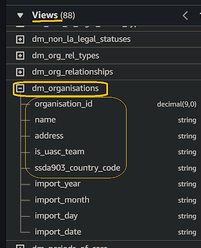
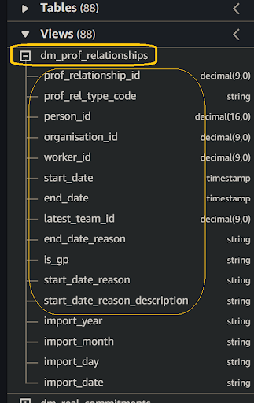
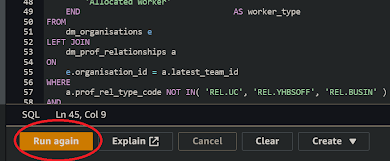
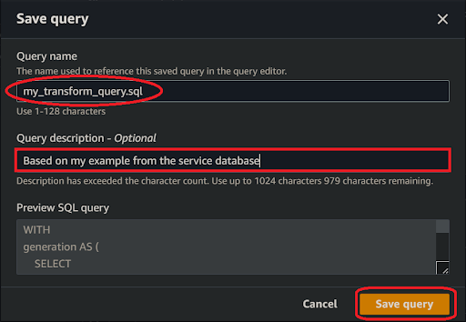

# How can I use Amazon Athena to prototype a data transformations from a `[legacy SQL query]`?
  

### 1. Access Amazon Athena
**`🖱`** In your web browser, log in to your AWS account, navigate to the AWS Management Console, and open Amazon Athena. 
   
👉 First time Amazon Athena users should **start here ►** **[DAP⇨flow📚Amazon Athena](../onboarding/access-my-Amazon-Athena-database)** 

### 2. Select your workgroup
**`🖱`** Ensure you have selected `[my service]` from the list box next to “Workgroup”.  
     
### 3. Select your database  
**`🖱`** Ensure you select `[my service raw zone]` from the list box under the "**Database**" section on the left side of the Athena interface.  

**`👁`** You should observe `[my service database]` equivalent tables and columns with their respective data types listed below "**▼ Views**".  

### 4.Prepare your SQL query
**`🖱`** Copy and paste your `[legacy SQL query]` lifted from  `[my service database]` into the query editor.  
     
You should take the opportunity to tidy up and format your code, making it easier to read, maintain, and spot errors.

👉 For an example, see [DPF-185 EXAMPLE 2.2 CFS Allocations query](https://docs.google.com/document/d/1EOBUOT6rZUk4tasub6Mqv\_ywHaXwQscTmFod9HQZQpU/edit?usp=sharing)  

### 5. Verify Table and Column Availability  
**`🖱`** Over on the left of the Athena interface, expand the list under “**Views**” to verify it includes your `[my service database]` equivalent tables and columns matching those in your `[legacy SQL query]`.  
**`Fig. 5a`**   
**`Fig. 5b`** 

### 6. Ensure your SQL query is compatible with Athena  
**`👁`** Review your SQL code to ensure all column functions and expressions are compatible with Athena, aiming to produce the same column output as the original. 

Often the easiest way to test your SQL code compatibility is simply to try running it (as per **Step 7**). It might succeed, or fail with errors that will inform you about what you need to change.

👉 If your original column functions need replacing with equivalent Athena functions then you can check the **Athena documentation ►[here](https://docs.aws.amazon.com/athena/latest/ug/functions.html)**.

**`🖱`** The first thing you will do when editing your SQL code, is make sure your tables names are fully qualified. 

- Table names should be prefixed by their correct database names, eg. `“[my service raw zone]”.“<table name>”`.  

- The original `[my service database]` database name, where used in your `[legacy SQL query]`, will be different here in **DAP⇨flow**, so you will need to swap it out with `[my service raw zone]`.   

### 7. Run your query  
**`🖱`** After customizing the SQL code, click “Run” located underneath the code window on the left side in the Athena interface.  
**`Fig. 7`** 

### 8. Review the results  
**`👁`** Athena here, should fetch the same results as your `[legacy SQL query]` would have when executed upon your original `[my service database]`. If you are able at his point, to make such a direct comparison with the legacy system then it will help you have confidence in the results of your prototype.  
**`Fig. 8`** 

### 9. Save your query 
Check you are in the correct `[my service]` workgroup before clicking on the three dots **⋮** to the right of your Query tab, then select “**Save as**”.  
**`Fig. 9a`**   

When the dialogue pops up, enter the name of your transform query eg. `[my transform].sql` and write a description before clicking the “**Save query**” button.  
**`Fig. 9b`** 

  
   

---
## ***"We* ♡ *your feedback!"***
  
:::tip UX  
👉 Please use **this link ►** [**DAP⇨flow** `UX` **Feedback / prototype-simple-transforms**](https://docs.google.com/forms/d/e/1FAIpQLSdqeNyWIPMNBHEr-YSyxnXQ4ggTwJPkffMYgFaJ4hGEhIL6LA/viewform?usp=pp_url&entry.339550210=prototype-simple-transforms)  
- Your feedback enables us to improve **DAP⇨flow** and our Data Analytics Platform service.  
- We encourage all our users to be generous with their time, in giving us their recollections and honest opinions about our service.  
- We especially encourage our new users to give feedback at the end of every **📚Onboarding** task because the quality of the onboarding experience really matters.  
☝ **Please use this link to help us understand your user experience!**
:::

#### UX Criteria
:::info ABILITY  
* Hackney **AWS Management Console** user  
* **Amazon Athena** beginner  
* `[my service]` Data Analyst
* `[my service database]` user
:::

:::note BEHAVIOR  
**Measures** the behavior of **Amazon Athena** showing `[my service raw zone]` when the user prototypes a simple transform.

**Given** in my web browser, I have accessed **Amazon Athena**  
**~and** I have selected `[my service]` workgroup  
**~and** Amazon Athena shows `[my service raw zone]` with `[my service database]` equivalent tables and columns  
**~and** I am familiar with the concepts and basic requirements of writing an Amazon Athena SQL query  
**~and** I have `[my example]` data transformation I want to create using two related tables from `[my service database]` that I want to join together to produce a combined output  
**~and** `[my example]` shows  a `<parent table>` containing a unique `<parent key>` which is a foreign key in a `<child table>` which also with its own unique `<child key>`  
**~and** Amazon Athena shows `[my service raw zone]` with `[my service database]` equivalent tables and columns when i expand the list under “View” which  includes the `<parent table>` and `<child table>`

**When** I copy-and-paste the SQL code from ***Fig. 5*** into the query editor  
**~and** replace the  `<parent table>` and  `<child table>` placeholders with corresponding table names from `[my example]`  
**~and** replace the  `<parent key>` and  `<child key>` placeholders with corresponding key column names from `[my example]`  
**~and** include `<col1>, <col2>,..<etc.>` for each table and column I want to fetch   
**~and** click “Run” underneath the code window on the left-hand side

**Then** Athena should fetch the first 100 rows of data   
**~and** the first column named original\_import\_date will show when the data was ingested from `[my service database]`  
**~and** the output data should be sorted in `<parent key>+<child key>` order  
**~and** I can save my SQL as a working and fully functional transform query with the name `[my transform].sql` and description in `[my service]` workgroup.

**Scale** of 7 to 13 **~and** flow features.  
:::
