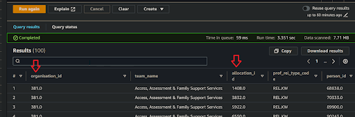

# How do I use ***Amazon Athena*** to prototype a data transformation from my `[legacy SQL query]`?
  

### 1. Access ***Amazon Athena***
**`🖱`** In your web browser, log in to your AWS account, navigate to the ***AWS Management Console***, and open ***Amazon Athena***. 
   
👉 First time ***Amazon Athena*** users should **start here ►** **[DAP⇨flow📚Amazon Athena](../onboarding/access-my-Amazon-Athena-database)** 

### 2. Select your `[service workgroup]`
**`🖱`** Ensure you have selected your `[service workgroup]` from the list box next to “**Workgroup**”.  
     
### 3. Select your `[service raw zone]` database  
**`🖱`** Ensure you select your `[service raw zone]` from the list box under the "**Database**" section on the left side of the Athena interface.  

**`👁`** You should observe your `[service database]` equivalent tables and columns with their respective data types listed below "**`▼` Views**".  

### 4.Prepare your `[transform SQL]` query
**`🖱`** *Copy-and-paste* your `[legacy SQL query]` lifted from your `[service database]` into ***Amazon Athena***'s query editor to become your new `[transform SQL]` code.  

You should take this opportunity to tidy up and format your SQL code, making it easier to read, maintain, and spot errors.  

👉 You'll find considerations for SQL development discussed **►[💡here](../onboarding/prototype-simple-transforms#considerations-when-adopting-amazon-athena-for-your-future-sql-development)**.

### 5. Verify table and column availability  
**`🖱`** Over on the left of the Athena interface, expand the list under “**`▼` Views**” to verify your `[service raw zone]` includes your `[service database]` equivalent tables and columns matching those in your `[transform SQL]`.

**`Fig. 5a`**   

**`Fig. 5b`**   

### 6. Ensure your `[transform SQL]` is compatible with ***Amazon Athena***  
**`👁`** Review your `[transform SQL]` code to ensure all column functions and expressions are compatible with ***Amazon Athena***, aiming to produce the same column output as the original `[legacy SQL query]`. 

Often the easy way to test your SQL code compatibility is to simply try running it (as per **Step 7**). It might succeed, or fail with errors that should inform you about what you need to change.

👉 If your original column functions need replacing with equivalent ***Amazon Athena*** functions then you can check the ***Amazon Athena* documentation ► [here](https://docs.aws.amazon.com/athena/latest/ug/functions.html)**.

**`🖱`** Ensure your table names from your `[transform SQL]` are fully qualified, as follows: 

- Table names should be prefixed by their correct database names, eg. `[service raw zone].<table name>`.  

- ***Amazon Athena***, by default, renders editor-inserted names encapsulated in `"` double-quotes, eg. `“[service raw zone]”.“<table name>”`.  You don't need to do this! But FYI, the quotes are a safeguard in case of column names containing spaces, even though we never allow that.

- Your original `[service database]` database name will not be used by **DAP⇨flow**, so you will need to swap it out with your `[service raw zone]`.
 
### 7. Run your `[transform SQL]` query
**`🖱`** After customizing the SQL code, click “**Run**” or “**Run again**” located underneath the code window on the left side in the ***Amazon Athena*** interface.  

**`Fig. 7`** 

### 8. Review the results  
**`👁`** ***Amazon Athena*** should fetch the same results as your `[legacy SQL query]` would have, when run by your original `[service database]`. If it is possible to make a direct comparison with the legacy system output then that should help you have confidence in the results of your prototype SQL.  

**`Fig. 8`** 

### 9. Save your query as `[transform].sql`
**`🖱`** Check you are in your correct `[service workgroup]` before clicking on the three dots **⋮** to the right of your Query tab, and clicking “**Save as**”.  

**`Fig. 9a`**   

**`🖮`** When the dialogue pops up, enter a name for your `[transform SQL]` eg. `[transform].sql` and write a description before clicking the “**Save query**” button.

**`Fig. 9b`** 

  
   

---
## ***"We* ♡ *your feedback!"***
  
:::tip UX  
👉 Please use **this link ►** [**DAP⇨flow** `UX` **Feedback / prototype-legacy-transforms**](https://docs.google.com/forms/d/e/1FAIpQLSdqeNyWIPMNBHEr-YSyxnXQ4ggTwJPkffMYgFaJ4hGEhIL6LA/viewform?usp=pp_url&entry.339550210=prototype-legacy-transforms)  
- Your feedback enables us to improve **DAP⇨flow** and our Data Analytics Platform service.  
- We encourage all our users to be generous with their time, in giving us their recollections and honest opinions about our service.  
- We especially encourage our new users to give feedback at the end of every **📚Onboarding** task because the quality of the onboarding experience really matters.  
☝ **Please use this link to help us understand your user experience!**
:::

#### UX Criteria
:::info ABILITY  
* **AWS Management Console** user  
* **Amazon Athena** beginner  
* Hackney `[service]` Data Analyst
* Hackney `[service database]` user
:::

:::note BEHAVIOR  
**Measures** the behavior of ***Amazon Athena*** while users convert there `[legacy SQL query]` into transforms:

**Given** in my web browser, I have accessed ***Amazon Athena***  
**~and** I have selected my `[service workgroup]`  
**~and** ***Amazon Athena*** shows my `[service raw zone]` with my `[service database]` equivalent tables and columns  
**~and** data was previously ingested from my `[service database]` into my `[service raw zone]`  
**~and** I have my `[legacy SQL query]` used by my `[service database]` that I now want to migrate to **DAP⇨flow**  

**When** I copy-and-paste my `[legacy SQL query]` into the query editor  
**~and** I ensure all the column functions and expressions are made input-and-output-compatible with ***Amazon Athena***  
**~and** I ensure the table names are fully qualified, being prefixed with my `[service raw zone]` instead of my `[service database]`  
**~and** I click “**Run**” underneath the code window on the left-hand side

**Then** ***Amazon Athena*** should fetch results as would my `[legacy SQL query]` have done when run by my `[service database]`    
**~and** I can save my new `[transform SQL]` with a name `[transform].sql` and a description in my `[service workgroup]`.  

**Scale** of 4 to 8 **~and** flow features.  
:::
