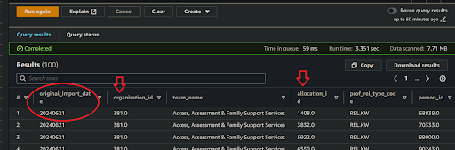

# How can I use Amazon Athena to prototype a simple table-join data transformation?
  

### 1. Access Amazon Athena
**`🖱`** In your web browser, log in to your AWS account, navigate to the AWS Management Console, and open Amazon Athena. 
   
👉 First time Amazon Athena users should **start here ►** **[DAP⇨flow📚Amazon Athena](../onboarding/access-my-Amazon-Athena-database)** 

### 2. Select your workgroup
**`🖱`** Ensure you have selected `[my service]` from the list box next to “Workgroup”.  
     
### 3. Explore your database
**`🖱`** Ensure you have selected `[my service raw zone]` from the list box under "**Database**" on the left side of the Athena interface, before expanding the lists of names under "**► Tables**" or "**► Views**". Expanding those names further should reveal column names with data types, as follows:

* "**▼ Tables**"  
👉 Documented here ► **[📚My service data history](../onboarding/access-my-service-data-history)** 

* "**▼ Views**"  
👉 Documented here ► **[📚My current service data](../onboarding/access-my-current-service-data)** 

### 4. Understand the data model
**`👁`** Identify which tables and columns you need to use for your data transformation.  

To be clear, where we want a `<table>` originally from `[my service database]` we will refer to it's equivalent name listed under "**▼ Views**" under the `[my service raw zone]`, in all that follows:

* You will need a `<parent table>` with a unique `<parent key>`.

* You will need a `<child table>` with a unique `<child key>` and a foreign key pointing to the `<parent key>` of the `<parent table>`.

### 5. Prepare your SQL query
**`🖱`** You can either:

* Start completely from scratch and building up your query in the editor as you go along;  

* Or, begin with `[my SQL template]`, eg. **`Fig. 5`**, by copying and pasting it into the query editor. 

**`Fig. 5 [my SQL template]`**
```sql
-- Query will use table names from [my service database]...
SELECT 
    p.import_date AS original_import_date, -- added to my query
    p.<parent key>, 
    p.<col1>,
    p.<col2>,
	.
	.
    p.<etc.>,
    c.<child key>, 
    c.<col1>,
    c.<col2>,
	.
	.
    c.<etc.>
FROM 
    <parent table> p
LEFT JOIN 
    <child table> c
ON 
    c.<parent key> = p.<parent key>
ORDER BY
    p.<parent key>,
    c.<child key>
limit 100;
```      

#### Considerations when using *Amazon Athena* for the first time

Migrating to a new technology or platform offers an ideal opportunity to raise standards and shed old coding habits of the past. But you are welcome to skip right to the next section and think about this later...

* You have complete freedom over the SQL code formatting however we recommend always putting each element, table or column, on its own line. This helps debugging and readability. You should endeavour to be consistent in your style and agree a particular style among your service colleagues. In our examples, we will use 4-space tabulation and use "hard left" nesting, which you are welcome to adopt. 

* Nesting has no syntactic significance to SQL interpreters. So a JOIN-clause joins everything previous, not just the previous table, with the table following, and nesting the JOIN-clauses makes no difference to the forward-order of execution. Execution order can only be affected by the use of bracketed sub-queries. The hard-left nesting style, on the other hand, is designed to help the reader be conscious of the execution order above all else.

* Avoid using lazy cartesian table products without JOIN-clauses in between the tables (or subqueries or CTEs). Likewise avoid using WHERE-clauses to perform cartesian filters and use JOIN-clauses instead. Conversely, Athena does not mind non-cartesian filters within JOIN-clauses and is even recommended where partition-columns are involved because it reduces the quantity of data scanned before any subsequent joins are executed.

* Always consider using CTEs in place of subqueries to help debugging and readability. ***Amazon Athena*** permits VALUES table constructors in CTEs allowing replacement of very lengthy WHERE-CASE filters with the more efficient JOIN-CTE filters.

### 6. Customizing a template query  
When, for example, using the **`Fig. 5`** template:  

**`🖱`** You will need to replace  `<parent table>` and  `<child table>` placeholders with actual names listed under “**▼ Views**” on the left-hand side of the interface. The Athena editor allows you to insert names directly into the text by simply clicking on the three dots **⋮**  to the right of the name, over on the left-hand side, then selecting “insert into editor”.

**`Fig. 6a`** 

**`🖱`** You will need to replace the  `<parent key>` and  `<child key>` placeholders with corresponding key column names from `[my example]`

**`Fig. 6b`** 

**`🖱`** Include all the columns you need. So replace `<col1>`, `<col2>`, etc. as per the example, with actual column names.

#### General considerations

👉 If your column expressions require functions, you can check the ***Amazon Athena* documentation ►[here](https://docs.aws.amazon.com/athena/latest/ug/functions.html)**.

**`🖱`** Edit your table names to ensure they are fully qualified, as follows: 

- Table names should be prefixed by their correct database names, eg. `[my service zone].<table name>`.  

- ***Amazon Athena***, by default, renders editor-inserted names encapsulated in `"` double-quotes, eg. `“[my service zone]”.“<table name>”`.  You don't need to do this! But FYI, the quotes are a safeguard in case of column names containing spaces, even though we never allow that.

- The original `[my service database]` database name will not be used by **DAP⇨flow**, so you will need to swap it out with `[my service raw zone]`.
   
- The use of fully-qualified table names means you can use tables from databases elsewhere in the Data Platform. For example, you might want to join your table from your raw-zone database with a table or view from a refined-zone elsewhere.   

- You must avoid using the following column names in your transform query output because they are reserved by the **DAP⇨flow** implementation when writing your transform output to the S3 data lake partition folders:   
    * `import_date`  
    * `import_year`  
    * `import_month`  
    * `import_day`  

    The **`Fig. 5`** template example shows the column `import_date` renamed as `original_import_date` to avoid that ever being a problem.  

    It isn't necessary to output this column in your query but it is good practice to add `original_import_date` to inform users of your transform products about which generation the data came from.  

    Because **DAP⇨flow**'s Airflow ingestion can trigger transforms immediately afterward, it natually follows that, the transform output dates will be equal to the import dates of the raw-zone views feeding those transforms. For that reason, you might not want to use `original_import_date` in your transform in production. But if the pipeline trigger logic might cause these dates to diverge in some future use case, then you should consider leaving it in.
 
* It is recommended to order the output by `<parent key>` then `<child key>`.

* Adding a `limit` clause at the end of your query when testing SQL queries in the Athena console normally prevents long-running queries when testing. You will routinely remove the `limit` clause later when your transform goes into production.

**`Fig. 7`** 

### 7. Run your query  
**`🖱`** After customizing the SQL code, click “Run” located underneath the code window on the left side in the Athena interface.

### 8. Review the results  
**`👁`** ***Amazon Athena*** should fetch however many rows your SQL `[limit]` clause is set to (eg. `limit 100;` in **`Fig. 5`**).  

* If you included it, the first column `original_import_data` will inform us when the underlying data was ingested from `[my service database]`. If you do not see today’s date then you’ll immediately know that the data ingestion had failed sometime after the date shown, and you should contact the DAP Team to find out what the problem is. But so long as you have data of any given generation you can still test your transform query.  

* The data will be sorted, eg.,  in the  `<parent key>` + `<child key>` order if that is what your `order by` clause says.  

* If your query is based on a `<parent table>` left-joined to the `<child table>` it is possible for the `<child key>` and its associated child columns to output NULLs in the place of values, alongside the `<parent key>` and parent column values. It is worth paying attention to ensure such behavior is the same way as when querying `[my service database]` previously.  

**`Fig. 8`** 

### 9. Save your query 
Check you are in the correct `[my service]` workgroup before clicking on the three dots **⋮** to the right of your Query tab, then select “**Save as**”. When the dialogue pops up, enter the name of your transform query eg. `[my transform].sql` and write a description before clicking the “**Save query**” button.

**`Fig. 9a`**   

**`Fig. 9b`** 

<br> 
</br>  

---
## ***"We* ♡ *your feedback!"***
  
:::tip UX  
👉 Please use **this link ►** [**DAP⇨flow** `UX` **Feedback / prototype-simple-transforms**](https://docs.google.com/forms/d/e/1FAIpQLSdqeNyWIPMNBHEr-YSyxnXQ4ggTwJPkffMYgFaJ4hGEhIL6LA/viewform?usp=pp_url&entry.339550210=prototype-simple-transforms)  
- Your feedback enables us to improve **DAP⇨flow** and our Data Analytics Platform service.  
- We encourage all our users to be generous with their time, in giving us their recollections and honest opinions about our service.  
- We especially encourage our new users to give feedback at the end of every **📚Onboarding** task because the quality of the onboarding experience really matters.  
☝ **Please use this link to help us understand your user experience!**
:::


#### UX Criteria
:::info ABILITY  
* Hackney **AWS Management Console** user  
* ***Amazon Athena*** beginner  
* `[my service]` Data Analyst
* `[my service database]` user
:::

:::note BEHAVIOR  
**Measures** the behavior of ***Amazon Athena*** showing `[my service raw zone]` when the user prototypes a simple transform.

**Given** in my web browser, I have accessed ***Amazon Athena***  
**~and** I have selected `[my service]` workgroup  
**~and** I have `[my example]` data transformation I want to implement using `[my SQL template]` involving two related tables from `[my service database]` that I want joined to produce a combined output  
**~and** `[my example]` has a `<parent table>` containing a unique `<parent key>` which is a foreign key in a `<child table>` which also with its own unique `<child key>`  
**~and** ***Amazon Athena*** shows `[my service raw zone]` with `[my service database]` equivalent tables and columns which includes the `<parent table>` and `<child table>`  
**~and** I am familiar with the concepts and basic requirements of writing an ***Amazon Athena*** SQL query  

**When** I copy-and-paste `[my SQL template]` into the query editor  
**~and** replace the  `<parent table>` and  `<child table>` placeholders with corresponding table names from `[my example]`  
**~and** replace the  `<parent key>` and  `<child key>` placeholders with corresponding key column names from `[my example]`  
**~and** include `<col1>, <col2>,..<etc.>` for each table and column I want to fetch   
**~and** click “Run” underneath the code window on the left-hand side

**Then** ***Amazon Athena*** should fetch the first `<limit>` rows of data   
**~and** the first column named `original_import_date` will show when the data was ingested from `[my service database]`  
**~and** the output data should be sorted in `<parent key>`+`<child key>` order  
**~and** I can save my SQL as a working and fully functional transform query with the name `[my transform].sql` and description in `[my service]` workgroup.

**Scale** of 7 to 12 **~and** flow features.  
:::
