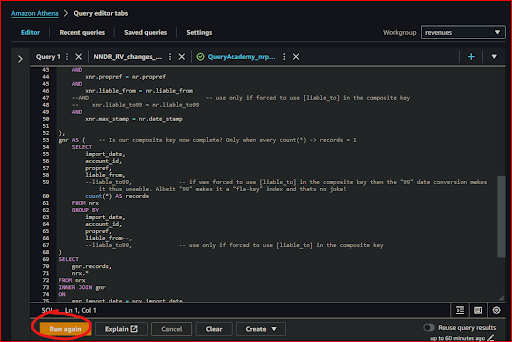
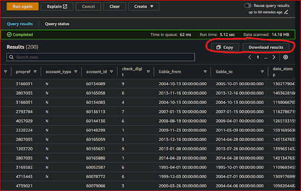

# How will I query and analyze my service data with Amazon Athena?
  

### 1. Access Amazon Athena
**`🖱`** In your web browser, log in to your AWS account, navigate to the AWS Management Console, and open Amazon Athena. 
   
👉 First time Amazon Athena users should **start here ►** **[DAP⇨flow📚Amazon Athena](../onboarding/access-my-Amazon-Athena-database)** 

### 2. Select your workgroup
**`🖱`** Ensure you have selected `[my service]` from the list box next to “Workgroup”.  
     
### 3. Explore your database
**`🖱`** Ensure you have selected `[my service raw zone]` from the list box under "**Database**" on the left side of the Athena interface, before expanding the lists under "**► Tables**" and/or "**► Views**. Expandanding further should reveal column names and data types, as follows:

   - "**▼ Tables**"  
   👉 Documented here ► **[📚My service data history](../onboarding/access-my-service-data-history)** 

   - "**▼ Views**"  
   👉 Documented here ► **[📚My current service data](../onboarding/access-my-current-service-data)** 

### 4. Familiarize yourself with SQL queries
**`🕮`** You will need to understand the concepts and basic requirements of writing SQL queries. This includes knowing how to select columns, filter data, join tables, etc.  

   👉 You can learn more about using Amazon Athena **►** [**here**](https://docs.aws.amazon.com/athena/latest/ug/using-athena-sql.html)

### 5. Run SQL queries
**`🖱`** Use the SQL query editor in Amazon Athena to write and run queries involving tables and columns equivalent to the original `[my service database]`.

**`Fig. 5`** 

### 6. Analyze your data   
**`👁`** Review the results of your queries to find answers to your questions about `[my service]` data.

**`Fig. 6`** 

**`🖱`** You can copy results to the clipboard.  

**`🖱`**  You can download the results into a CSV file.  
  
   

---
## ***"We* ♡ *your feedback!"***
  
:::tip UX  
👉 Please use **this link ►** [**DAP⇨flow** `UX` **Feedback / query-my-service-data**](https://docs.google.com/forms/d/e/1FAIpQLSfCAYaKcZDJPzdhVZGno2R7Xzb36UzYU1FdC0W0YcOLXlLGag/viewform?usp=pp_url&entry.339550210=query-my-service-data)  
- Your feedback enables us to improve **DAP⇨flow** and our Data Analytics Platform service.  
- We encourage all our users to be generous with their time, in giving us their recollections and honest opinions about our service.  
- We especially encourage our new users to give feedback at the end of every **📚Onboarding** task because the quality of the onboarding experience really matters.  
☝ **Please use this link to help us understand your user experience!**
:::

#### UX Criteria
:::info ABILITY  
* Hackney **AWS Management Console** user  
* **Amazon Athena** user  
* `[my service]` Data Analyst
* `[my service database]` user
:::

:::note BEHAVIOR  
**Measures** the behavior of **Amazon Athena** showing `[my service raw zone]` when working SQL queries are run.

**Given** in my web browser, I have accessed **Amazon Athena**  
**~and** I have selected `[my service]` workgroup  
**~and** Amazon Athena shows `[my service raw zone]` with `[my service database]` equivalent tables and columns  
**~and** I am familiar with the concepts and basic requirements of writing an Amazon Athena SQL query  
**When** I run my SQL query containing given those tables and columns  
**Then** I should be able to find answers to my questions about `[my service]` data  
**~and** I can copy results to the clipboard  
**~and** I can download the results into a CSV file

**Scale** of 2 to 5 **~and** flow features.  
:::
