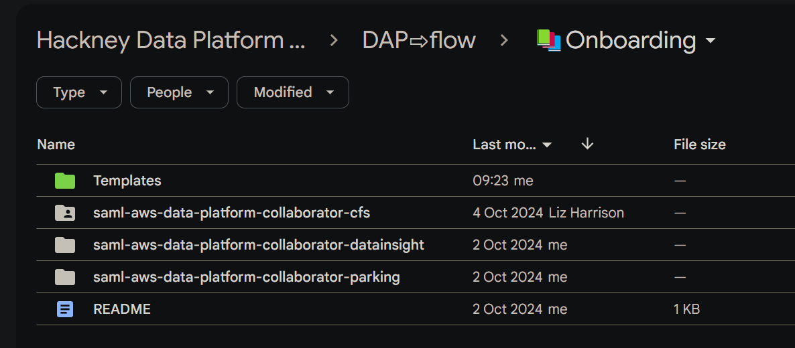

# Welcome to DAP⇨flow!
  

## 1. Have you been added to your [`[service access group]` *Google Group*](https://groups.google.com/all-groups?q=saml-aws-data-platform-collaborator)? 
Check here if you are not certain about that:

👉  [**DAP⇨flow📚Begin here**](../onboarding/begin)  

If you're certain you've been added and you know your `[service access group]` name then please proceed.

## 2. Open your `[service access group]`([*Google Drive folder*](https://drive.google.com/drive/folders/1k30M7Hh8WLttL5T5JVGbnKvSLNX7lVSg?usp=drive_link))

👉  Open the [**DAP⇨flow📚Onboarding** *Google Drive folder*](https://drive.google.com/drive/folders/1k30M7Hh8WLttL5T5JVGbnKvSLNX7lVSg?usp=drive_link) in your web browser.  
👉  Next, open the subfolder bearing the name of your `[service access group]`.  
👉  In there, you will find a document called "***welcome***". Please open it!  

**`Fig. 2`** 

The following **REMINDER** box appears throughout the [**DAP⇨flow📚Onboarding**](../introduction#📚Onboarding) documentation to remind you where to find the ***welcome*** document in case you want to be reminded of your `[service]` terms:
:::info REMINDER
👉  Your **Service Terms`[]`** are defined in the ***welcome*** document stored in your [**`[service access group]`** ***Google Drive subfolder***](https://drive.google.com/drive/folders/1k30M7Hh8WLttL5T5JVGbnKvSLNX7lVSg?usp=drive_link).
:::

## 3. Review your **Service Terms`[]`**
Your Service's "***welcome***" document provides you with the necessary translations for the **Service Terms`[]`** used throughout the [**DAP⇨flow📚Onboarding**](../introduction#📚Onboarding) documentation, ensuring you are directed to the appropriate places while using the **Hackney Council AWS Console** or the **LBHackney-IT/dap-airflow** *GitHub repository*.

The **Service Terms`[]`** defined include:  
- `[service]`  
- `[service access group]`  
- `[service workgroup]`  
- `[service role]`  
- `[service raw zone]`  
- `[service refined zone]`  
- `[service trusted zone]`  
- `[service database]`  
- `[service dags]`  

  
   

---
## ***"We* ♡ *your feedback!"***
  
:::tip UX  
### 👉 Please use **this link ►** [**DAP⇨flow** `UX` **Feedback / welcome**](https://docs.google.com/forms/d/e/1FAIpQLSdqeNyWIPMNBHEr-YSyxnXQ4ggTwJPkffMYgFaJ4hGEhIL6LA/viewform?usp=pp_url&entry.339550210=welcome)  

- Your feedback enables us to improve **DAP⇨flow** and our Data Analytics Platform service.  
- We encourage all our users to be generous with their time, in giving us their recollections and honest opinions about our service.  
- We especially encourage our new users to give feedback at the end of every **📚Onboarding** task because the quality of the onboarding experience really matters.  

    ☝ **Please use this link to help us understand your user experience!**
:::

## 📚`UX` Criteria
:::info ABILITY  
* Hackney **Google Workspace** user 
* Hackney `[service]` Data Analyst
:::

:::note BEHAVIOR  
### Welcome to DAP⇨flow!
**Measures** the **DAP⇨flow📚Onboarding** documentation behavior:  

**Given** my name was added to the my [`[service access group]`](https://groups.google.com/all-groups?q=saml-aws-data-platform-collaborator)  

**When** I open the [**DAP⇨flow📚Onboarding** *Google Drive folder*](https://drive.google.com/drive/folders/1k30M7Hh8WLttL5T5JVGbnKvSLNX7lVSg?usp=drive_link) in my web browser  
**~and** open the subfolder bearing the name of my `[service access group]`  
**~and** there, open the document called "***welcome***"   

**Then** that "***welcome***" document will define the **Service Terms`[]`** I need while using the [**DAP⇨flow📚Onboarding**](../introduction#📚Onboarding) documentation, ensuring I am directed to all the right places when using the **Hackney Council AWS Console** and the **LBHackney-IT/dap-airflow** *GitHub repository*.  
**~and** those definitions will include:  
- `[service]`  
- `[service access group]`  
- `[service workgroup]`  
- `[service role]`  
- `[service raw zone]`  
- `[service refined zone]`  
- `[service trusted zone]`  
- `[service database]`  
- `[service dags]`  

**Scale** of 3 **~and** flow features.
:::
