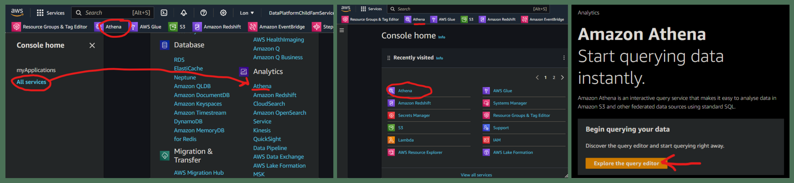
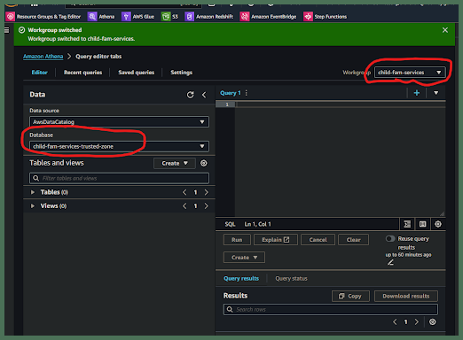

# How will I use ***Amazon Athena*** to access my database?
   

## 1. Access the ***AWS Management Console***
**`🖱`** In your web browser, log in to your AWS account to access the ***AWS Management Console***.  
   
👉 First time AWS Users should **start here ►** **[📚AWS Console access](../parking/access-the-AWS-Management-Console)** 

## 2. Familiarize yourself with the console
**`👁`** Take a moment to get comfortable with the layout and check out options available in the ***AWS Management Console*** interface.

**`Fig. 2 & 3`** 

## 3. Open ***Amazon Athena***
**`🖱`** Locate and open ***Amazon Athena*** from the services menu.

## 4. Select your `[service workgroup]`
**`👁`** Look to the top right corner of the ***Amazon Athena*** interface, next to "**Workgroup**".  

**`🖱`** From the list-box there, click on **`▼`** to select your `[service workgroup]`.

**`Fig. 4 & 5`** 

:::info REMINDER
👉  Your **Service Terms`[]`** are defined in your **`welcome`** document stored in your `[service access group]`'s **► ** [***Google Drive subfolder***](https://drive.google.com/drive/folders/1soY6hORmPVlRvlW_t1V1hTFXfZbLt6NS?usp=drive_link). 
:::

## 5. Select your database
**`👁`** On the left side of the ***Amazon Athena*** interface, below the "**Database**" section, find the list-box and check you can see one of your `[service zones]`.  

**`🖱`** If you don't see it there, then simply click on **`▼`** to find and select any one of your `[service zones]` from the list-box.

---
## ***"We* ♡ *your feedback!"***
   
:::tip UX  
### 👉 Please use **this link ►** [**DAP⇨flow** `UX` **Feedback / access-my-Amazon-Athena-database**](https://docs.google.com/forms/d/e/1FAIpQLSc7nv1XmfRJKZlZTYIJQxAwbimUfsZLXQOVt3TJO-zUOjcRGQ/viewform?usp=pp_url&entry.339550210=access-my-Amazon-Athena-database)  

- Your feedback enables us to improve **DAP⇨flow** and our Data Analytics Platform service.  
- We encourage all our users to be generous with their time, in giving us their recollections and honest opinions about our service.  
- We especially encourage our new users to give feedback at the end of every **DAP⇨flow📚Migration onboarding** task because the quality of the onboarding experience really matters.  

    ☝ **Please use this link to help us understand your user experience!**  

:::

## 📚`UX` Criteria
:::info ABILITY  
* **AWS Management Console** user  
* Hackney `[service]` Data Analyst

:::

:::note BEHAVIOR  
### How will I use ***Amazon Athena*** to access my database?
**Measures** the behavior of **Amazon Athena** when first run and configured by the user:

**Given** in my web browser, I have access to the ***AWS Management Console***  
**~and** I have familiarized myself with the console interface  

**When** I open ***Amazon Athena*** via the console menu system, by clicking on “**Athena**” whereever it appears  
**~and** I click through any splash screen that might appear, eg. “**Explore the Query Editor**” 

**Then** I will be presented with the **Amazon Athena** interface  
**~and** up at the right next to “**Workgroup**”, I should be offered my `[service workgroup]` from the list-box  
**~and** over on the left under “**Database**” I should be offered my `[service zones]` from the list-box.  

**Scale** of 3 to 4 **~and** flow features.  
:::
