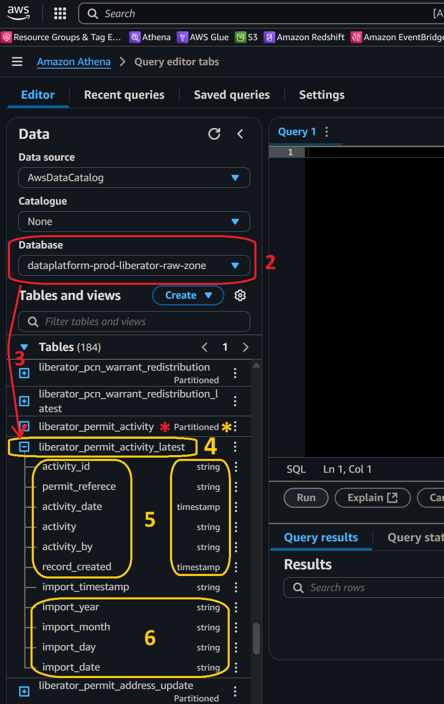

# How will I access just my `[service]`'s current data from ***Amazon Athena***?
  

## 1. Access ***Amazon Athena***
**`🖱`** In your web browser, log in to your AWS account, navigate to the ***AWS Management Console***, and open ***Amazon Athena***. 
   
👉 First time ***Amazon Athena*** users should **start here ►** **[📚Amazon Athena](../parking/access-my-Amazon-Athena-database)** 

## 2. Select your database
**`🖱`** Select the `[service zones]` database, *prefixed `-raw-zone`*, that is equivalent to your `[service database]`, from the list-box under "**Database**" on the left side of the Athena interface.  

:::info REMINDER
👉  Your **Service Terms`[]`** are defined in your **`welcome`** document stored in your `[service access group]`'s **►** [***Google Drive subfolder***](https://drive.google.com/drive/folders/1soY6hORmPVlRvlW_t1V1hTFXfZbLt6NS?usp=drive_link). 
:::

## 3. Explore the tables in your database
**`🖱`** Beneath the "**Database**" section on the left of the Athena interface, expand the "**`►` Tables**" section (clicking **`►`**→“**`▼` Tables**”) to find a list of tables based on the table names from your `[service zones]` database.

* **DAP⇨flow**'s Athena database migration allows users to simply use *current-generation* data, by implementing tables suffixed with `_latest`. Using these tables, Data Analysts can ignore the *generational history* in the *S3 data lake* and instead write much simpler transformations or more easily adapt the queries from their legacy `[service database]` systems.  

* Their adjacent table counterparts without the suffixes, on the other hand, contain the full *generational history* of those tables, as far back as the *S3 data lake* retention schedule will allow.  

   👉 Find the explanation of the *generational-history* tables **here ►** **[📚My service data history](../parking/access-my-service-data-history)** 

**`Fig. 2, 3, 4, 5 & 6`** 

## 4. Expand each `_latest` table
**`🖱`** Navigating beneath "**`▼` Tables**", click "`🞧`" adjacent each table name with the suffix `_latest` to expand it and observe it's associated columns and data types.

## 5. Verify the `_latest` tables and columns
**`👁`** Compare each table and its columns with the equivalent table and columns from your `[service database]` and observe how their names and data types match up with their original counterparts.

* Occasionally the automatic data type translation will yield unexpected results. Always check columns to ensure no potential loss of data. For example, if integer precision is lost.

* Be especially aware of *Date* translations. *Dates* are sometimes transmitted in specialized formats, possibly numerical or possibly textual. If we’re unlucky these might require decoding to be made readable and useful in computations, especially when used in comparisons or to join other tables.

## 6. Observe the partition columns
**`🖱`** Scroll down to the bottom of the column list to find columns which did not come from your original `[service database]` but came from the *partition subfolder* scheme derived from the underlying *generational history* table. The partition scheme comprises four columns shown with the partition data type alongside eg. **`string`**. But unlike their adjacent *generational history" counterparts, `_latest` tables do not also show **`(Partitioned)`**.

* Later, when we come to query these `_latest` tables we will observe data is only fetched from the most *current generation* of data, when the `import_date` is selected.

👉 A simpler solution for writing new Athena SQL transforms was developed using this `_latest` table feature which is **described here ►** **[📚Prototype simple transforms](../parking/prototype-simple-transforms)**  

👉 Why didn't we implement simpler ***current views***? Users migrating to **DAP⇨flow** with their pre-existing *S3 data lakes* also used external reporting of the `_latest` tables via **Amazon Redshift**. Redshift does not support Athena's Views so it was decided to continue supporting `_latest` objects as *tables*. Where **DAP⇨flow** continues to be rolled out for other **Service Areas** with no previous **Data Platform** experience, we shall however, use the simpler Database design **described here ►** **[Onboarding📚My current service data](../parking/access-my-current-service-data)**  

---
## ***"We* ♡ *your feedback!"***
  
:::tip UX  
### 👉 Please use **this link ►** [**DAP⇨flow** `UX` **Feedback / access-my-current-service-data**](https://docs.google.com/forms/d/e/1FAIpQLSc7nv1XmfRJKZlZTYIJQxAwbimUfsZLXQOVt3TJO-zUOjcRGQ/viewform?usp=pp_url&entry.339550210=access-my-current-service-data)  

- Your feedback enables us to improve **DAP⇨flow** and our Data Analytics Platform service.  
- We encourage all our users to be generous with their time, in giving us their recollections and honest opinions about our service.  
- We especially encourage our new users to give feedback at the end of every **DAP⇨flow📚Migration onboarding** task because the quality of the onboarding experience really matters.  

   ☝ **Please use this link to help us understand your user experience!**  

:::

## 📚`UX` Criteria
:::info ABILITY  
* ***AWS Management Console*** user  
* Hackney `[service]` Data Analyst
* Hackney `[service database]` user

:::

:::note BEHAVIOR  
### How will I access my `[service]`'s current data from ***Amazon Athena***?
**Measures** the behavior of **Amazon Athena** as users explore their `[service zones]` database tables and columns:  

**Given** I have selected the `[service zones]` database *suffixed `-raw-zone`*, equivalent to my `[service database]`, in the ***Amazon Athena*** interface  

**When** I explore the list below “**Tables**”  
**~and** expand each table name to list its columns  

**Then** I should find table names exactly equivalent to tables from my `[service database]` also with the suffix `_latest`  
***~and** I should observe every table has these columns added at the very end:
   * `import_date`  
   * `import_year`  
   * `import_month`  
   * `import_day`  

**Scale** of 3 **~and** flow features.  
:::
