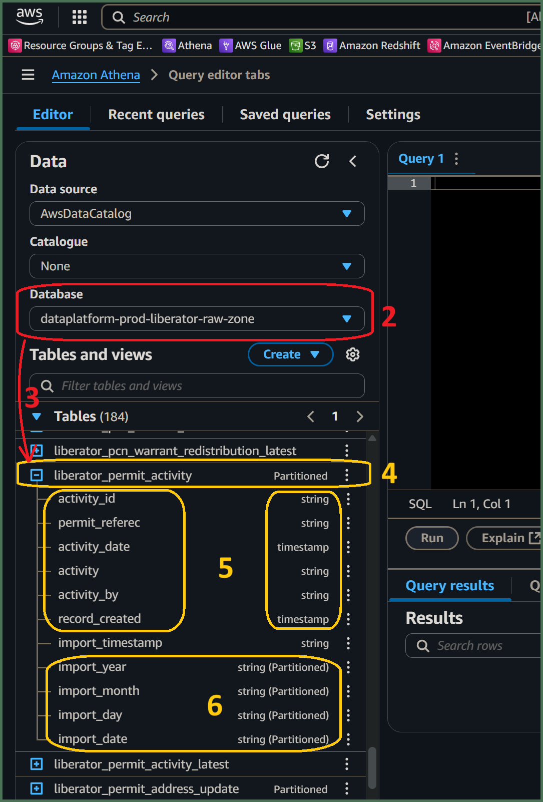

# How will I access my `[service]`'s data history from ***Amazon Athena***?
  

## 1. Access ***Amazon Athena***
**`🖱`** In your web browser, log in to your AWS account, navigate to the ***AWS Management Console***, and open ***Amazon Athena***. 
   
👉 First time ***Amazon Athena*** users should **start here ►** **[📚Amazon Athena](../parking/access-my-Amazon-Athena-database)** 

## 2. Understanding your Database `[service zones]`

:::info REMINDER
👉  Your **Service Terms`[]`** are defined in your **`welcome`** document stored in your `[service access group]`'s **►** [***Google Drive subfolder***](https://drive.google.com/drive/folders/1soY6hORmPVlRvlW_t1V1hTFXfZbLt6NS?usp=drive_link). 
:::

💡 ***Athena’s*** *databases are catalogs* pointing to physical data contained in ***AWS S3*** *storage buckets* and *folders*, collectively known as an ***S3 data lake***. Each *storage bucket* is divided up hierarchically from top to bottom, approximating to `/zone`, `/service` then `/service database`, with possible further levels in between. Below all that, are finally formed the `/table` folders where data is produced.  

***Tables*** in *S3* are physically constructed from several identically specified and formatted *Parquet data files*, each slotted into a `/yyyy/mm/dd/yyyymmdd` *partition subfolder structure*, forming the *generational history* for all data added to *tables*.  

(Additional `/partition` subfolder levels are allowed in between the `/table` and the *generational history*, but we are not going to worry about that here!)

💡 ***Athena’s*** *database catalogs* shall here be known as **Database `[service zones]`** which are named in the reverse *`"service-database-zone"`* format. The *`-zone`* *suffixes* of your `[service zones]` are expanded as follows:-  

* ***`-raw-zone`*** databases may contain, either...
   - *tables* repeatedly ingested from your `[service database]`. *Table* specifications depend upon the data maintained at the `[service database]` source.  
   - *tables* ingested from a variety of other sources such as CSV files, spreadsheets or Google sheets. *Table* specifications may change often or may remain fixed over a longer period.

* ***`-refined-zone`*** databases contain *tables* produced by data transformations in **DAP⇨flow**, or by **Glue ETL** in the past. *Table* specifications are implemented by Data Analysts and Data Engineers while developing their data transformations.  

* ***`-trusted-zone`*** databases contain the *product tables*. *Product table* specifications are declared by Service Data Analysts and Data Engineers working in collaboration with Service Data Users.

👉 For more information on how Amazon S3 organizes data, see ►[**here**](https://docs.aws.amazon.com/AmazonS3/latest/userguide/organizing-objects.html)

**`🖱`** Select the `[service zones]` with a `-raw-zone` *suffix*, associated with your `[service database]`, from the list-box under "**Database**" on the left side of the Athena interface.  

## 3. Explore the tables in your database

**`🖱`** Beneath the "**Database**" section on the left of the Athena interface, expand the "**`►` Tables**" section to find the list of tables available from your selected `[service zones]` database.

* This is how Athena presents tables from the *S3 data lake*. In S3’s folder structure, tables are represented by folders below the service database folder.

* When the *S3 data lake* was migrated to **DAP⇨flow**, the names of the daily-generated history tables were left completely unchanged. This was done to allow a phased transition from the old **Data Platform** *Glue ETL* jobs to the new **DAP⇨flow** transforms.

**`👁`** Also found under each *generational-history* table listed under "**`▼` Tables**", you will observe a same-named table created with the *suffix* `_latest`. Please ignore those as we focus upon the *generational-history* here.

👉 Find the explanation of the `_latest` tables **here ►** **[📚My current service data](../parking/access-my-current-service-data)** 

**`Fig. 2, 3, 4, 5 & 6`** 

## 4. Expanding each *generational-history* table
**`🖱`** Click on each table name to expand it to observe the complete list of columns for that table.

## 5. Verifying *generational-history* tables and columns
**`👁`** Compare each table and its columns with the equivalent table and columns from your `[service database]` and observe how their names and data types match up with their original counterparts.

* Occasionally the automatic data type translation will yield unexpected results. Always check columns to ensure no potential loss of data. For example, if integer precision is lost.

* Be especially aware of *date* translations. Dates are sometimes transmitted in specialized formats, possibly numerical or possibly textual. If we’re unlucky these might require decoding to be made readable and useful in computations, especially when used in comparisons or joining of other tables.

## 6. Observing the partition columns
**`🖱`** Scroll to the bottom of the column list to find the *generational* partition scheme, comprising four partition columns shown with the partition data type shown alongside eg. **`string (Partitioned)`**.

**`👁`** You will also notice the *table name* above, also shows `Partitioned` next to it. 

#### 💡 Traditional databases versus the *S3 data lake*  
It helps to become familiar with the fundamental differences between a traditional database and an *S3 data lake* that records the entire generational history of data ingested from external database sources.

* Because tables are ingested or otherwise transformed daily (the most common generational frequency), each table folder, in the *S3 data lake*, must be subdivided by it's **generational history**, so the underlying technology of the data platform can quickly access either *current data*, or some specified *previous data*. 

* *Generational history* is organized hierarchically using *S3 subfolders* to represent the following partition-column date strings:   
   * ***Year*** eg. `import_year` eg. ‘2024’ (the current year)  
   * ***Month*** eg. `import_month` eg. ‘06’ (the current month eg. June)  
   * ***Day*** eg. `import_day` eg. ‘05’ (5th day of the current month)  
   * ***Date*** eg. `import_date` eg. “20240605” (5th June 2024\)  

   By convention, we observe `import_` *prefixed* partition names in all our *`-raw-zone`* databases, but we might also see other `transform_` or `generation_` *prefixes* in other zone databases which comply with these exact same *generational history* principles even if they break with the naming convention.

* We might observe additional partition columns that subdivide ingested data in some other useful way, eg. an *open* or *closed* flag based upon *record end-date*, that facilitates governance of data that we know should never change in future generations. (But we are not going to worry about that here!)

👉 So that Data Analysts are not overwhelmed by the *generational history* partitioning scheme, and can avoid using complex *generational sub-queries* in their transformations, a simpler solution for writing *Athena SQL transforms* was developed and **implemented here ►** **[📚Prototype simple transforms](../parking/prototype-simple-transforms)** 

👉 This *Generational history* partitioning scheme was fully supported for the old *Glue/Spark SQL queries* while they were migrated to **DAP⇨flow**'s Athena SQL transforms **described here ►** **[📚Migrating transforms](../parking/migrating-transforms)**  

---
## ***"We* ♡ *your feedback!"***
  
:::tip UX  
### 👉 Please use **this link ►** [**DAP⇨flow** `UX` **Feedback / access-my-service-data-history**](https://docs.google.com/forms/d/e/1FAIpQLSc7nv1XmfRJKZlZTYIJQxAwbimUfsZLXQOVt3TJO-zUOjcRGQ/viewform?usp=pp_url&entry.339550210=access-my-service-data-history)  

- Your feedback enables us to improve **DAP⇨flow** and our Data Analytics Platform service.  
- We encourage all our users to be generous with their time, in giving us their recollections and honest opinions about our service.  
- We especially encourage our new users to give feedback at the end of every **DAP⇨flow📚Migration onboarding** task because the quality of the onboarding experience really matters.  

   ☝ **Please use this link to help us understand your user experience!**  

:::

## 📚`UX` Criteria
:::info ABILITY  
* **AWS Management Console** user  
* Hackney `[service]` Data Analyst
* Hackney `[service database]` user

:::

:::note BEHAVIOR  
### How will I access my `[service]`'s data history from ***Amazon Athena***?
**Measures** the behavior of **Amazon Athena** while users explore their `[service zones]` database tables and columns:  

**Given** I have selected the `[service zones]` database *suffixed `-raw-zone`*, equivalent to my `[service database]`, in the ***Amazon Athena*** interface  

**When** I explore the list below “**Tables**”  
**~and** expand each table name to list its columns  

**Then** I should find table names equivalent to tables of my `[service database]`  
**~and** observe equivalent column names with their respective equivalent data types  
**~and** I should observe every table has these partition columns added at the very end:
   * `import_date`  
   * `import_year`  
   * `import_month`  
   * `import_day`  

**Scale** of 3 **~and** flow features.  
:::
