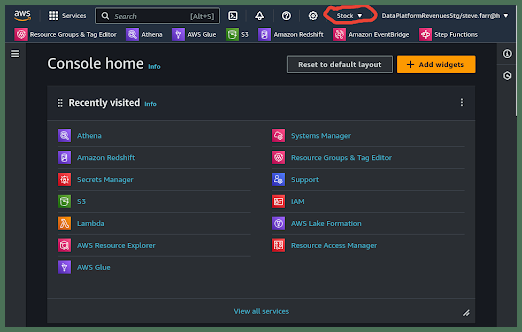
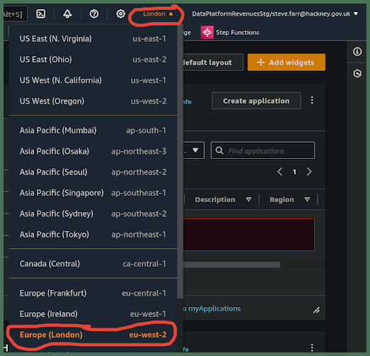

# How will I ensure I am in the correct AWS region?
   

You will need to check the region you are in, usually the first time you access the AWS Management Console. Thereafter your web browser will remember the region you last used so you should not need to check this very often.

## 1. Access the ***AWS Management Console***
**`🖱`** In your web browser, log in to your AWS account to access the ***AWS Management Console***.  
   
👉 First time AWS Users should **start here ►** **[📚AWS Console access](../parking/access-the-AWS-Management-Console)** 

## 2. Locate the Region Selector
**`👁`** At the top of the console, locate the region selector **`▼`**.

**`Fig. 2`** 

## 3. Select Your Region
**`🖱`** Click on the **`▼`** arrow to open the region menu.  
**`🖱`** From the list that appears, choose **`Europe (London) eu-west-2`** as your region.

**`Fig. 3 & 4`** 

## 4. Verify the Selected Region
**`👁 `** After selecting your region, you should see **`London ▼`** displayed at the top of the console, confirming that you have successfully changed the region.  

  
   

---

## ***"We* ♡ *your feedback!"***
   
:::tip UX  
### 👉 Please use **this link ►** [**DAP⇨flow** `UX` **Feedback / access-the-AWS-region**](https://docs.google.com/forms/d/e/1FAIpQLSc7nv1XmfRJKZlZTYIJQxAwbimUfsZLXQOVt3TJO-zUOjcRGQ/viewform?usp=pp_url&entry.339550210=access-the-AWS-region)  

- Your feedback enables us to improve **DAP⇨flow** and our Data Analytics Platform service.  
- We encourage all our users to be generous with their time, in giving us their recollections and honest opinions about our service.  
- We especially encourage our new users to give feedback at the end of every **DAP⇨flow📚Migration onboarding** task because the quality of the onboarding experience really matters.  

    ☝ **Please use this link to help us understand your user experience!**  
:::

## 📚`UX` Criteria
:::info ABILITY  
* Hackney **Google Workspace** user  
:::

:::note BEHAVIOR  
### How will I ensure I am in the correct AWS region?
**Measures** the ***AWS Management Console*** behavior:  

**Given** I have accessed the ***AWS Management Console***  

**When** I check then select my region by clicking the **`▼`** arrow second from the right at the top of the console    
**~and** select **`Europe (London) eu-west-2`** from the menu  

**Then** **`London ▼`** should appear at the top of the console as my region.  

**Scale** of 2 to 3 **~and** flow features.  
:::
