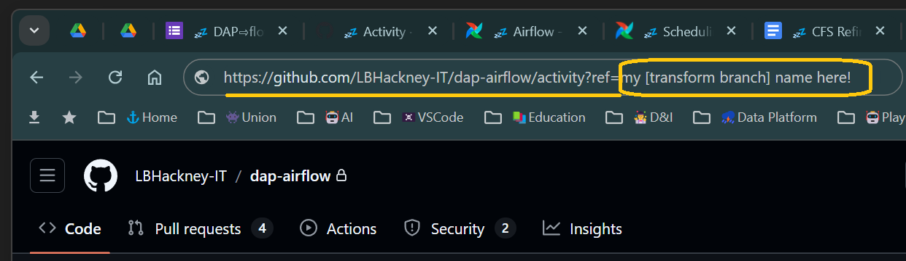
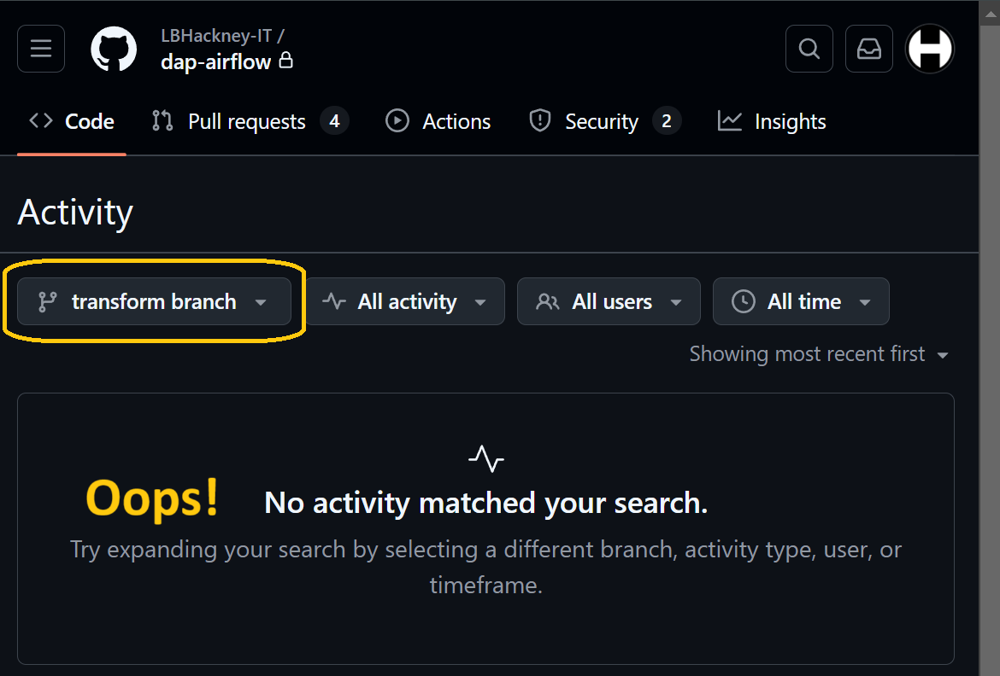
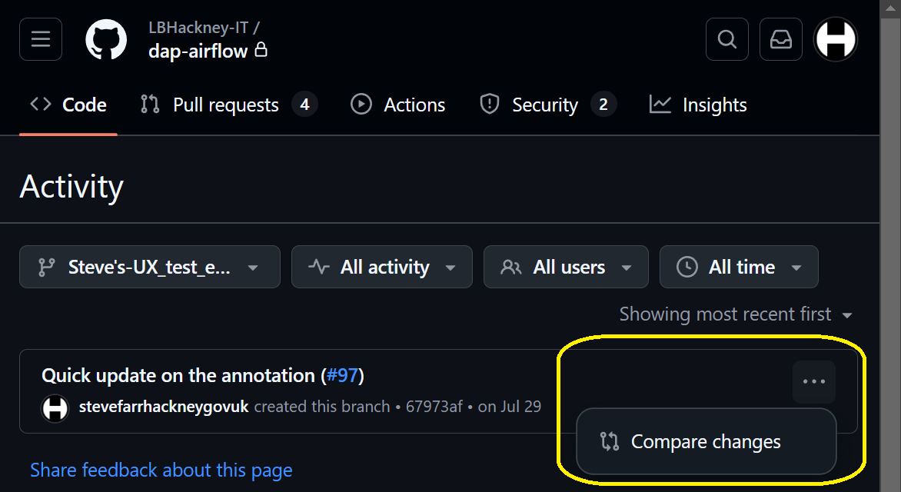

# 👉 [📚GitHub pull requests](../parking/github-pull-request)

#### How do I raise a *"pull request"* to merge my `[transform branch]` back into the `main` trunk of **DAP⇨flow**'s `dap-airflow` repository?  
---
## 📚Appendix

### How will I know?

💡 Let's assume you set up your `[transform branch]` earlier but then you got distracted so, now, you are not certain if you actually *committed* your `[transform SQL]` to a `[transform].sql` file.  

#### So, how do you know if you did or you didn't?  

Those that have ***GitHub*** integrated with their editors eg. ***Visual Studio Code*** can quickly pull up a ***Git Graph*** to simply find out. But what if you only have ***GitHub***'s web interface available, because you are on a Chromebook or you don't have a local copy of the repository?   

#### Then here's a neat trick you can use...  
You must be [logged into your ***GitHub*** account](#1-log-into-your-github-account) for this to work...  

**`🖱`** Use the following link to open a separate new tab in your web browser:   
**[`https://github.com/LBHackney-IT/dap-airflow/activity?ref=[transform branch]`](https://github.com/LBHackney-IT/dap-airflow/activity?ref=transform%20branch)**  

**`🖮`** Then replace all the text immediately after `ref=` with the name of your `[transform branch]` before hitting *Enter*.  
  

**`👁`** Then below, ***GitHub*** should appear with your **![][branch]`[transform branch]`** showing.  
  
**`👁`** If, below that, you get the message "**No activity matched your search**" then you can be certain you never actually *committed* your `[transform].sql` file.  

👉  If you did not *commit* your `[transform SQL]` to your `[transform branch]` then check back **here ►[📚Committing transforms](../parking/github-commit-transform)**  

**`👁`** Otherwise, you should see a list of one-or-more *commits* to your `[transform branch]`.  

**`🖱`** But if you are not sure about those, then you can click on `…` after each *commit message* and select "**Compare changes**"  
  
**`👁`** Then, on the next screen you will be presented with a list of changes that should remind you what you actually did!   

👉  If you are not sure you have properly *committed* your `[transform SQL]` to your `[transform branch]` then you should retrace your steps **here ►[📚Committing transforms](../parking/github-commit-transform)**  
