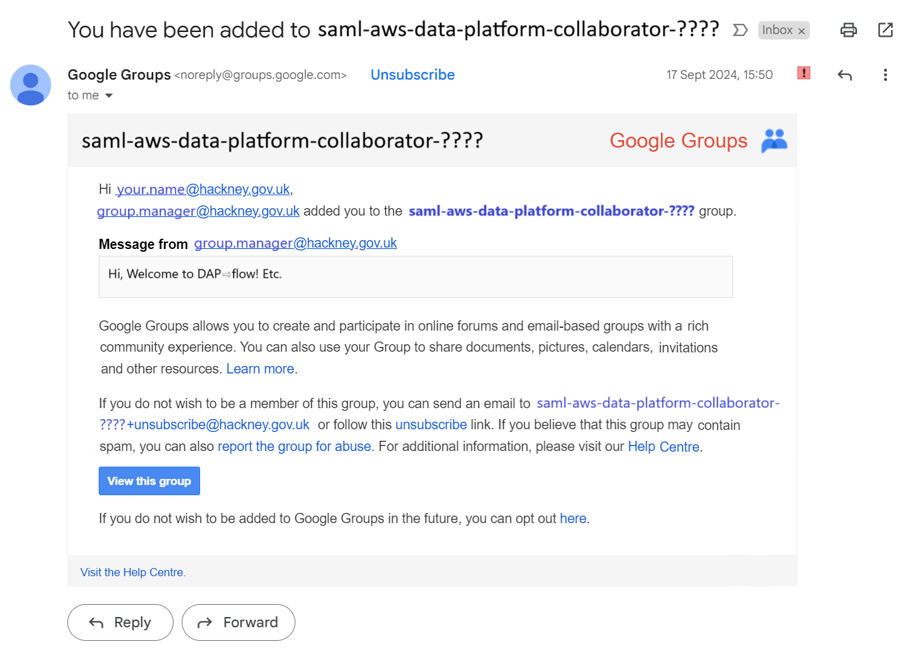

# Before you begin DAP⇨flow
  

## 1. Are you using your **Hackney Council** Google Account?
You’ll always need to be logged into your **Hackney Council** Google account via your web browser when following the **DAP⇨flow** onboarding guides.

## 2. Is your `[service]`’s data now available on the Data Analytics Platform (DAP)?
If your `[service]` manager or the **DAP Platform Team** have not already informed you about this, please visit the [**📊Data Analyst Community**](https://chat.google.com/room/AAAAKdvhyKA?cls=7) *Google Chat Space* to ask the question there. Someone from the team should be able to help you, and if your `[service]`’s data isn't available right now, this might be planned for near future.

## 3. You must be added to your `[service access group]`'s [*Google Group*](https://groups.google.com/all-groups?q=saml-aws-data-platform-collaborator) 
Depending on your circumstance there are various ways that could happen:  

- If your `[service]` manager (or representative) also manages your [`[service access group]`](https://groups.google.com/all-groups?q=saml-aws-data-platform-collaborator) then you can ask them to [add you](https://support.google.com/groups/answer/2465464?hl=en). That is the quick and easy way.

- Otherwise, when **DAP⇨flow** access is requested via any other means the **DAP Platform Team** must interact with your manager before they can add you, for example:
    * An access request directed at **Data Analytics Platform's** [***Halo support portal***](https://support.hackney.gov.uk/portal/service?btn=204&root_category=13&autolog=true&shownewticket=true&id=137) sent via [**data.analytics.platform@hackney.gov.uk**](mailto:data.analytics.platform@hackney.gov.uk). Always make sure managers are cc'd in to email so that requests can be authorized as quickly as possible and we can be sure what [service] you belong to.  
    * Asking for help via the [**📊Data Analyst Community**](https://chat.google.com/room/AAAAKdvhyKA?cls=7) *Google Chat Space*.  

## 4. Access granted

**`Fig. 4`** 

You should receive an email, similar to ***fig.4*** above, which will confirm the *actual name* of the *Google Group* you were added to. So henceforth in the 📚Onboarding articles, wherever you read `[service access group]` you should interpret that to be the *Google Group* named in that email. 

You will then be be granted:  

👉  Access to the [Hackney Council AWS Console](https://d-936715b9ec.awsapps.com/start/#/?tab=accounts) 

Please allow a couple of hours for the *access permission* to propagate to [**Hackney Council AWS Console**](https://d-936715b9ec.awsapps.com/start/\#/?tab=accounts)

👉  Access to your `[service **☎️DAP⇨flow** Hotline]` *Google Chat Space* 

All members of the `[service access group]` with access to **DAP⇨flow** are now automatically members of this *Google Chat Space*. This is where you will interact with the **DAP Platform Team** when you need help, encounter a problem or need to chase a request while performing some task.  

## 5. Welcome!

Please take some time to go and introduce yourself on your `[service **☎️DAP⇨flow** Hotline]`!

To get you started on your **DAP⇨flow** journey and enable effective use of the [**DAP⇨flow📚Onboarding**](../introduction#📚Onboarding) documentation, you will need certain information in the form of **Service Terms`[]`** defined for your `[service]`'s implementation. The next onboarding article will guide you through that: 

👉  [**DAP⇨flow📚Welcome**](../onboarding/welcome)  

Please note your `[service access group]` named in the email because you will need that correctly access information you will need. 

  
   

---
## ***"We* ♡ *your feedback!"***
  
:::tip UX  
### 👉 Please use **this link ►** [**DAP⇨flow** `UX` **Feedback / begin**](https://docs.google.com/forms/d/e/1FAIpQLSdqeNyWIPMNBHEr-YSyxnXQ4ggTwJPkffMYgFaJ4hGEhIL6LA/viewform?usp=pp_url&entry.339550210=begin)  

- Your feedback enables us to improve **DAP⇨flow** and our Data Analytics Platform service.  
- We encourage all our users to be generous with their time, in giving us their recollections and honest opinions about our service.  
- We especially encourage our new users to give feedback at the end of every **📚Onboarding** task because the quality of the onboarding experience really matters.  

    ☝ **Please use this link to help us understand your user experience!**
:::

## 📚`UX` Criteria
:::info ABILITY  
* Hackney **Google Workspace** user 
* Hackney `[service]` Data Analyst
:::

:::note BEHAVIOR  
### Before you begin DAP⇨flow
**Measures** the **DAP Platform** & **DAP Platform Team**  behaviors and the agency of the `[service]` manager:  

**Given** my `[service]` was already set up as a [**DAP department**](https://playbook.hackney.gov.uk/Data-Platform-Playbook/playbook/getting-set-up/onboarding-new-departments-to-the-platform)  
**~and** I have a **Hackney Council Google account** 

**When** my `[service]`manager (or representative) adds my name to the [`[service access group]`](https://groups.google.com/all-groups?q=saml-aws-data-platform-collaborator)  
**~or** my `[service]`manager authorizes the **DAP Platform Team** to add my name to the [`[service access group]`](https://groups.google.com/all-groups?q=saml-aws-data-platform-collaborator) as requested 

**Then** I will receive an email confirming I was added to the `[service access group]`  
**~and** I will be granted access to the [**Hackney Council AWS Console**](https://d-936715b9ec.awsapps.com/start/\#/?tab=accounts)  
**~and** I will be granted membership of our `[service **☎️DAP⇨flow** Hotline]` *Google Chat Space*    
**~and** I can be [welcomed to **DAP⇨flow**](../onboarding/welcome)   

**Scale** of 4 to 5 **~and** / **~or** flow features.
:::
