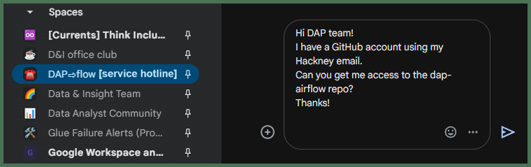

# How do I set up my ***GitHub*** access for **DAP⇨flow**?
  

## 1. So you're a new DAP⇨flow user, and you're ready to go?
 
👉 Check you did everything **here ►** **[📚Before you begin](../parking/begin)** 

👉 Have you introduced yourself on your **☎️DAP⇨flow** `[service hotline]` *Google Chat Space*?  
      
## 2. You'll need a ***GitHub*** Account

👉 When creating your ***GitHub*** account you must use your ***Hackney email address***. **Go here ►** [**github.com**](https://github.com/) 

## 3. Set Up Two-Factor Authentication

👉 Follow the steps to configure two-factor authentication for your ***GitHub*** account **here ►** [**GitHub 2-factor authentication for added security**](https://docs.github.com/en/authentication/securing-your-account-with-two-factor-authentication-2fa/configuring-two-factor-authentication)

## 4. Request Access to the `dap-airflow` repo

👉 Use your **☎️DAP⇨flow** `[service hotline]` *Google Chat Space* to request collaborator access to **DAP⇨flow**'s private repository called `dap-airflow`.

**`Fig. 4`** 

## 5. Access request granted
The **DAP Platform Team** will acknowledge your request and continue to update your status via a reply-thread in your **☎️DAP⇨flow** `[service hotline]` *Google Chat Space* 👉

* If you don't have membership already, they will ensure you [get invited](https://docs.github.com/en/enterprise-cloud@latest/organizations/managing-membership-in-your-organization/inviting-users-to-join-your-organization) to the [**London Borough of Hackney**](https://github.com/LBHackney-IT) organization on GitHub.

* They will check your access to the [**`dap-airflow`** private repository](https://github.com/LBHackney-IT/dap-airflow).

* They will confirm your ***GitHub*** `[service folder]` and point you to a `README.md` document in your primary `[dag folder]`.  

    eg. `https://github.com/LBHackney-IT/dap-airflow/airflow/dags/[service folder]/[dag folder]/readme.md`  

    If you can access that page, then you will be good to go!

:::info REMINDER
👉  Your **Service Terms`[]`** are defined in your **`welcome`** document stored in your `[service access group]`'s **►** [***Google Drive subfolder***](https://drive.google.com/drive/folders/1soY6hORmPVlRvlW_t1V1hTFXfZbLt6NS?usp=drive_link). 
:::

There, you will find your  ***GitHub*** `[service folder]` and all of your `[service dags]` project folders defined, including your primary `[dag folder]`.
:::

  
   

---
## ***"We* ♡ *your feedback!"***  

   
:::tip UX  
### 👉 Please use **this link ►** [**DAP⇨flow** `UX` **Feedback / github-access**](https://docs.google.com/forms/d/e/1FAIpQLSc7nv1XmfRJKZlZTYIJQxAwbimUfsZLXQOVt3TJO-zUOjcRGQ/viewform?usp=pp_url&entry.339550210=github-access)  

- Your feedback enables us to improve **DAP⇨flow** and our Data Analytics Platform service.  
- We encourage all our users to be generous with their time, in giving us their recollections and honest opinions about our service.  
- We especially encourage our new users to give feedback at the end of every **DAP⇨flow📚Migration onboarding** task because the quality of the onboarding experience really matters.  

    ☝ **Please use this link to help us understand your user experience!**
:::

## 📚`UX` Criteria  
:::info ABILITY  
* Hackney **Google Workspace** user 
* Hackney `[service]` Data Analyst
* ***GitHub*** beginner
:::

:::note BEHAVIOR  
### How do I set up my ***GitHub*** access for **DAP⇨flow**?
**Measures** the **DAP Platform Team** behavior:  

**Given** I am member of our **☎️DAP⇨flow** `[service hotline]` *Google Chat Space*

**When** I create my ***GitHub*** account at [github.com](https://github.com/) using my Hackney email address  
**~and** I set up 2 factor authentication for my ***GitHub*** account  
**~and** I request access to the `dap-airflow` private repository via our **☎️DAP⇨flow** `[service hotline]`

**Then** the **DAP Platform Team** will acknowledge my request via a reply-thread on our **☎️DAP⇨flow** `[service hotline]`   
**~and** ensure I am granted membership of [**London Borough of Hackney**](https://github.com/LBHackney-IT) organization on ***GitHub***  
**~and** ensure I can access the [`dap-airflow`](https://github.com/LBHackney-IT/dap-airflow) private repository  
**~and** confirm my ***GitHub*** `[service folder]` and `[service dags]` project folders by sending me a link to the `README.md` in the primary `[dag folder]`.  

**Scale** of 5 **~and** flow features.
:::
