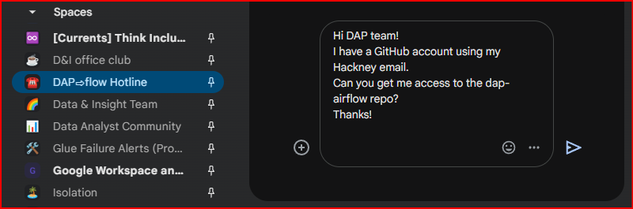
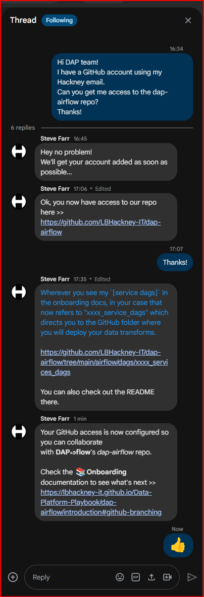

# How do I set up my ***GitHub*** access for **DAP⇨flow**?
  

## 1. So you're a DAP⇨flow user, and you're ready to go?
 
👉 Check you did everything **here ►** **[DAP⇨flow📚Before you begin](../onboarding/begin)** 

👉 Have you introduced yourself? **Here ►** [**☎️DAP⇨flow Hotline**](https://chat.google.com/room/AAAAZYTZYPE/w4EMQuK-9QA/w4EMQuK-9QA?cls=10)  
      
## 2. You'll need a ***GitHub*** Account

👉 When creating your ***GitHub*** account you must use your ***Hackney email address***. **Go here ►** [**github.com**](https://github.com/) 

## 3. Set Up Two-Factor Authentication

👉 Follow the steps to configure two-factor authentication for your ***GitHub*** account **here ►** [**GitHub 2-factor authentication for added security**](https://docs.github.com/en/authentication/securing-your-account-with-two-factor-authentication-2fa/configuring-two-factor-authentication)

## 4. Request Access to the `dap-airflow` repo

👉 Use the [**☎️DAP⇨flow Hotline**](https://chat.google.com/room/AAAAZYTZYPE?cls=7)  Google Chat Space to request collaborator access to **DAP⇨flow**'s private repository called `dap-airflow`.

**`Fig. 4`** 

## 5. Access request granted
The **DAP Platform Team** will 👉

* Acknowledge your request and continue to update your status via a reply-thread on the [☎️DAP⇨flow Hotline](https://chat.google.com/room/AAAAZYTZYPE?cls=7).

* If you don't have membership already, [ensure you get invited](https://docs.github.com/en/enterprise-cloud@latest/organizations/managing-membership-in-your-organization/inviting-users-to-join-your-organization) to the [**London Borough of Hackney**](https://github.com/LBHackney-IT) organization on GitHub.

* Check your access to the [**`dap-airflow`** private repository](https://github.com/LBHackney-IT/dap-airflow).

* Confirm your `[service dags]` ***GitHub*** project folder and point you to the `README.md` there.

:::info REMINDER
👉  Your **Service Terms`[]`** are defined in the ***welcome*** document stored in your [**`[service access group]`** ***Google Drive subfolder***](https://drive.google.com/drive/folders/1k30M7Hh8WLttL5T5JVGbnKvSLNX7lVSg?usp=drive_link).
:::

* Tell you your `dap-airflow` access is now configured while directing you back to the **📚Onboarding** documentation to learn about [what you should do next](../introduction#github-branching).

**`Fig. 5`** 

  
   

---
## ***"We* ♡ *your feedback!"***  

  
:::tip UX  
### 👉 Please use **this link ►** [**DAP⇨flow** `UX` **Feedback / github-access**](https://docs.google.com/forms/d/e/1FAIpQLSdqeNyWIPMNBHEr-YSyxnXQ4ggTwJPkffMYgFaJ4hGEhIL6LA/viewform?usp=pp_url&entry.339550210=github-access)  

- Your feedback enables us to improve **DAP⇨flow** and our Data Analytics Platform service.  
- We encourage all our users to be generous with their time, in giving us their recollections and honest opinions about our service.  
- We especially encourage our new users to give feedback at the end of every **📚Onboarding** task because the quality of the onboarding experience really matters.  

    ☝ **Please use this link to help us understand your user experience!**
:::

## 📚`UX` Criteria  
:::info ABILITY  
* Hackney **Google Workspace** user 
* Hackney `[service]` Data Analyst
* ***GitHub*** beginner
:::

:::note BEHAVIOR  
### How do I set up my ***GitHub*** access for **DAP⇨flow**?
**Measures** the **DAP Platform Team** behavior:  

**Given** I am member of the [**☎️DAP⇨flow Hotline**](https://chat.google.com/room/AAAAZYTZYPE?cls=7) Google Chat Space

**When** I create my ***GitHub*** account at [github.com](https://github.com/) using my Hackney email address  
**~and** I set up 2 factor authentication for my ***GitHub*** account  
**~and** I request access to the `dap-airflow` private repository via the [☎️DAP⇨flow Hotline](https://chat.google.com/room/AAAAZYTZYPE?cls=7)

**Then** the **DAP Platform Team** will acknowledge my request via a reply-thread on the [☎️DAP⇨flow Hotline](https://chat.google.com/room/AAAAZYTZYPE?cls=7)   
**~and** ensure I am granted membership of [**London Borough of Hackney**](https://github.com/LBHackney-IT) organization on ***GitHub***  
**~and** ensure I can subsequently access the [`dap-airflow`](https://github.com/LBHackney-IT/dap-airflow) private repository  
**~and** confirm my `[service dags]` ***GitHub*** project folder with link to the `README.md` there  
**~and** tell me my `dap-airflow` access is now configured while directing me back to the [**📚Onboarding** documentation](../introduction#github-branching). 

**Scale** of 5 **~and** flow features.
:::
