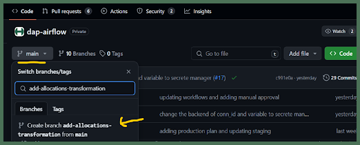
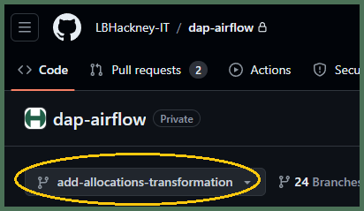

# How do I create `[transform branch]` as my new working branch of **DAP⇨flow**'s `dap-airflow` repository?
  

## 1. Log into your ***GitHub*** account
**`🖱`** Open your web browser and log into your ***GitHub*** account using your ***Hackney email address*** with two-factor authentication.
 
👉 Users without a ***GitHub*** account or existing ***GitHub*** users without membership of the **[London Borough of Hackney](https://github.com/LBHackney-IT) organization,** should **start here ►** **[📚GitHub access](../parking/github-access)** 

## 2. Access the `dap-airflow` repository
**`🖱`** When you are ready to begin, open the **[`dap-airflow`](https://github.com/LBHackney-IT/dap-airflow)** repository in your web browser.

## 3. Create `[transform branch]` as your new working branch

**`🖱`** Select the "**Code**" tab at the top of the repository page

**`Fig. 3`** 

**`🖱`** Below that, click on the "**![][branch]`main`**" branch dropdown button menu.

**`🖮`** Type the name of your new working branch as your **`[transform branch]`** using whatever naming convention your [service] may have agreed upon.

**`🖱`** Below that on the dropdown menu, click on "Create branch **![][branch]`[transform branch]`** from **`main`.**"

:::info REMINDER
👉  Your **Service Terms`[]`** are defined in your **`welcome`** document stored in your `[service access group]`'s **► ** [***Google Drive subfolder***](https://drive.google.com/drive/folders/1soY6hORmPVlRvlW_t1V1hTFXfZbLt6NS?usp=drive_link). 
:::

## 4. Verify `[transform branch]` is now your working branch
**`👁`** Check your "![][branch]`[trannsform branch]`” has replaced "![][branch]`main`" as your working branch.

**`Fig. 4`** 

  
   

---
## ***"We* ♡ *your feedback!"***
   
:::tip UX  
### 👉 Please use **this link ►** [**DAP⇨flow** `UX` **Feedback / github-branch**](https://docs.google.com/forms/d/e/1FAIpQLSc7nv1XmfRJKZlZTYIJQxAwbimUfsZLXQOVt3TJO-zUOjcRGQ/viewform?usp=pp_url&entry.339550210=github-branch)  

- Your feedback enables us to improve **DAP⇨flow** and our Data Analytics Platform service.  
- We encourage all our users to be generous with their time, in giving us their recollections and honest opinions about our service.  
- We especially encourage our new users to give feedback at the end of every **DAP⇨flow📚Migration onboarding** task because the quality of the onboarding experience really matters.  

    ☝ **Please use this link to help us understand your user experience!**
:::

## 📚`UX` Criteria  
:::info ABILITY  
* Hackney **Google Workspace** user 
* Hackney `[service]` Data Analyst
* ***GitHub*** beginner  
:::

:::note BEHAVIOR  
### How do I create `[transform branch]` as my new working branch of **DAP⇨flow**'s `dap-airflow` repository?
**Measures** the ***GitHub*** and `dap-airflow` repository behavior:  

**Given** in my web browser, I am logged on to my ***GitHub*** account using my ***Hackney email address*** with two-factor authentication  
**~and** I am granted membership of **[London Borough of Hackney](https://github.com/LBHackney-IT) organization** on ***GitHub*** incorporating the [`dap-airflow`](https://github.com/LBHackney-IT/dap-airflow) private repository     
**~and** **`[transform branch]`** will be the name of my new working branch  

**When** I access the [`dap-airflow`](https://github.com/LBHackney-IT/dap-airflow) repository  
**~and** I select the "**Code**" tab at the top of the repository page  
**~and** below that, I click on the "**![][branch]`main`**" branch dropdown button menu   
**~and** I type **`[transform branch]`**  
**~and** click "Create branch **![][branch]`[transform branch]`** from **`main`**" below that on the dropdown menu  

**Then** "**![][branch]`[transform branch]`**” should replace "**![][branch]`main`**" as my working branch  

**Scale** of 4 to 6 **~and** flow features.
:::

[branch]: <data:image/png;base64,iVBORw0KGgoAAAANSUhEUgAAAA8AAAAPCAYAAAA71pVKAAAAAXNSR0IArs4c6QAAAU9JREFUOE+tk79Pg1AQx99bHPwf+k8URxJ2VngdtaTGMEDC4iqv0s2FxA4tjUl1fbzJiXSiOiKhy+s/wayDCWfbCKG/UBNveMPdffK9u3eH0bcRQmTbtl+EEJemaT6U/nrccZxr3/fvGGOvaz9eP+Px2JrNZveyLA+FEFYQBBt/3brdLrRareFyubQAwOacDzdJk8nEjaKIappG4zimo9FoDzZNExRFoZxzumJoGIb9KknX9XOE0CMAuJzz211lTdNuMMZ9hNBFGIZPVdlloq7rgDE+Y4y9HehZAoBkpVgJbpX3LzAhRDDGtsSLonhXVfWz1+udlIE9ZQAIJEm6StO0gtvtNprP5zRJkuc8z6vAHmwYBppOp6d1WUII6nQ6H7tz+HXPu+Cfpt0I//TPR+HFYuF6nte4YUfhLMuswWDQuNuNZa+vqkwor+YQUPd9AUZ2tBDCa9wvAAAAAElFTkSuQmCC>
