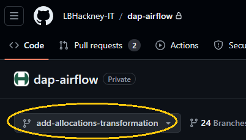
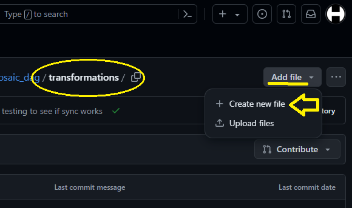
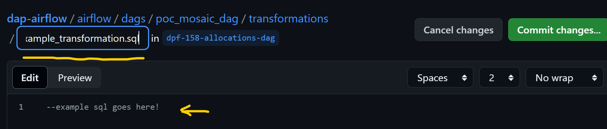
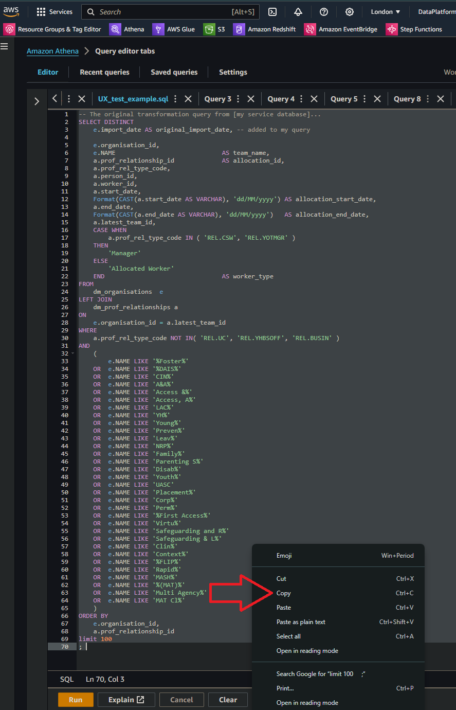
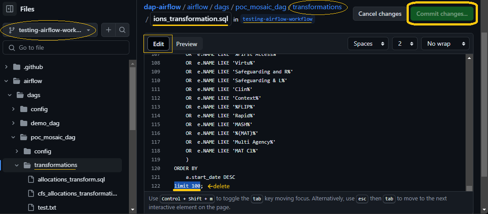
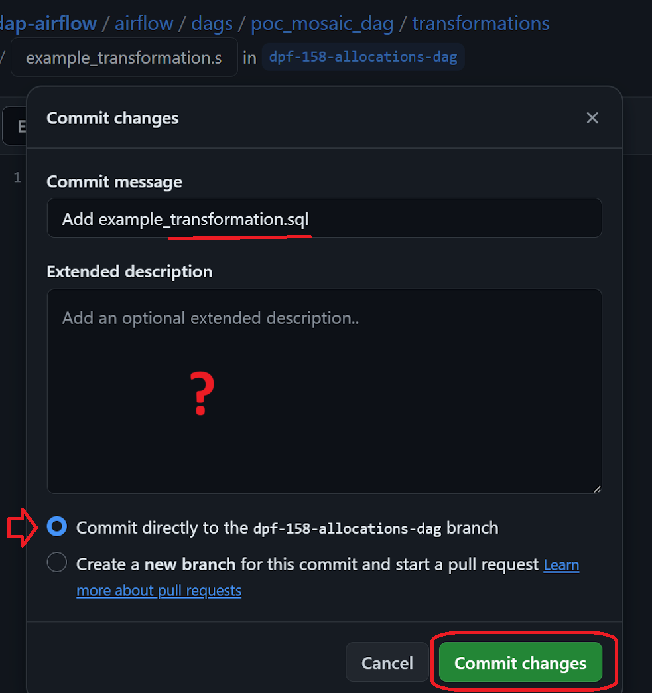

# How do I commit my working `[transform SQL]` query to **DAP⇨flow**'s `dap-airflow` repository? 
  

:::info REMINDER
👉  Your **Service Terms`[]`** are defined in **your `welcome` document** stored in your `[service access group]`'s **►** [***Google Drive subfolder***](https://drive.google.com/drive/folders/1soY6hORmPVlRvlW_t1V1hTFXfZbLt6NS?usp=drive_link). 
:::

## 1. Prepare and make ready your `[transform SQL]` query 
**`🖱`** Ensure you have already created, tested and saved **your `[transform SQL]` code** as a working, fully functional Athena SQL query. 

👉 For how that is done, see **here ►** **[📚Prototype simple transforms](../parking/prototype-simple-transforms)**  

**`🖱`**  Open **your `[transform SQL]` code** in the ***Amazon Athena*** query editor and keep it open in a web browser tab.
 
## 2. Access the `dap-airflow` repository in ***GitHub*** 

**`🖱`** Use another tab in your web browser to log into your ***GitHub*** account using your *Hackney email address* with two-factor authentication.
 
👉 Users without a ***GitHub*** account or existing ***GitHub*** users without membership of the **[London Borough of Hackney](https://github.com/LBHackney-IT) organization,** should check back at **the start ►** **[📚GitHub access](../parking/github-access)** 

**`🖱`** Open the **[`dap-airflow`](https://github.com/LBHackney-IT/dap-airflow)** repository in your web browser.

## 3. Open your `[transform folder]` on a your `[transform branch]` 

**`🖱`** Ensure you have created **your ![][branch]`[transform branch]`** and have it selected.  

**`Fig. 3a`** 

👉 To recall how to create your ![][branch]`[transform branch]`, **see here ►** **[📚GitHub branching](../parking/github-branch)**  
    
**`🖱`** In the `dap-airflow` repository, navigate to your `dap-airflow/airflow/dags/[service folder]/[dag folder]/[transform folder]`, by using ***GitHub***’s left-hand navigation pane as follows:  
* Click on the **`airflow`** folder  
* Inside the `airflow` folder, click on the **`dags`** folder  
* Inside the `dags` folder, click on **your `[service folder]`**  
* Inside **your `[service folder]`**, click on **your `[dag folder]`**  
* Inside **your `[dag folder]`**, click on **your `[transform folder]`**.

**`Fig. 3b & 4a`** 

## 4. Create your new `[transform].sql` file in ***GitHub*** 

**`🖱`** At the top right region of the page, click the "**Add file**" button and select "**Create new file**"  

**`🖮`** In the box following **your `[transform folder]`**, enter **your `[transform].sql` filename***.  

**`Fig. 4b`** 

**`🖱`** Keep this ***Github*** code editor and it's web browser tab open for later on.

## 5. Copy your `[transform SQL]` code from ***Amazon Athena*** 

**`🖱`** Switch back to the ***Amazon Athena*** tab in your web browser, with **your `[transform SQL]` code** still in the query editor.  
**`🖱`** Select **your entire `[transform SQL]` code** in the Athena query editor.  

**`Fig. 5`**   

**`🖱`** Use the right-click menu to "*Copy*" the selected code to your computer’s clipboard.  

## 6. Paste your `[transform SQL]` code into ***GitHub*** 

**`🖱`** Switch back to the ***GitHub*** tab in your web browser, with **your `[transform].sql` file** currently empty in the code editor.  
**`🖱`** In the ***GitHub*** editor window beneath where it says “**Edit**”, use the right-click menu to "*Paste*" **your entire `[transform SQL]` code**, from the computer’s clipboard, into **your `[transform].sql` file**.  

**`Fig. 6 & 7`**   

## 7. Review and adjust your `[transform SQL]` code  

**`🖱`** Scroll to the bottom of the ***GitHub*** editor window to remove any `limit` clause (e.g., `limit 100`), leaving just the final **`;`** semi-colon at the very end.  

**`👁`** If you spot problems in your code you have an opportunity to fix them now, or else fix them later.  

## 8. Commit your `[transform].sql` file  

**`🖱`** Click the "**Commit changes**" button to open a dialogue box. 

**`Fig. 8`**   

**`🖮`** Enter a short commit message, Eg. `Add ... [transform].sql`.  
**`🖮`** Enter a longer description if wanted.  
**`🖱`** Select the option “**Commit directly to the `[transform branch]`**”.  
**`🖱`** Click the "**Commit changes**" button.  

**`👁`** You should see a message confirming **your `[transform].sql` file** was successfully committed directly to **your ![][branch]`[transform branch]`**.

## 9. Making subsequent changes to your `[transform].sql` 

Whether you are just fault-fixing or you want to add new SQL code features to **your `[transform SQL]` code**:

**`🖱`** In the ***GitHub*** editor window beneath where it says “**Edit**”, you can edit **your `[transform].sql` file** directly.    

**`🖱`** Alternatively, you can use the right-click menu to "*Paste*" a new version of **your `[transform SQL]` code**, from the computer’s clipboard, into **your `[transform].sql` file**.  

💡 But unlike regular code editors, ***GitHub*** will not allow you to simply *"Save"* consecutive changes to your code then come back later to finally *commit* your `[transform].sql` with the rest of your `[transform branch]`. Using ***GitHub***'s *web console* in this way absolutely requires you to re-*commit* your `[transform branch]` each and every time you edit or change your files. If you closed your web browser before *committing*, you would lose the edits you did using ***GitHub***'s editor since the previous *commit*. 

👉 After editing **your `[transform].sql` file** each time, simply **repeat from ► [step 8](#8-commit-your-transformsql-file)**.  

👉 You may *commit* as often as you need to, until finally, you are ready to go ahead *orchestrate* **your `[transform SQL]`/`[transform].sql` here ►** **[📚Orchestrating transforms](../parking/github-orchestrate-transform)**   

👉 The later on, when you've both ***committed*** and ***orchestrated*** your transform you will raise a ***pull request***, **here ►** **[📚GitHub pull request](../parking/github-pull-request)**   

  
   

---
## ***"We* ♡ *your feedback!"***
   
:::tip UX  
### 👉 Please use **this link ►** [**DAP⇨flow** `UX` **Feedback / github-commit-transform**](https://docs.google.com/forms/d/e/1FAIpQLSc7nv1XmfRJKZlZTYIJQxAwbimUfsZLXQOVt3TJO-zUOjcRGQ/viewform?usp=pp_url&entry.339550210=github-commit-transform)  

- Your feedback enables us to improve **DAP⇨flow** and our Data Analytics Platform service.  
- We encourage all our users to be generous with their time, in giving us their recollections and honest opinions about our service.  
- We especially encourage our new users to give feedback at the end of every **DAP⇨flow📚Migration onboarding** task because the quality of the onboarding experience really matters.  

    ☝ **Please use this link to help us understand your user experience!**
:::

## 📚`UX` Criteria  
:::info ABILITY  
* Hackney **Google Workspace** user 
* Hackney `[service]` Data Analyst
* ***Amazon Athena*** user  
* ***GitHub*** user  
:::

:::note BEHAVIOR  
### How do I commit my working `[transform SQL]` query to **DAP⇨flow**'s `dap-airflow` repository?
**Measures** the behavior of ***GitHub*** and ***Amazon Athena***.  

**Given** I previously created and saved my `[transform SQL]` as a working fully functional Athena SQL query  
**~and** I have my `[transform SQL]` open in the Athena query editor in my web browser 
**~and** in another tab in my web browser, I am logged on to my ***GitHub*** account using my ***Hackney email address*** with two-factor authentication  
**~and** I am granted membership of the **[London Borough of Hackney](https://github.com/LBHackney-IT) organization** on ***GitHub*** incorporating the [`dap-airflow`](https://github.com/LBHackney-IT/dap-airflow) private repository  
**~and** I have accessed the [`dap-airflow`](https://github.com/LBHackney-IT/dap-airflow) repository  
**~and** I previously created my **`[transform branch]`**  

**When** I select my **`[transform branch]`** as my working branch  
**~and** I navigate to `dap-airflow/airflow/dags/[service folder]/[dag folder]/[transforms folder]` where my transform `.sql` files are stored  
**~and** at the top right region of the page, click the "**Add file**" button and select "**Create new file**"  
**~and** in the box following the **`[transforms folder]/`** subfolder, I enter my `[transform].sql`  
**~and** back in the ***Amazon Athena*** web browser tab, I select my entire `[transform SQL]` code in the Athena query editor before *copying* it into the computer’s clipboard   
**~and** back in the ***GitHub*** web browser tab, in the editor window, beneath where it says “**Edit**”, I *paste* my `[transform SQL]` code, from the computer’s clipboard, into my `[transform].sql` file   
 **~and** I scroll to the bottom of the editor window to check and remove any `limit` clause (eg. `limit 100`), leaving just the `;` semi-colon at the very end  
**~and** I click the "**Commit changes**" button to open up a dialogue box  
**~and** I enter a short commit message, Eg. `Add ... [transform].sql`   
**~and** I enter a longer description if I want to  
**~and** I select the option “**Commit directly to my `[transform branch]`**  
**~and** I click the "**Commit changes**" button  

**Then** I should see a message telling me, my `[transform].sql` was successfully *committed* directly to my `[transform branch]`  
**~and** I will be permitted to make further edits to my `[transform].sql` followed by *commits* to my to my `[transform branch]`, as often as I need to, until I raise a *pull request* for my `[transform branch]`.

**Scale** of 12 to 17 **~and** flow features.
:::

[branch]: <data:image/png;base64,iVBORw0KGgoAAAANSUhEUgAAAA8AAAAPCAYAAAA71pVKAAAAAXNSR0IArs4c6QAAAU9JREFUOE+tk79Pg1AQx99bHPwf+k8URxJ2VngdtaTGMEDC4iqv0s2FxA4tjUl1fbzJiXSiOiKhy+s/wayDCWfbCKG/UBNveMPdffK9u3eH0bcRQmTbtl+EEJemaT6U/nrccZxr3/fvGGOvaz9eP+Px2JrNZveyLA+FEFYQBBt/3brdLrRareFyubQAwOacDzdJk8nEjaKIappG4zimo9FoDzZNExRFoZxzumJoGIb9KknX9XOE0CMAuJzz211lTdNuMMZ9hNBFGIZPVdlloq7rgDE+Y4y9HehZAoBkpVgJbpX3LzAhRDDGtsSLonhXVfWz1+udlIE9ZQAIJEm6StO0gtvtNprP5zRJkuc8z6vAHmwYBppOp6d1WUII6nQ6H7tz+HXPu+Cfpt0I//TPR+HFYuF6nte4YUfhLMuswWDQuNuNZa+vqkwor+YQUPd9AUZ2tBDCa9wvAAAAAElFTkSuQmCC>
