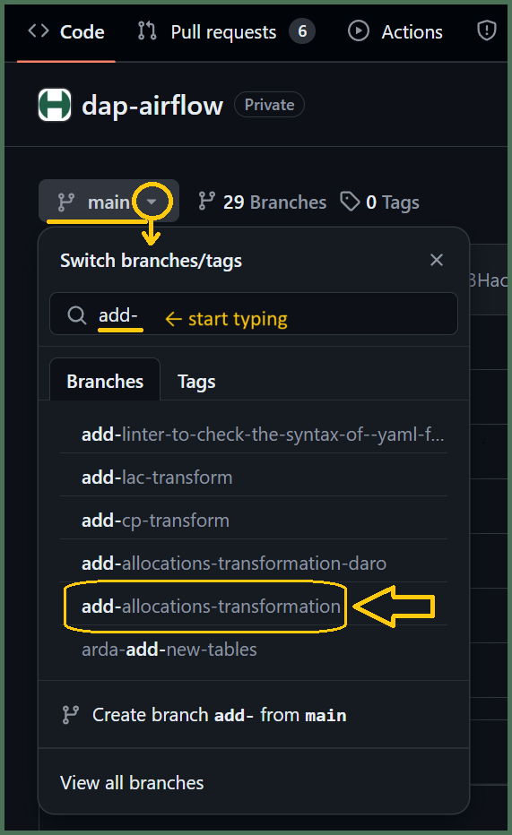
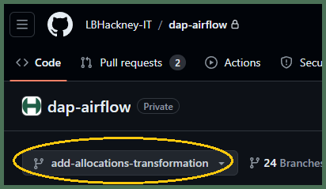
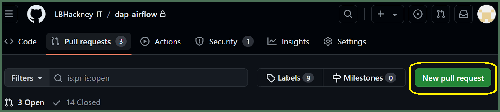
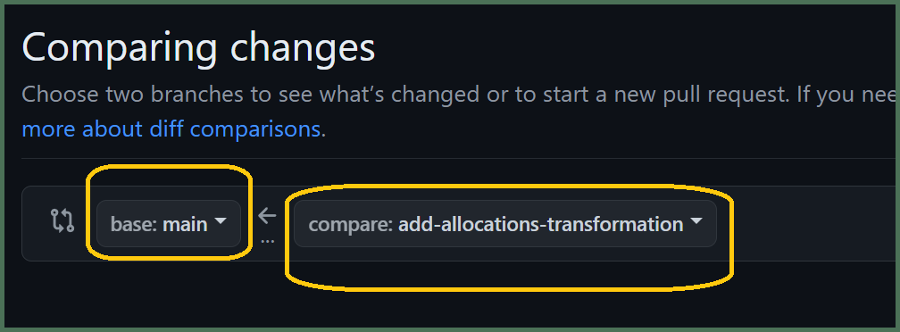
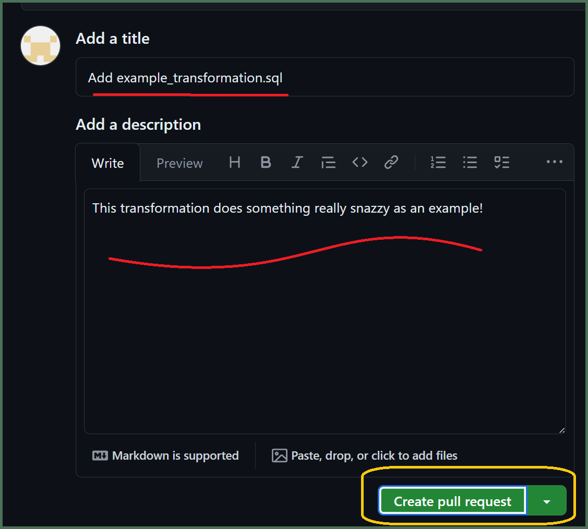
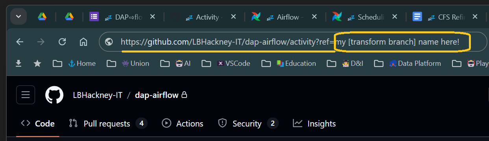
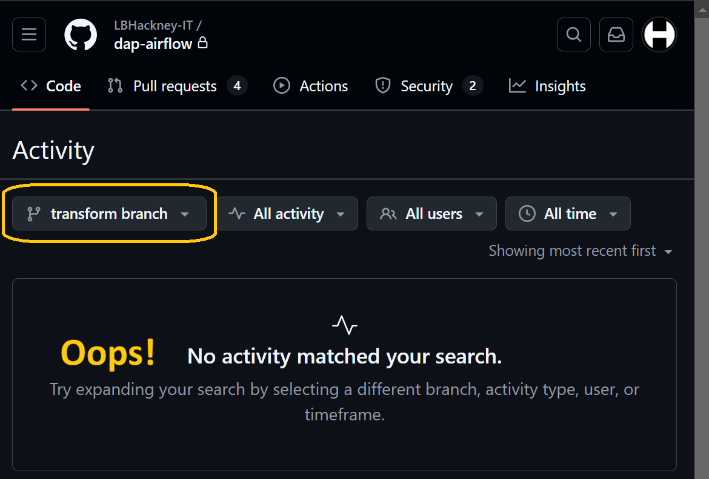
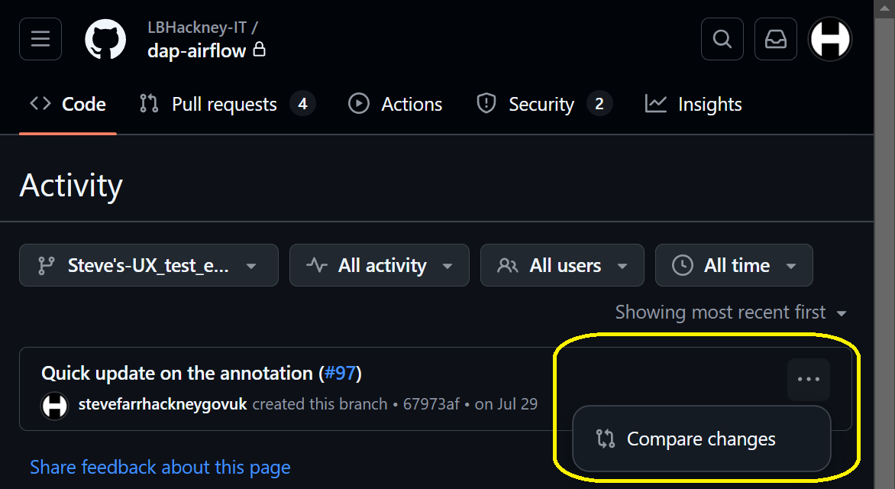

# How do I raise a *"pull request"* to merge my `[transform branch]` back into the `main` trunk of **DAP⇨flow**'s `dap-airflow` repository?

   

## 1. Log into your ***GitHub*** account
**`🖱`** Open your web browser and log into your ***GitHub*** account using your ***Hackney email address*** with two-factor authentication.

👉 Users without a ***GitHub*** account or existing ***GitHub*** users without membership of the **[London Borough of Hackney](https://github.com/LBHackney-IT) organization,** should **start here ►** **[📚GitHub access](../parking/github-access)** 

## 2. Access the `dap-airflow` repository
**`🖱`** When you are ready, open the **[`dap-airflow`](https://github.com/LBHackney-IT/dap-airflow)** repository in your web browser.

## 3. Switch to your working `[transform branch]`

👉  If you haven't yet created your `[transform branch]` then **see here** how to do that **►** **[📚GitHub branching](../parking/github-branch)**  

**`🖱`** Select the "**Code**" tab at the top of the repository page.   
**`Fig. 3a`**   
**`🖱`** Click the `▼`dropdown button next to ![][branch]`main`.  
**`🖮`** Start typing your `[transform branch]` name.  
**`🖱`** Find and select your `[transform branch]` from the menu below.  

**`Fig. 3b`**   
**`👁`** Your **![][branch]`[transform branch]`** should reappear next to the `▼`dropdown button.  

👉  If you've yet to *commit* your `[transform SQL]` to your `[transform branch]` then check back **here ► [📚Committing transforms](../parking/github-commit-transform)** 

👉  If you don't remember if you *committed* your `[transform SQL]` to your `[transform branch]` then check **here ► [📚Appendix ► How will I know?](#appendix)**

## 4. Create your *pull request*
**`🖱`** Select the "**Pull requests**" tab at the top of the repository page.  
**`Fig. 4a`**   
**`🖱`** Click the "**New pull request**" button on the right.  

**`🖱`** Set the `base:` branch to the **`main`** trunk.  
**`Fig. 4b`**   
**`🖱`** Set the `compare:` branch to your **`[transform branch]`**.  

**`🖱`** Click the "**Create pull request**" button.  
**`Fig. 4c`**   

## 5. Add the details to your *pull request*
**`🖮`** Enter a title for your *pull request*.  
**`🖮`** Add a description explaining the changes you have made.

**`Fig. 5 & 6`**   

## 6. Submit your *pull request*  
**`🖱`** Click the "**Create pull request**" button below the description on the right.

***GitHub*** should begin the process of pulling your **`[transform branch]`** into the `main` trunk or the `dap-airflow` repository:  
**`✉`** You will be sent an email to confirm that.  
**`✉`** A *pull request* email will be sent to the **DAP Platform Team** to notify them of your request.  

  
   

---
## ***"We* ♡ *your feedback!"***
   
:::tip UX  
### 👉 Please use **this link ►** [**DAP⇨flow** `UX` **Feedback / github-pull-request**](https://docs.google.com/forms/d/e/1FAIpQLSc7nv1XmfRJKZlZTYIJQxAwbimUfsZLXQOVt3TJO-zUOjcRGQ/viewform?usp=pp_url&entry.339550210=github-pull-request)  

- Your feedback enables us to improve **DAP⇨flow** and our Data Analytics Platform service.  
- We encourage all our users to be generous with their time, in giving us their recollections and honest opinions about our service.  
- We especially encourage our new users to give feedback at the end of every **DAP⇨flow📚Migration onboarding** task because the quality of the onboarding experience really matters.  

    ☝ **Please use this link to help us understand your user experience!**
:::

## 📚`UX` criteria
:::info ABILITY  
* Hackney **Google Workspace** user 
* Hackney `[service]` Data Analyst
* ***GitHub*** beginner  
:::

:::note BEHAVIOR  
### How do I raise a *"pull request"* to merge my `[transform branch]` back into the `main` trunk of **DAP⇨flow**'s `dap-airflow` repository?
**Measures** the ***GitHub*** and `dap-airflow` repository behavior:  

**Given** in my web browser, I am logged on to my ***GitHub*** account using my ***Hackney email address*** with two-factor authentication  
**~and** I am granted membership of **[London Borough of Hackney](https://github.com/LBHackney-IT) organization** on ***GitHub*** incorporating the [`dap-airflow`](https://github.com/LBHackney-IT/dap-airflow) private repository     
**~and** I previously *committed* my `[transform].sql` file, containing my `[transform SQL]`, to my current **`[transform branch]`**  
**~and** I have not previously raised a *pull request* on my **`[transform branch]`**  

**When** I access the [`dap-airflow`](https://github.com/LBHackney-IT/dap-airflow) repository  
**~and** I select the "**Code**" tab at the top of the repository page  
**~and** below that, I click on the "**![][branch]`main`**" `▼`dropdown button  
**~and** I begin typing my **`[transform branch]`**  
**~and** below that, I select my **`[transform branch]`** so that my **![][branch]`[transform branch]`** reappears above next to the `▼`dropdown button  
**~and** I select the "**Pull requests**" tab at the top of the repository page  
**~and** I click the "**New pull request**" button over on the right  
**~and** I set the `base:` branch to the **`main`** trunk  
**~and** I set the `compare:` branch my **`[transform branch]`**  
**~and** I click on the "Create pull request" button  
**~and** I add a *title* for my pull request and a *description* explaining the changes I have made  
**~and** below on the right, I click the "**Create pull request**" button  

**Then** ***GitHub*** should begin the process of pulling my **`[transform branch]`** into the `main` trunk or the `dap-airflow` repository
**~and** I will be sent an email confirming that  
**~and** a *pull request* email will be sent to the **DAP Platform Team**.

**Scale** of 13 to 16 **~and** flow features.
:::

## 📚Appendix

How will I know?

Let's assume you set up your `[transform branch]` earlier but then you got distracted so, now, you are not certain if you actually *committed* your `[transform SQL]` to a `[transform].sql` file. 

### So, how will you know if you did or you didn't?

Those that have ***GitHub*** integrated with their editors eg. ***Visual Studio Code*** can quickly pull up a *Git Graph* to simply find out. But what if you only have ***GitHub***'s web interface available, because you are on a Chromebook or you don't have a local copy of the repository?

#### Here's a neat trick you can use!
You must be [logged into your ***GitHub*** account](#1-log-into-your-github-account) for this to work...

**`🖱`** Use the following link to open a separate new tab in your web browser:   
**[`https://github.com/LBHackney-IT/dap-airflow/activity?ref=[transform branch]`](https://github.com/LBHackney-IT/dap-airflow/activity?ref=transform%20branch)**

**`🖮`** Then replace all the text immediately after `ref=` with the name of your `[transform branch]` before hitting *Enter*.  
  

**`👁`** Then below, ***GitHub*** should appear with your **![][branch]`[transform branch]`** showing.  
  
**`👁`** If, below that, you get the message "**No activity matched your search**" then you can be certain you never actually *committed* a `[transform].sql` file.  

👉  If you did not *commit* your `[transform SQL]` to your `[transform branch]` then check back **here ►[📚Committing transforms](../parking/github-commit-transform)**  

**`👁`** Otherwise, you should see a list of one-or-more *commits* to your `[transform branch]`.

**`🖱`** But if you are not sure about those, then you can click on `…` after each *commit message* and select "**Compare changes**"  
  
**`👁`** Then, on the next screen you will be presented with a list of changes that should remind you what you actually did!

👉  If you are not sure you have properly *committed* your `[transform SQL]` to your `[transform branch]` then you should retrace your steps **here ►[📚Committing transforms](../parking/github-commit-transform)**  

[branch]: <data:image/png;base64,iVBORw0KGgoAAAANSUhEUgAAAA8AAAAPCAYAAAA71pVKAAAAAXNSR0IArs4c6QAAAU9JREFUOE+tk79Pg1AQx99bHPwf+k8URxJ2VngdtaTGMEDC4iqv0s2FxA4tjUl1fbzJiXSiOiKhy+s/wayDCWfbCKG/UBNveMPdffK9u3eH0bcRQmTbtl+EEJemaT6U/nrccZxr3/fvGGOvaz9eP+Px2JrNZveyLA+FEFYQBBt/3brdLrRareFyubQAwOacDzdJk8nEjaKIappG4zimo9FoDzZNExRFoZxzumJoGIb9KknX9XOE0CMAuJzz211lTdNuMMZ9hNBFGIZPVdlloq7rgDE+Y4y9HehZAoBkpVgJbpX3LzAhRDDGtsSLonhXVfWz1+udlIE9ZQAIJEm6StO0gtvtNprP5zRJkuc8z6vAHmwYBppOp6d1WUII6nQ6H7tz+HXPu+Cfpt0I//TPR+HFYuF6nte4YUfhLMuswWDQuNuNZa+vqkwor+YQUPd9AUZ2tBDCa9wvAAAAAElFTkSuQmCC>

