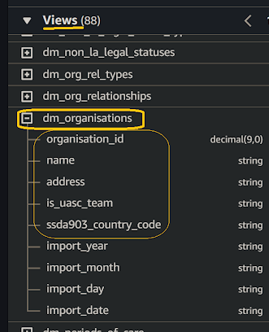
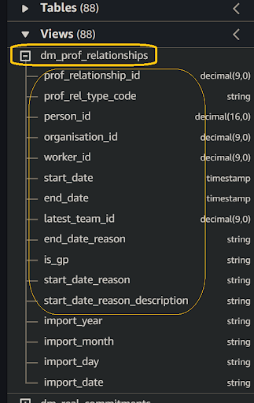
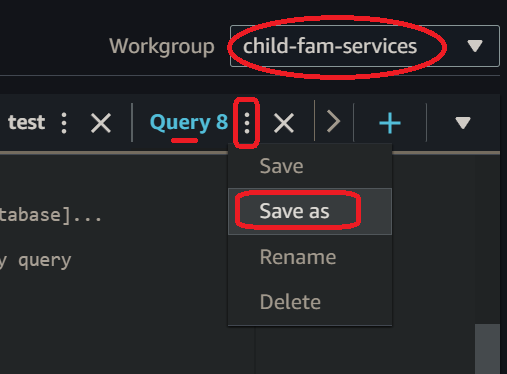

# How do I use ***Amazon Athena*** to prototype a data transformation based on a `[legacy SQL query]`?
  

A `[legacy SQL query]` is a SQL query originally developed for your `[service database]`. Although written in a different SQL DML dialect, the query should contain object references equivalent to the those in your `[service raw zone[ #]]`.

## 1. Access ***Amazon Athena***
**`🖱`** In your web browser, log in to your AWS account, navigate to the ***AWS Management Console***, and open ***Amazon Athena***. 
   
👉 First time ***Amazon Athena*** users should **start here ►** **[📚Amazon Athena](../onboarding/access-my-Amazon-Athena-database)** 

## 2. Select your `[service workgroup]`
**`🖱`** Ensure you have selected your `[service workgroup]` from the list-box next to “**Workgroup**”.  

:::info REMINDER
👉  Your **Service Terms`[]`** are defined in the ***welcome*** document stored in your [**`[service access group]`** ***Google Drive subfolder***](https://drive.google.com/drive/folders/1k30M7Hh8WLttL5T5JVGbnKvSLNX7lVSg?usp=drive_link).
:::

## 3. Select your `[service raw zone[ #]]` database  
**`🖱`** Select the `[service raw zone[ #]]` which is equivalent to your `[service database]`, from the list-box under "**Database**" on the left side of the Athena interface.  

## 4.Prepare your `[transform SQL]` query
**`🖱`** *Copy-and-paste* your `[legacy SQL query]` lifted from your `[service database]` into ***Amazon Athena***'s query editor to become your new `[transform SQL]` code.  

You should take this opportunity to tidy up and format your SQL code, making it easier to read, maintain, and spot errors.  

👉 You'll find considerations for SQL development discussed **►[💡here](../onboarding/prototype-simple-transforms#considerations-when-adopting-amazon-athena-for-your-future-sql-development)**.

## 5. Verify table and column availability  
**`🖱`** Over on the left of the Athena interface, expand the list under “**`▼` Tables**”.

**`👁`** You should observe your `[service database]` equivalent tables with the suffix `..._latest`, and their columns and associated data types listed below "**`▼` Tables**".

**`Fig. 5a`**   

**`Fig. 5b`**   

## 6. Ensure your `[transform SQL]` is compatible with ***Amazon Athena***  

**`👁`** Review your `[transform SQL]` code to ensure all column functions and expressions are compatible with ***Amazon Athena***, aiming to produce the same column output as the original `[legacy SQL query]`. 

Often the easy way to test your SQL code compatibility is to simply try running it (as per **Step 7**). It might succeed, or fail with errors that should inform you about what you need to change.

**`🖮`** Ensure your table names from your `[transform SQL]` are fully qualified, as follows:  

eg. `[service raw zone[ #]].<table name>_latest`  

- Table names should be prefixed by their correct database names. Your original `[service database]` database name will not be understood by **DAP⇨flow**, so you will need to swap it out with your `[service raw zone[ #]]`.  

- Table names should be suffixed by `..._latest`  

💡 ***Amazon Athena***, by default, renders editor-inserted names encapsulated in `"` double-quotes, 

eg. `“[service raw zone[ #]]”.“<table name>_latest”`  

You don't need to do use `"` double-quotes, but the quotes are a safeguard in case column names contain spaces, even though we don't normally allow such spaces in **DAP⇨flow**.

 👉 If your original column functions need replacing with equivalent ***Amazon Athena*** functions then you can check the ***Amazon Athena* documentation ► [here](https://docs.aws.amazon.com/athena/latest/ug/functions.html)**.

## 7. Run your `[transform SQL]` query
**`🖱`** After customizing the SQL code, click “**Run**” or “**Run again**” located underneath the code window on the left side in the ***Amazon Athena*** interface.  

**`Fig. 7`** 

## 8. Review the results  
**`👁`** ***Amazon Athena*** should fetch the same results as your `[legacy SQL query]` would have, when run by your original `[service database]`. If it is possible to make a direct comparison with the legacy system output then that should help you have confidence in the results of your prototype SQL.  

**`Fig. 8`** 

## 9. Save your query as `[transform].sql`
**`🖱`** Check you are in your correct `[service workgroup]` before clicking on the three dots **⋮** to the right of your Query tab, and clicking “**Save as**”.  

**`Fig. 9a`**   

**`🖮`** When the dialogue pops up, enter a name for your `[transform SQL]` eg. `[transform].sql` and write a description before clicking the “**Save query**” button.

**`Fig. 9b`** 

<br> 
</br>  

---
## ***"We* ♡ *your feedback!"***
  
:::tip UX  
### 👉 Please use **this link ►** [**DAP⇨flow** `UX` **Feedback / prototype-legacy-transforms**](https://docs.google.com/forms/d/e/1FAIpQLSdqeNyWIPMNBHEr-YSyxnXQ4ggTwJPkffMYgFaJ4hGEhIL6LA/viewform?usp=pp_url&entry.339550210=prototype-legacy-transforms)  

- Your feedback enables us to improve **DAP⇨flow** and our Data Analytics Platform service.  
- We encourage all our users to be generous with their time, in giving us their recollections and honest opinions about our service.  
- We especially encourage our new users to give feedback at the end of every **📚Onboarding** task because the quality of the onboarding experience really matters.  

    ☝ **Please use this link to help us understand your user experience!**
:::


## 📚`UX` Criteria
:::info ABILITY  
* **AWS Management Console** user  
* **Amazon Athena** beginner  
* Hackney `[service]` Data Analyst
* Hackney `[service database]` user
:::

:::note BEHAVIOR  
### How do I use ***Amazon Athena*** to prototype a data transformation from my `[legacy SQL query]`?
**Measures** the behavior of ***Amazon Athena*** while users convert there `[legacy SQL query]` into transforms:

**Given** in my web browser, I have accessed ***Amazon Athena***  
**~and** I have selected my `[service workgroup]`  
**~and** ***Amazon Athena*** shows my `[service raw zone[ #]]` with my `[service database]` equivalent tables and columns  
**~and** data was previously ingested from my `[service database]` into my `[service raw zone[ #]]`  
**~and** I have my `[legacy SQL query]` used by my `[service database]` that I now want to migrate to **DAP⇨flow**  

**When** I copy-and-paste my `[legacy SQL query]` into the query editor  
**~and** I ensure the table names are prefixed with my `[service raw zone[ #]]` instead of my `[service database]`  
**~and** I ensure the table names are suffixed with `..._latest`  
**~and** I ensure all the column functions and expressions are made input-and-output-compatible with ***Amazon Athena***  
**~and** I click “**Run**” underneath the code window on the left-hand side

**Then** ***Amazon Athena*** should fetch results as would my `[legacy SQL query]` have done when run by my `[service database]`    
**~and** I can save my new `[transform SQL]` with a name `[transform].sql` and a description in my `[service workgroup]`.  

**Scale** of 5 to 9 **~and** flow features.  
:::

## 📚Appendix

<details><summary>Refactoring legacy SQL</summary>

### A. WHERE *versus* JOIN

Sometimes legacy reporting will SELECT...FROM entire data sources before WHERE *filter logic* the cartesian result during presentation. This is an extreme costly way to scan and fetch data from an *S3 data lake*.

Avoid using lazy cartesian table products by introducing JOIN...ON *filter-logic* in between table identifiers. 

***Amazon Athena*** will also happily execute ***non-cartesian*** filters applied in JOIN...ON *filter-logic*, which can also reduce the quantity of data scanned from the *S3 data lake* at the earliest possible stage in the query execution.

---

### B. CTEs *replacing* CASE statements

It is already common for legacy SQL queries to use ***Common Table Expressions*** *(CTEs)* in place of in-line subqueries to avoid SQL code duplication (applying [DRY principles](https://www.getdbt.com/blog/dry-principles)), help debugging and readability. 

But did you know that ***Amazon Athena*** can declare table-constructs linked to VALUES maintained in CTEs? You can use them as simple table-lookups to replace commonly used CASE-WHEN-THEN-ELSE-END logic often found in legacy SQL queries:-

Eg. Replace lookup-filters like this...

```
SELECT 
    CASE
        WHEN change = 'I' THEN 'Insert'
        WHEN change = 'U' THEN 'Update'
        WHEN change = 'D' THEN 'Delete'
        WHEN change = 'S' THEN 'Status'
    END AS description,
    t.* 
FROM transaction t 
;
```
    
...with CTE table-lookups which are easily extendable and reconfigurable, and are instantly re-usable throughout your SQL...

```
WITH 
    lookup(change, description) AS ( 
    VALUES 
        ('I', 'Insert'), 
        ('U', 'Update'), 
        ('D', 'Delete'), 
        ('S', 'Status')
) 
SELECT 
    l.description, 
    t.* 
FROM transaction t 
LEFT JOIN lookup l
    ON t.change = l.change
;
```

Eg. Replace range-filters like this example of arbitrary age description...

```
SELECT 
    CASE
        WHEN age < 1 THEN 'baby'
        WHEN age BETWEEN 1 AND 3 THEN 'toddler' 
        WHEN age BETWEEN 4 AND 12 THEN 'child' 
        WHEN age BETWEEN 13 AND 17 THEN 'teenager' 
        WHEN age BETWEEN 18 AND 24 THEN 'young adult' 
        WHEN age BETWEEN 25 AND 59 THEN 'adult' 
        WHEN age BETWEEN 60 AND 99 THEN 'senior' 
        WHEN age >= 100 THEN 'centenarian' 
    END AS description,
    s.* 
FROM survey s 
;
```
    
...with CTE table-range-lookups which are easily extendable and reconfigurable...

```
WITH 
    age_lookup(ID, from, to, description) AS ( 
    VALUES 
        (1,   0,   1, 'baby'        ), 
        (2,   1,   3, 'toddler'     ), 
        (3,   4,  12, 'child'       ),
        (4,  13,  17, 'teenager'    ),
        (5,  18,  24, 'young adult' ),
        (6,  25,  59, 'adult'       ),
        (7,  60,  99, 'senior'      ),
        (8, 100, 199, 'centenarian' )
) 
SELECT 
    l.description, 
    s.* 
FROM survey s 
LEFT JOIN age_lookup l
    ON s.age BETWEEN l.from AND l.to
;
```
Here, an ID column, though not essential, was added to illustrate how this becomes just like database normalization. So that `l.ID AS age_ID,` might  be added to query output so that it's corresponding description may be exchanged in the presentation layer for something more desirable!

</details>
