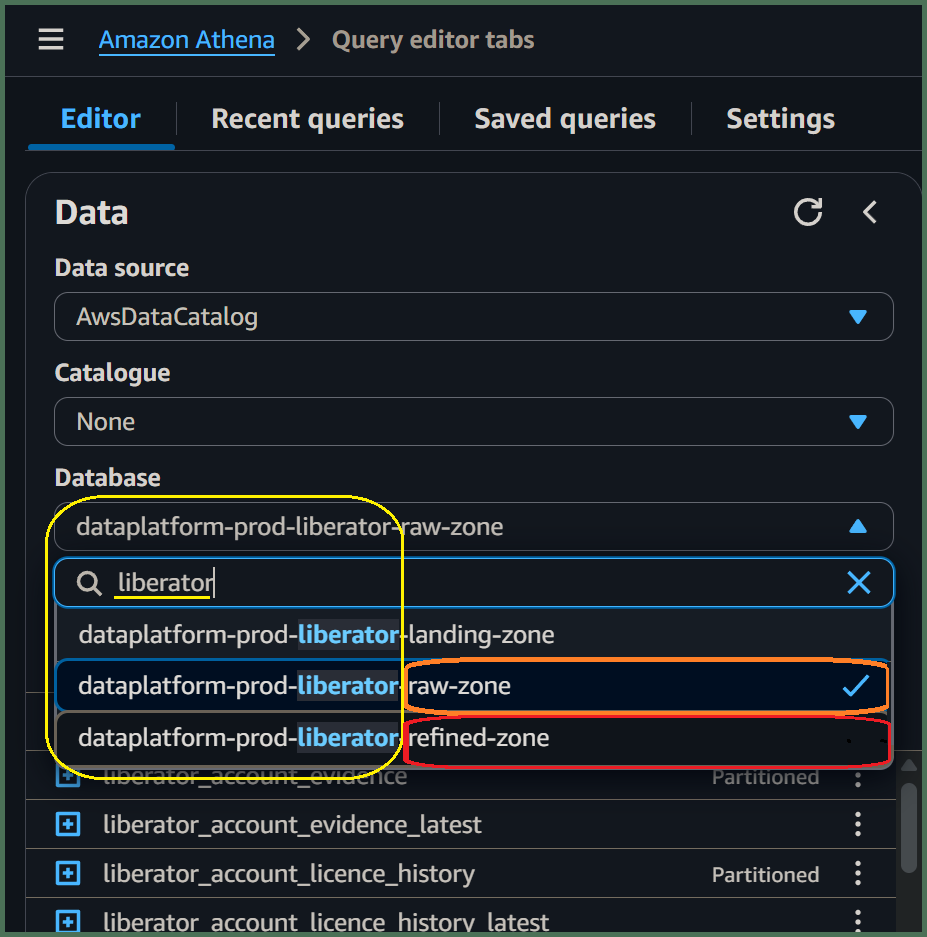
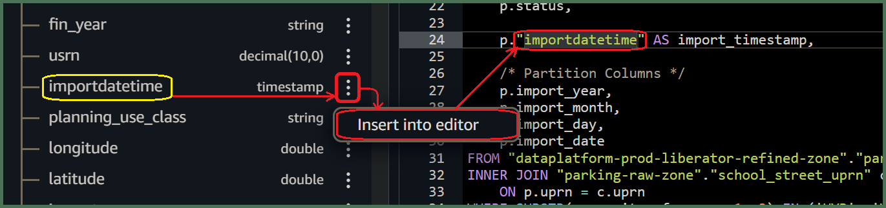

# How can I use ***Amazon Athena*** to prototype a simple *table-join* data transformation?
  

## 1. Access ***Amazon Athena***
**`🖱`** In your web browser, log in to your AWS account, navigate to the ***AWS Management Console***, and open ***Amazon Athena***. 
   
👉 First time ***Amazon Athena*** users may want to **start here ►** **[📚Amazon Athena](../parking/access-my-Amazon-Athena-database)** 

## 2. Select your `[service workgroup]`
**`🖱`** Ensure you have selected your `[service workgroup]` from the list-box next to “**Workgroup**”.  

:::info REMINDER
👉  Your **Service Terms`[]`** are defined in your **`welcome`** document stored in your `[service access group]`'s **►** [***Google Drive subfolder***](https://drive.google.com/drive/folders/1soY6hORmPVlRvlW_t1V1hTFXfZbLt6NS?usp=drive_link). 
:::

## 3. Explore your databases

💡 ***Athena’s*** **Database `[service zones]`** are named in the reverse *`"service-database-zone"`* format, where *`-zone`* *suffix* expands to either of:- 
- *`-raw-zone`*
- *`-refined-zone`*
- *`-trusted-zone`*

**`🖱`** Find your `[service zones]` databases by ***🔍typing into search box*** below "**Database**" over on the left side of the *Athena interface*. Then select the database *prefixed `-raw-zone`* from the list-box, which is equivalent to your `[service database]`.  

**`👁`** Afterwards, you should observe your `[service database]` equivalent tables with their columns and associated data types listed below "**`▼` Tables**". Make a note of columns which you understand to be a primary key of some sort.

**`Fig. 3`** 

**`🖱`** Go back to the list-box under "**Database**" and select the similarly named `service-database-`, this time *prefixed `-refined-zone`*.

**`👁`** Now, when you check below "**`▼` Tables**", you should observe various *refined product* tables with names you might not recognize. However, some of their columns and associated data types should resemble those of your `[service database]`. Observe particular columns which are the same as those primary key columns you noted previously.

👍 Great! You may have already discovered the tables you need to prototype a simple *table-join* SQL data transformation using **Athena**. Going forward, however, we will assume you have enough basic knowledge about your `[service database]` and data products available from the **Data Platform**, perhaps using BI tools and such like.

## 4. Prepare your `[Transform SQL]` query

You can either start completely from scratch, building up your query as you go along, or, begin with a SQL template design.  

👍 Let's get started! You will need to identify which tables and columns you need to use for your data transformation. We will assume, just like in the `[SQL template]`s below you want to join a *"child table"* from your  *`raw-zone` database* to a *"parent table"* from your *`refined-zone` database*. 

Decide whether your *transform query* needs to be **1:n** `LEFT JOIN` or **1:1** `INNER JOIN`:

### a) `[SQL template]` = 1:n LEFT JOIN

```sql
/********************************************************************************
[Transform description] 
*********************************************************************************/
SELECT 
    p.[parent primary key], 
    c.[child key], 

    [output columns], 
/* eg.
    p.col1,
    p.col2,
    p.etc.,
    c.col3,
    c.col4,
    c.etc., 
*/
    p.import_timestamp,
    
    /* Partition Columns */
    p.import_year,
    p.import_month,
    p.import_day,
    p.import_date

FROM "[service refined zone]"."[parent table]_latest" p
LEFT JOIN "[service raw zone]"."[child table]_latest" c
    ON c.[parent foreign key] = p.[parent primary key]
WHERE [filter expression]
ORDER BY
    p.[parent primary key],
    c.[child key]
LIMIT [rows fetched];
```  

👉 You'll find information about *Partition Columns* **here ► [📚Appendix ► A. Partition Columns](../parking/appendix-prototype-simple-transforms#a-partition-columns)**  

### b) `[SQL template]` = 1:1 INNER JOIN

```sql
/********************************************************************************
[Transform description] 
*********************************************************************************/
SELECT 
    p.[parent primary key], 

    [output columns], 
/* eg.
    p.col1,
    p.col2,
    p.etc.,
    c.col3,
    c.col4,
    c.etc., 
*/
    p.import_timestamp,
    
    /* Partition Columns */
    p.import_year,
    p.import_month,
    p.import_day,
    p.import_date

FROM "[service refined zone]"."[parent table]_latest" p
INNER JOIN "[service raw zone]"."[child table]_latest" c
    ON c.[parent foreign key] = p.[parent primary key]
WHERE [filter expression]
ORDER BY
    p.[parent primary key]
LIMIT [rows fetched];
```  

👉 You'll find information about *Partition Columns* **here ► [📚Appendix ► A. Partition Columns](../parking/appendix-prototype-simple-transforms#a-partition-columns)**  

**💡** These were the most common query arrangements found in the **Data Platform** when the old SparkSQL *transformations* were migrated to **DAP⇨flow**. 

When creating *table-join* transforms in future, you might want to begin with a previously migrated *SQL transform*, and modify that just as you would a `[SQL template]` here.

👉 After you've finish with this guide, you may want to check out guide for *Migrating SQL Transforms*, **here ►** **[📚Migrating transforms](../parking/migrating-transforms)**

## 5. Understand your data model

**`🖱`** You can switch between your `[service databases]` whenever you need to by using the *list-box* beneath "**Database**" in the ***Athena*** *interface*. Then, listed under "**`▼` Tables**", you should find the table you need. To make everything simple going forward, please only select the tables with a  `_latest` *suffix*.

👉 For an explanation about **accessing your current service data**, using the `_latest` *suffix*, **check here ►** **[📚My current service data](../parking/access-my-current-service-data)** 

For a *simple* ***table-join*** *data transformation* you will need the following tables:

- The **`[parent table]_latest`** with a unique `[parent primary key]` column.

- The **`[child table]_latest`** with a foreign key pointing to the `[parent table]`, which we will call the `[parent foreign key]` column. 

- If this is will to be a typical **1:n** `LEFT JOIN` query, we should also feature a separate unique `[child key]` column, if we want to properly sort our results afterwards.

**`🖱`** Click the "**`🞧`**" adjacent those table names, suffixed `_latest`, to expand them and observe their associated columns and data types. 

There, you should find:

- The `[... key]` columns, identified above, for the ***table-join***. 

- The source columns needed for your transformation's `[output columns]`.

The `[output columns]` may variously comprise of either:

- `.`*columns* directly associated with our tables used in the query.

- `AS`*named-column* expressions, involving ****SQL Functions*** and operators used to manipulate variables or `.`*columns*.

We may require a `[filter expression]` to ensure you only select the data we needed for your output. This is a logical-state expression which must involve at least one of our `.`*columns*, and may involve ***SQL Functions*** and operators to manipulate variables or various `.`*columns*.

👉 If your expressions require ***SQL Functions***, you can check the ***Amazon Athena* documentation ►[here](https://docs.aws.amazon.com/athena/latest/ug/functions.html)**.

Finally, take some time to think about how the `[Transform description]` should inform others about the data your SQL query will produce.

## 6. Customize your SQL in the query editor

**`🖱`** Begin by *copying* your preferred `[SQL template]` into your computer's clipboard, then *pasting* it directly into the ***Amazon Athena*** query editor

Did you decide whether your *transform query* needed to be **1:n** `LEFT JOIN` or **1:1** `INNER JOIN`?

👉 [📚**a)** `[SQL template]` = 1:n LEFT JOIN query...](#a-sql-template--1n-left-join)  

👉 [📚**b)** `[SQL template]` = 1:1 INNER JOIN query...](#a-sql-template--11-left-join)  

**`🖮`** Then, go through the `[SQL template]` line-by-line, replacing the `[`parameters`]` and making changes until you have created your new `[Transform SQL]`...

**`🖱`**  When replacing the `[parent table]_latest` and `[child table]_latest` template `[`parameters`]`, the Athena editor allows you to insert an actual ***table name*** listed under “**`▼` Tables**” over from the left-hand side of the interface. Simply click on the three dots **`⋮`**, to the right of the *table name*, then select “***insert into editor***”. 

**`Fig. 6a`** 

**`🖮`** Unfortunately, *Athena* will not insert the ***database name*** for you, so you will need to type it yourself! If omitted, then, when you come to test your query using the *Athena* **"Run"** button, then *Athena* assumes the database is whatever is currently selected under **Database**.  

- However, *table names* **must always** be qualified by their ***database name***, eg. `"[service raw zone]"."[table name]"` before deploying your `[Transform SQL]` using **DAP⇨flow**.  

- Use of fully-qualified *table names* means you can use tables from databases anywhere inside the **Data Platform**. For example, you might want to join your `[service raw zone]` *table* to another table from a different set of`[service zones]` databases where you are granted access. **`Fig. 6a`** and **`Fig. 6a`** show such an example.

**`🖱`** The Athena editor will insert actual ***column names*** after you have expanding them by clicking their "**`🞧`**" adjacent the table name. Again, right of the *column name*, adjacent it's data-type, simply click on the three dots **`⋮`**, then select “***insert into editor***”.  

**`Fig. 6b`** 
  
- ***Amazon Athena***, by default, renders all editor-inserted names encapsulated in `"..."` double-quotes. Double-quotes are not mandatory but are included for names containing spaces. We like to keep them for table names, but unfortunately they can be annoying for column names where we tend to remove them because they are universally disliked!

**`🖮`** You must include all the following partition-column names in your transform query output because they are expected later by the **DAP⇨flow** deployment, which writes your transform data out to their corresponding *S3 data lake* partition folders:  

* `import_date`  
* `import_year`  
* `import_month`  
* `import_day`

**`🖮`** Also, make any necessary changes to the `import_timestamp` template column. Eg. **`Fig. 6b`** shows us finding an alternative column from the database that we can insert in front of it.

👉 You'll find information about *Partition Columns* **here ► [📚Appendix ► A. Partition Columns](../parking/appendix-prototype-simple-transforms#a-partition-columns)**  

**`🖮`** It is highly recommended to sort your transform's output using `ORDER BY` to ensures the fetch-behavior remains predictable. Enter the appropriate sort key columns as per your `[SQL Template]`. 

**`🖮`** Adding a `LIMIT` clause at the end of your query when testing SQL queries in the Athena console normally prevents long-running queries when testing. You will routinely remove the `LIMIT` clause later when your transform goes into production.

## 7. Run your `[Transform SQL]` query  
**`🖱`** After customizing the SQL code, click “**Run**” or “**Run again**” located underneath the code window on the left side in the Athena interface.  

**`Fig. 7`** 

## 8. Review your results  
**`👁`** ***Amazon Athena*** should fetch data if no errors were found in your `[SQL Transform]`'s code.

- The number of rows fetched should be determined by your `LIMIT [rows fetched];`  

- The data should be sorted by whatever your `ORDER BY` specified. Eg. **`Fig. 7`** illustrates an `INNER JOIN` query sorted by a single `[parent primary key]` column.

- The data should comprise your `[output columns]` in the order left to right, as they were specified top to bottom.  

## 9. Save your query as `[Transform SQL]`
**`🖱`** Check you are in your correct `[service workgroup]` before clicking on the three dots **⋮** to the right of your Query tab, and clicking “**Save as**”.  

**`Fig. 9`**   

**`🖮`** When the dialogue pops up, enter a name for your `[Transform SQL]` eg. `[transform].sql` and write a description before clicking the “**Save query**” button.

**And you're done!**
<br> 
</br>  

---
## ***"We* ♡ *your feedback!"***
  
:::tip UX  
### 👉 Please use **this link ►** [**DAP⇨flow** `UX` **Feedback / prototype-simple-transforms**](https://docs.google.com/forms/d/e/1FAIpQLSc7nv1XmfRJKZlZTYIJQxAwbimUfsZLXQOVt3TJO-zUOjcRGQ/viewform?usp=pp_url&entry.339550210=prototype-simple-transforms)  

- Your feedback enables us to improve **DAP⇨flow** and our Data Analytics Platform service.  
- We encourage all our users to be generous with their time, in giving us their recollections and honest opinions about our service.  
- We especially encourage our new users to give feedback at the end of every **DAP⇨flow📚Migration onboarding** task because the quality of the onboarding experience really matters.  

    ☝ **Please use this link to help us understand your user experience!**
:::

## 📚`UX` Criteria
:::info ABILITY  
* **AWS Management Console** user  
* ***Amazon Athena*** beginner  
* Hackney `[service]` Data Analyst
* Hackney `[service database]` user
:::

:::note BEHAVIOR  
### How can I use ***Amazon Athena*** to prototype a simple table-join data transformation?
**Measures** the behavior of ***Amazon Athena*** while users prototype simple transforms:

**Given** in my web browser, I have accessed ***Amazon Athena***  
**~and** I have selected my `[service workgroup]`  
**~and** ***Amazon Athena*** shows my `[service zones]` databases with my `[service database]` equivalent tables and columns needed for my `[Transform SQL]`  
**~and** I am familiar with the concepts and basic requirements of writing an ***Amazon Athena*** SQL query  
**~and** I have chosen a `[SQL template]` for a **simple table-join query** with added essential elements eg. *Partition Columns*  
**~and** I can identify the following `[SQL template]` `[`*parameters*`]` needed for my `[Transform SQL]`:-
- /\* `[Transform description]` \*/
- SELECT `[output columns]`
- FROM `"[service refined zone]"."[parent table]_latest" p`
- JOIN `"[service raw zone]"."[child table]_latest" c`
- ON `p.[parent primary key]` = `c.[parent foreign key]`
- WHERE `[filter expression]`
- ORDER BY `p.[parent primary key]` (with `, c.[child key]` if needed)
- LIMIT `[rows fetched]`;

**When** I copy-and-paste the `[SQL template]` into the query editor    
**~and** I replace the `[SQL template]` `[`*parameters*`]` to create my `[Transform SQL]`  
**~and** make any necessary changes to the *Partition Columns* with the  `import_timestamp`  
**~and** I click “**Run**” underneath the code window on the left-hand side

**Then** ***Amazon Athena*** will display the first `[rows fetched]` of data ordered by `[parent primary key]`and`[child key]`, showing my selected `[output columns]`  
**~and** I can save my working and fully compliant `[Transform SQL]` query as `[transform].sql`, with a description, in my `[service workgroup]`.

**Scale** of 4 to 9 **~and** flow features.  
:::

---
## [📚Appendix](../parking/appendix-prototype-simple-transforms)

### ► [A. Partition Columns](../parking/appendix-prototype-simple-transforms#a-partition-columns) 

### ► [B. Conversations about style](../parking/appendix-prototype-simple-transforms#b-conversations-about-style) 

---
