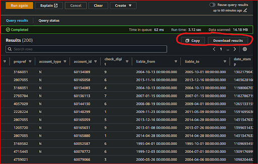

# How will I query and analyze my `[service]`'s data with ***Amazon Athena***?
  

## 1. Access ***Amazon Athena***
**`🖱`** In your web browser, log in to your AWS account, navigate to the AWS Management Console, and open Amazon Athena. 
   
👉 First time Amazon Athena users should **start here ►** **[📚Amazon Athena](../onboarding/access-my-Amazon-Athena-database)** 

## 2. Select your `[service workgroup]`
**`🖱`** Ensure you have selected your `[service workgroup]` from the list-box next to “**Workgroup**”.  

:::info REMINDER
👉  Your **Service Terms`[]`** are defined in the ***welcome*** document stored in your [**`[service access group]`** ***Google Drive subfolder***](https://drive.google.com/drive/folders/1k30M7Hh8WLttL5T5JVGbnKvSLNX7lVSg?usp=drive_link).
:::

## 3. Explore your database
**`🖱`** Select the `[service raw zone[ #]]` which is equivalent to your `[service database]`, from the list-box under "**Database**" on the left side of the Athena interface.  

**`🖱`** Expand the list under "**`►` Tables**" to reveal the database objects there.

**`👁`** You should observe your `[service database]` equivalent tables, suffixed with `..._latest`, with their columns and associated data types listed.

## 4. Familiarize yourself with SQL queries
**`🕮`** You will need to understand the concepts and basic requirements of writing SQL queries. This includes knowing how to select columns, filter data, join tables, etc.  

   👉 You can learn more about using Amazon Athena **►** [**here**](https://docs.aws.amazon.com/athena/latest/ug/using-athena-sql.html)

## 5. Run SQL queries
**`🖱`** Use the SQL query editor in ***Amazon Athena*** to write and run queries involving tables and columns equivalent to those in your original `[service database]`.

**`Fig. 5`** 

## 6. Analyze your data   
**`👁`** Review the results of your SQL queries to find answers to your questions about your `[service database]`.

**`Fig. 6`** 

**`🖱`** You can copy results to the clipboard.  

**`🖱`** You can download the results into a CSV file.  
  
   

---
## ***"We* ♡ *your feedback!"***
  
:::tip UX  
### 👉 Please use **this link ►** [**DAP⇨flow** `UX` **Feedback / query-my-service-data**](https://docs.google.com/forms/d/e/1FAIpQLSdqeNyWIPMNBHEr-YSyxnXQ4ggTwJPkffMYgFaJ4hGEhIL6LA/viewform?usp=pp_url&entry.339550210=query-my-service-data)  

- Your feedback enables us to improve **DAP⇨flow** and our Data Analytics Platform service.  
- We encourage all our users to be generous with their time, in giving us their recollections and honest opinions about our service.  
- We especially encourage our new users to give feedback at the end of every **📚Onboarding** task because the quality of the onboarding experience really matters.  

   ☝ **Please use this link to help us understand your user experience!**
:::

## 📚`UX` Criteria
:::info ABILITY  
* **AWS Management Console** user  
* **Amazon Athena** user  
* Hackney `[service]` Data Analyst
* Hackney `[service database]` user
:::

:::note BEHAVIOR  
### How will I query and analyze my `[service]`'s data with ***Amazon Athena***?
**Measures** the behavior of **Amazon Athena** when users' run working SQL queries:

**Given** in my web browser, I have accessed ***Amazon Athena***  
**~and** I have selected my `[service workgroup]`  
**~and** Amazon Athena shows my `[service raw zone[ #]]` with my `[service database]` equivalent tables, suffixed with `..._latest`, with their columns and associated data types  
**~and** I am familiar with the concepts and basic requirements of writing an ***Amazon Athena*** SQL query  

**When** I run my SQL query containing given those tables and columns  

**Then** I should be able to find answers to my questions about my `[service database]`    
**~and** I can copy results to the clipboard  
**~and** I can download the results into a CSV file  

**Scale** of 2 to 5 **~and** flow features.  
:::
