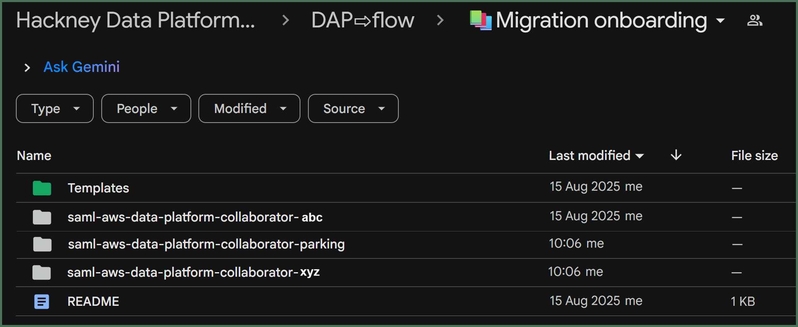
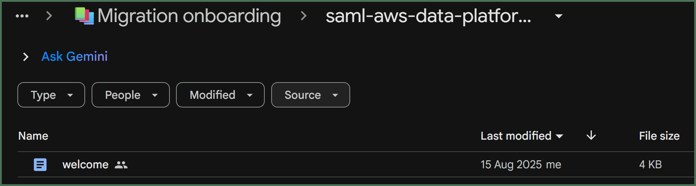

# Welcome to DAP⇨flow!
  

## 1. Were you added to your `[service access group]` [*Google Group*👥](https://groups.google.com/all-groups?q=saml-aws-data-platform-collaborator)? 

When you know your `[service access group]`, and you know you belong to it, then you may proceed.

👉 Otherwise ► [📚Begin here**](../parking/begin)  

## 2. Open your `[service access group]` [*Google Drive subfolder*](https://drive.google.com/drive/folders/1soY6hORmPVlRvlW_t1V1hTFXfZbLt6NS?usp=drive_link)  

**`🖱`** Open the [**DAP⇨flow📚Migration onboarding** *Google Drive folder*](https://drive.google.com/drive/folders/1soY6hORmPVlRvlW_t1V1hTFXfZbLt6NS?usp=drive_link) in your web browser.  

**`Fig. 2`** 

**`🖱`** Open the subfolder bearing the name of your `[service access group]`.  

## 3. Review all of your **Service Terms`[]`**

**`🖱`** When inside your your `[service access group]` [*Google Drive subfolder*](https://drive.google.com/drive/folders/1soY6hORmPVlRvlW_t1V1hTFXfZbLt6NS?usp=drive_link), open the "**`welcome`**" document.  

**`Fig. 3`** 

The following **REMINDER** appears throughout the [**DAP⇨flow📚Migration onboarding**](../introduction#migration-onboarding) quides, so you will be able to find your **`welcome`** document and be reminded of your **Service Terms`[]`** whenever you need them:

:::info REMINDER
👉  Your **Service Terms`[]`** are defined in your **`welcome`** document stored in your `[service access group]`'s **►** [***Google Drive subfolder***](https://drive.google.com/drive/folders/1soY6hORmPVlRvlW_t1V1hTFXfZbLt6NS?usp=drive_link). 
:::

Your Service "**`welcome`**" document provides you with every necessary translation for the **Service Terms`[]`** used throughout the [**📚Migration onboarding**](../introduction#migration-onboarding) guides, ensuring you are directed to the appropriate places while using the **Hackney Council AWS Console** or the **LBHackney-IT/dap-airflow** *GitHub repository*.

### Your general **Service Terms`[]`**  
- `[service]`         (Your service, department or directorate)
- `[service access group]`  ([*Google Group*👥](https://groups.google.com/all-groups?q=saml-aws-data-platform-collaborator) & [*Google Drive subfolder*](https://drive.google.com/drive/folders/1soY6hORmPVlRvlW_t1V1hTFXfZbLt6NS?usp=drive_link))
- `[service hotline]`       (Google Chat Space)
- `[service workgroup]`     (for Athena etc.)
- `[service role]`          (in the AWS console)
- `[service database]`      (Legacy or Enterprise database) 

### Your **Database `[service zones]`**
Defined and expanded, as required while using the ***AWS Console*** and ***Amazon Athena***:- 
- `[service zones]` = 
    - `[service raw zone]`  
    - `[service raw zone 2]` (optional second zone) 
    - `[service raw zone 3]` (optional third, etc.) 
    - `[service refined zone]`  
    - `[service refined zone 2]` (optional second zone) 
    - `[service refined zone 3]` (optional third, etc.) 
    - `[service trusted zone]`  

### Your `LBHackney-IT/dap-airflow` assets 
Find your ***GitHub*** service and dag project folders, for all your transforms and orchestrations, should be defined and expanded as required:- 
- `[service folder]` 
- `[service dags]` =
    - `[dag folder]` (primary dag folder)
        - `[transforms folder]`
        - `[orchestration folder]`
        - `[orchestration yaml]`
    - `[dag folder 2]`  (optional second dag)
        - `[transforms folder 2]` 
        - `[orchestration folder 2]`
        - `[orchestration yaml 2]`   
    - `[dag folder 3]` (optional third, etc.) 
        - `[transforms folder 3]`
        - `[orchestration folder 3]`
        - `[orchestration yaml 3]`

  
   

---
## ***"We* ♡ *your feedback!"***
   
:::tip UX  
### 👉 Please use **this link ►** [**DAP⇨flow** `UX` **Feedback / welcome**](https://docs.google.com/forms/d/e/1FAIpQLSc7nv1XmfRJKZlZTYIJQxAwbimUfsZLXQOVt3TJO-zUOjcRGQ/viewform?usp=pp_url&entry.339550210=welcome)  

- Your feedback enables us to improve **DAP⇨flow** and our Data Analytics Platform service.  
- We encourage all our users to be generous with their time, in giving us their recollections and honest opinions about our service.  
- We especially encourage our new users to give feedback at the end of every **DAP⇨flow📚Migration onboarding** task because the quality of the onboarding experience really matters.  

    ☝ **Please use this link to help us understand your user experience!**
:::

## 📚`UX` Criteria
:::info ABILITY  
* Hackney **Google Workspace** user 
* Hackney `[service]` Data Analyst
:::

:::note BEHAVIOR  
### Welcome to DAP⇨flow!
**Measures** the **DAP⇨flow📚Migration onboarding** documentation behavior:  

**Given** my name was added to the my [`[service access group]`](https://groups.google.com/all-groups?q=saml-aws-data-platform-collaborator)  

**When** I open the [**DAP⇨flow📚Migration onboarding** *Google Drive folder*](https://drive.google.com/drive/folders/1k30M7Hh8WLttL5T5JVGbnKvSLNX7lVSg?usp=drive_link) in my web browser  
**~and** open the subfolder bearing the name of my `[service access group]`  
**~and** there, open the document called "**`welcome`**"   

**Then** that "**`welcome`**" document will define the **Service Terms`[]`** I need: 
- while reading the **DAP⇨flow📚Migration onboarding** guides, 
- directing me to my `[service zones]` *databases* while using the ***AWS Console*** and ***Amazon Athena***  
- directing me to my ***GitHub*** *repository* project folders while accessing `LBHackney-IT/dap-airflow`  

**~and** the following terms should all be defined:  
- `[service]`  
- `[service access group]`  
- `[service hotline]`  
- `[service workgroup]`  
- `[service role]`  
- `[service database]`  
- `[service raw zone]`  
- `[service refined zone]`  
- `[service trusted zone]`  
- `[service folder]` 
- `[dag folder]`
- `[transforms folder]`
- `[orchestration folder]`
- `[orchestration yaml]`  

**~and** where those terms are expanded further, they will be collected within:
- `[service zones]` = { `...` }
- `[service dags]` = { `...` }

**Scale** of 4 **~and** flow features.
:::
