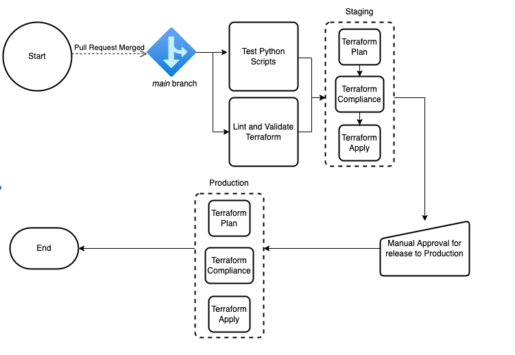

### Current Process

#### Staging and Production Deployment

1. Pipeline is triggered on merge of a pull request or commit of code to the ```main``` code branch of the Data Platform repository
2. Terraform and python scripts are then tested in parallel. For Python the unit tests are executed and for Terraform the source code is linted and then validated using ```tf lint``` and ```terraform validate``` commands 
3. If the previous steps are successful then a ```terraform plan``` followed by Terraform compliance checks and then finally a ```terraform apply``` is executed against the Staging environment
4. The pipeline then pauses for a manual approval.
5. If the manual approval step is approved then a ```terraform plan``` followed by Terraform compliance checks and then finally a ```terraform apply``` is executed against the Production environment
