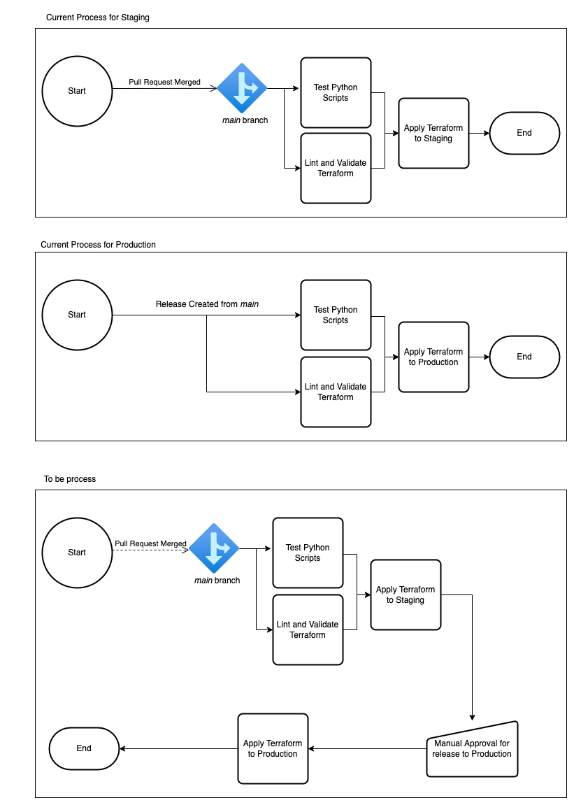

## Architecture



## Current Process

#### CI

1. The CI pipeline is triggered on every push to a branch that is not the ```main``` code branch
2. Terraform and python scripts are then tested in parallel. For Python the unit tests are executed and for Terraform the source code is linted, validated and then tested using ```tf lint``` and ```terraform validate``` commands and then finally a ```terraform plan``` against Staging

#### Staging Deployment
1. The staging deployment pipeline is triggered on merge of a pull request or commit of code to the ```main``` code branch of the Data Platform repository
2. Terraform and python scripts are then tested in parallel. For Python the unit tests are executed and for Terraform the source code is linted and then validated using ```tf lint``` and ```terraform validate``` commands
3. If the previous steps are successful then a ```terraform apply``` is executed against the environment

#### Production Deployment

1. The production deployment pipeline is triggered on manual creation of a release in the Data Platform repository
2. Terraform and python scripts are then tested in parallel. For Python the unit tests are executed and for Terraform the source code is linted and then validated using ```tf lint``` and ```terraform validate``` commands
3. If the previous steps are successful then a ```terraform apply``` is executed against the environment

## To Be Process

#### Staging and Production Deployment

In the near future there will be only 1 pipeline that completes the staging and production deployments together instead of 2 different pipelines. The below steps document the intended process

1. Pipeline is triggered on merge of a pull request or commit of code to the ```main``` code branch of the Data Platform repository
2. Terraform and python scripts are then tested in parallel. For Python the unit tests are executed and for Terraform the source code is linted and then validated using ```tf lint``` and ```terraform validate``` commands 
3. If the previous steps are successful then a ```terraform apply``` is executed against the Staging environment
4. The pipeline then pauses for a manual approval.
5. If the manual approval step is approved then a ```terraform apply``` is executed against the Production environment

Step 4 could be left out, and the change would flow straight through to production however this is something that may not be wanted

## Source Code

Github pipelines: [Link](https://github.com/LBHackney-IT/Data-Platform/tree/main/.github/workflows)