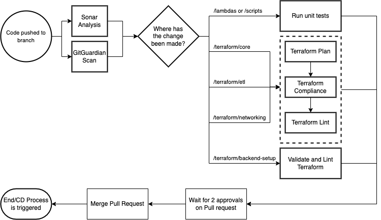

### Current Process

1. The CI pipeline is triggered on every push to a branch that is not the ```main``` code branch
2. Sonar Analysis and GitGuardian scans are automatically triggered - see independent sections below for more detail on these sections
3. Github then makes a decision on which workflow to run depending on where the change has been made in the repository
   
#### /lambdas or /scripts:
1. Run python unit tests
   
#### /terraform/core, /terraform/etl or /terraform/networking:
1. A ```terraform plan``` command is run against the staging environment
2. Terraform compliance then checks the outcome of the ```terraform plan``` to ensure it meets our requirements
3. Finally, a ``tf lint`` is completed to ensure all necessary resources have tags associated

#### /terraform/backend-setup
1. Source code is linted, validated and then tested using ```tf lint``` and ```terraform validate``` commands

### Sonar

SonarCloud is a cloud-based code quality and security service. Sonar supports scanning of multiple languages out of the box and then reports on four main metrics, Reliability, Security, Maintainability and a Security Hotspot Review

#### Reliability
Reliability is based on the total number of bugs in the repository or piece of code. A more in depth explanation of how the reliability metric is calculated can be found here: [SonarCloud Reliability](https://docs.sonarqube.org/latest/user-guide/metric-definitions/#header-6)          

#### Security
Security is based on the total number of vulnerability issues in the repository or piece of code. A more in depth explanation of how the security metric is calculated can be found here: [SonarCloud Security](https://docs.sonarqube.org/latest/user-guide/metric-definitions/#header-7)          

#### Maintainability
Maintainability is based on the total number of code smells in the repository or piece of code. Code smells are pieces of code that do not cause bugs or any imediate issue however they are generally bad practice and lead to a build up of technical debt if not fixed
A more in depth explanation of how the maintainability metric is calculated can be found here: [SonarCloud Maintainability](https://docs.sonarqube.org/latest/user-guide/metric-definitions/#header-4)

#### Security Hotspot Review
The Security hotspot review is based on the total number of security hotspots in the repository or piece of code. Security hotspots are not always an issue or a security problem but they have been flagged by Sonar as a 
security-sensitive piece of code that requires manual review to assess whether or not a vulnerability exists.

#### Quality Gate
The Sonar quality gate is an indicator that tells you whether your code meets the minimum level of quality required for our project. It consists of a set of conditions that are applied to the results of each analysis. If the analysis results meet or exceed the quality gate conditions then it shows a Passed status otherwise, it shows a Failed status.
More information about how the Sonar quality gate is calculated can be found here: [SonarCloud Quality Gate](https://docs.sonarcloud.io/improving/quality-gates/)

### GitGuardian
GitGuardian runs on every pull request and also against the main code branch to detect API keys, passwords, certificates, encryption keys and other sensitive data. If any of these things are found in your pull request you will not
be able to merge until the issue has been resolved. There are two options to resolving the issue, 1. Remove the password (or other sensitive information) from the repository and generate a new password so that there is no longer a security issue. 2. If GitGuardian has falsely flagged a
piece of code as a secret than you can mark the issue as a false positive and continue with your work. Documentation for GitGuardian can be found here: [GitGuardian](https://docs.gitguardian.com/)
