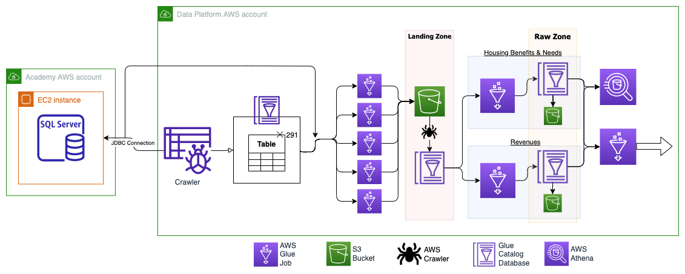

This section covers the overview of how Academy data is ingested onto the Data Platform from an MS SQL database and distributed to Housing Benefits & Needs and Revenues Departments

## Architecture 

A [JDBC connection][aws-jdbc-connection] (Glue Connection) is used to get access and connect to the Academy's MS SQL server database which contains Benefits & Housing Needs and Revenues data. 

The JDBC connection is used in both the AWS Glue crawler and AWS Glue job (seen in the diagram) to extract data from the SQL views and tables.
- JDBC is a low-level API for making database connections and handling SQL queries and responses. 

With the established connection, the Glue Crawler crawls the source database and populates a Glue Catalog database 
with the tables' structures; such as table schemas and other metadata of the specified tables from the MS SQL database.

The tables' schema and metadata are then read from the Glue Catalog Database, and multiple concurrent Glue jobs pull the data from the MS SQL Server source database via the JDBC Connection (ingestion of tables are divided up to improve efficiency), and then the data is written to a landing zone S3 bucket. 

Once the data has been ingested into the landing zone S3 bucket, it is then crawled and uploaded to a landing zone Glue Catalog database where another Glue job then copies it over to the respective Benefits & Housing Needs and Revenues raw zone department areas in S3 and Glue Catalog databases.

The departments' data then becomes available for querying in Athena and/or for further processing and transforming in Glue jobs to move the data to refined and trusted zones and ultimately pulled into BI tools such as Qlik and Google Data Studio.

[aws-jdbc-connection]: https://docs.aws.amazon.com/glue/latest/dg/connection-defining.html