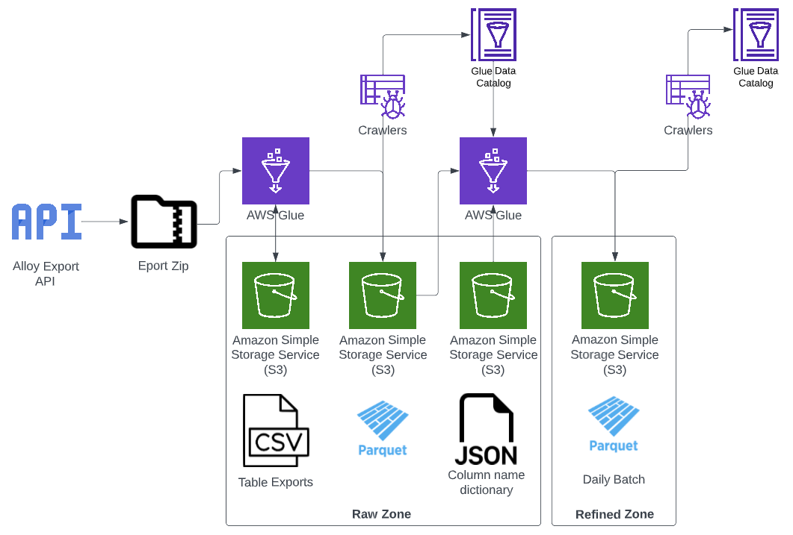

# This article describes the Alloy data ingestion process.

## Overview of process

The following diagram describes the process steps that make up the pipeline for ingesting Alloy data:



- An initial Glue job triggered on a schedule
  - requests the export described in AQS (Alloy query syntax) from the API
  - extracts the csv tables from the returned zip file and saves them to the _raw zone_ in S3
  - applies only a necessary amount of transformation to save a copy of the data as parquet files also to s3
- On job completion, a crawler updates tables in the env-services-raw Glue Catalog with the new parquet files
- A second Glue job then creates Dynamic Frames for all unprocessed parquet files for each table in the raw zone
  - this job then checks for a column name dictionary in S3 then applies a mapping if one is found
  - the transformed data is then exported to the refined zone and saved to s3
- This data is then crawled and made available in the _refined zone_ Catalog

## Retrieving a data extract from the Alloy API

  [*This Glue job*](https://github.com/LBHackney-IT/Data-Platform/blob/main/scripts/jobs/env_services/alloy_api_ingestion.py) sends queries to the Alloy API that request an extract of datasets described in [Alloy Query Syntax (AQS)](https://help.alloyapp.io/alloy-query-syntax/alloy-query-syntax.html). These queries are stored in json format and uploadeded to [this directory in the Data Platform GitHub repository](https://github.com/LBHackney-IT/Data-Platform/tree/main/scripts/jobs/env_services/aqs).

Each query creates a new job for that dataset that runs independently of any other queries.  

A request is sent to the API and once the export is complete the data is downloaded and extracted as a zip file containing csvs that are saved in S3. These csvs then read from the S3 bucket to a spark data frame. Minimal transformation is applied to allow for conversion to parquet format and import datetime columns are added. 

## Creating the refined tables

[*The second Glue job*](https://github.com/LBHackney-IT/Data-Platform/blob/main/scripts/jobs/env_services/alloy_raw_to_refined.py) looks for tables in the _env-services-raw-zone_ Glue Catalog database with a given prefix of the form "parent table name_".

It then iterates over each of the sub-tables to process any parquet files in the raw zone that have been created since the last run (identified using the [job bookmarking feature](https://docs.aws.amazon.com/glue/latest/dg/monitor-continuations.html)). 

As part of the refining process, the job checks for a json dictionary stored in s3 under the raw bucket with a key formed like this:


> env-services/alloy/mapping-files/parent table name_table_name.json

The json is of the form:

```json
{
    "old_name1": "new_name1",
    "old_name2": "new_name2",
    ...
}
```

If a key is not present in the table no action will be taken, and similarly if there is no key for a column that is present in the table it remains unchanged. 

Column names are cleaned to conform to requirements for parquet formatted files. Refined date columns are added. Then the resultant DynamicFrames are written to the _Refined Zone_. 

## Pipeline creation in Terraform

[The Terraform](https://github.com/LBHackney-IT/Data-Platform/blob/main/terraform/etl/25-alloy-etl-env-services.tf) will create a complete pipeline and triggers for each AQS json file added to the [aqs directory in the Data-Platform repository](https://github.com/LBHackney-IT/Data-Platform/tree/main/scripts/jobs/env_services/aqs).

The naming of these files dictates the names for the resources in AWS. Adding an AQS query in a file called "Parent Table.json" will create:
- A Glue trigger:
  - Alloy API Export Job Trigger **Parent Table**
- 2 Glue jobs:
  - alloy_api_export_**Parent Table**_env_services
  - **Parent Table**_alloy_daily_raw_to_refined_env_services
- 2 Crawlers
  - Alloy Export Crawler **Parent Table**
  - Alloy Refined Crawler **Parent Table**

Removing files from this location will result in the related AWS resources also being destroyed when the Terraform in applied. 
 


