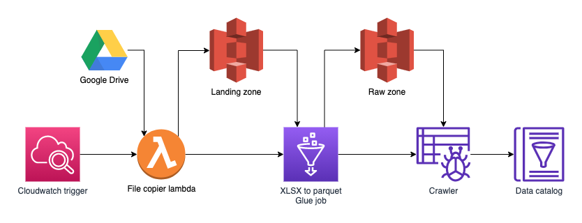

This section covers the technical overview of uploading data into the data
platform from a db instance in AWS. For step by step instructions on how to do
this, refer to [Import XLXS from G Drive](../playbook/import-xlsx-from-g-drive)
guide.

The terraform module [`import_xlsx_file_from_g_drive`](https://github.com/LBHackney-IT/Data-Platform/tree/main/modules/import-xlsx-file-from-g-drive) will provision the following resources:

  

At deployment a single lambda will be deployed per file along side a glue job
and crawler provisioned for each worksheet that will be imported.

After deployed a CloudWatch trigger will invoke the copier lambda at 10 am daily.

The lambda will copy the specified file into the S3 landing zone bucket and
start all the glue jobs that will import data from the defined workbooks.

Upon a successful glue job run a crawler will be run and produce a data catalog
for the dataset.
