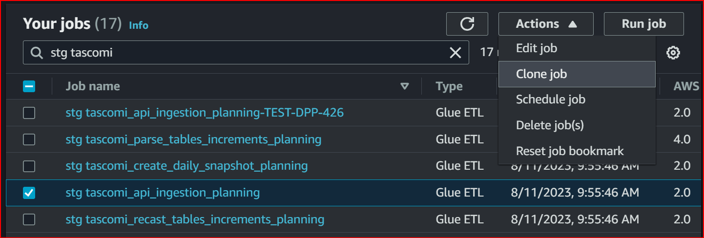
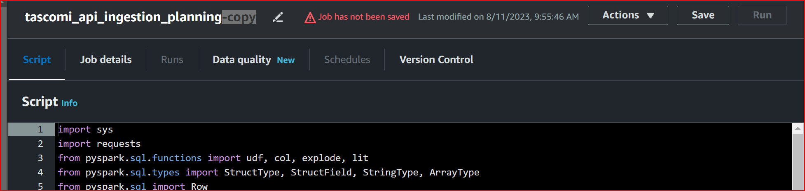
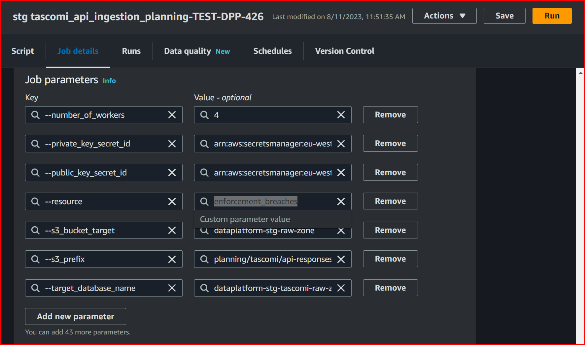
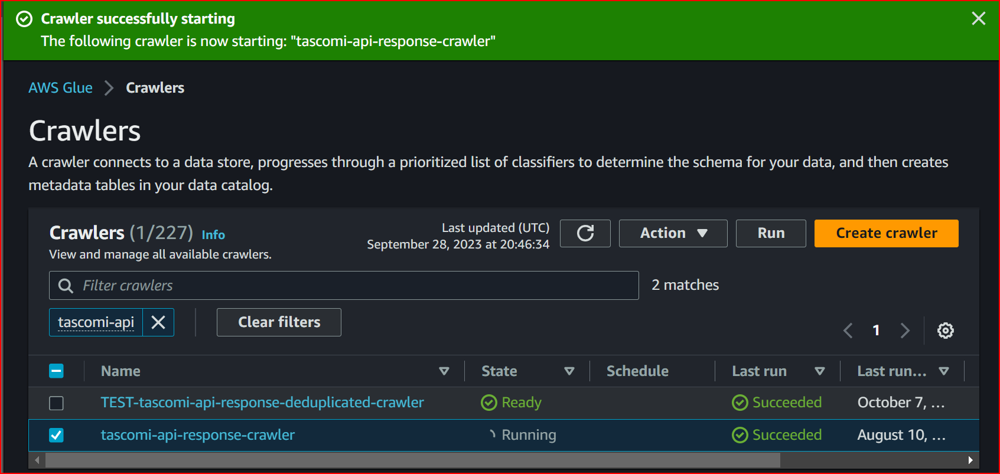
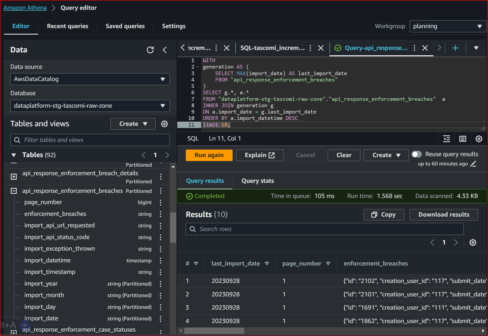
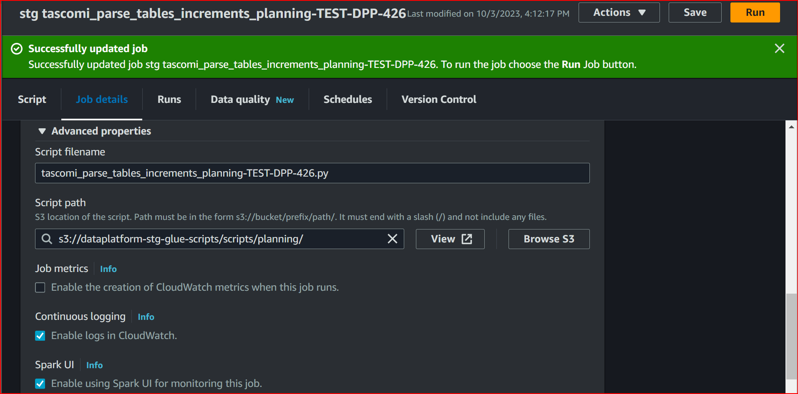
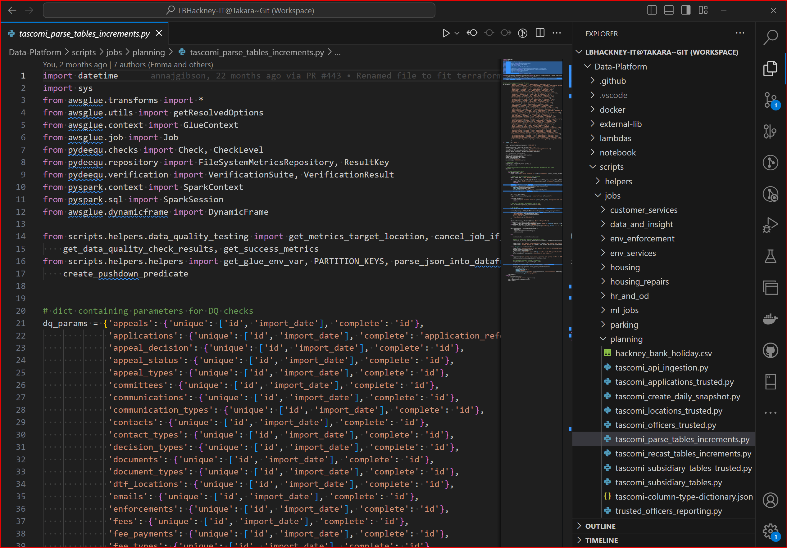
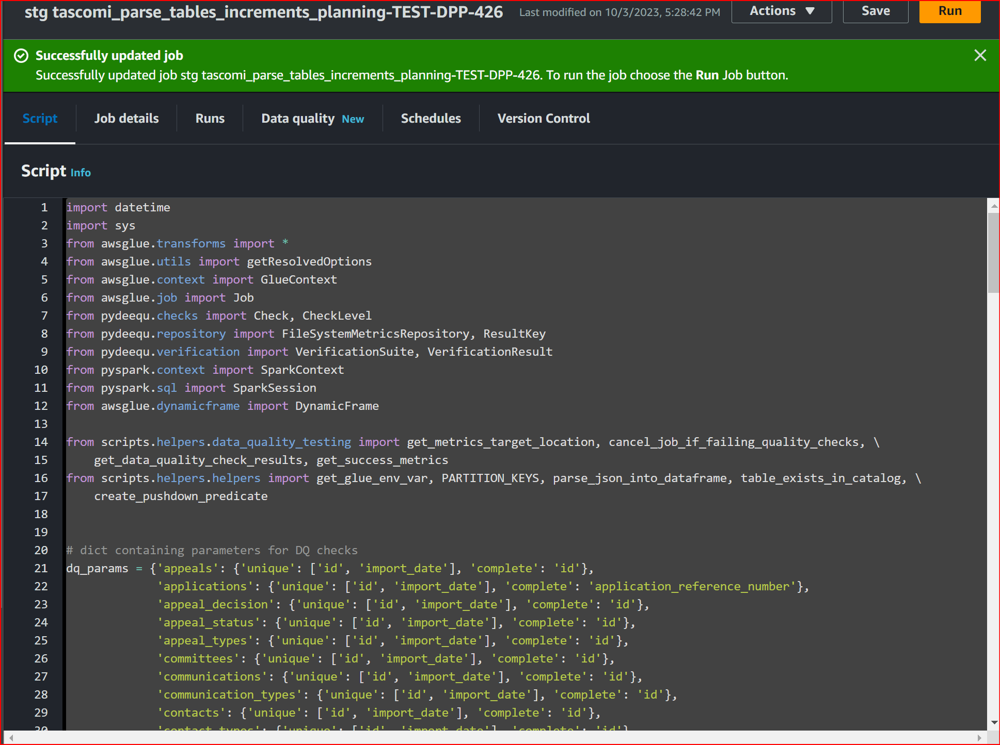
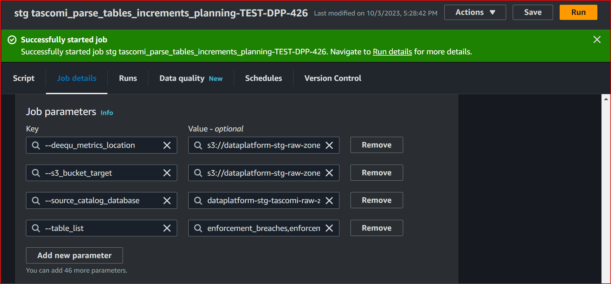

<!---
This markdown has Docusaurus :::features::: that will need uncommenting and enabling later. The larger **`ⓘ` SIDE NOTE** features have been moved to the appendices at the end of this document.
--->

<!---# How to add Tascomi tables to the Data Platform--->

## Introduction

This playbook guide describes how the Tascomi Planning data ingestion and refinement processes can be extended to include new table resources. The original description of the ingestion, which is written from the developer's perspective can be found ► [**here**](https://playbook.hackney.gov.uk/Data-Platform-Playbook/docs/tascomi-ingestion).

This guide will lead you through updating and testing the Tascomi Glue jobs in the **Data Platform** ***Pre-production*** environment. It diverges from the original developer guide in many respects, for example:

* It will not be necessary to test the [Tascomi API](https://hackney-planning.tascomi.com/rest/v1/documentation.html?public_key=dd95bcd473f46a4325a4021d54500c7d#available-resources) endpoints using a local Jupyter installation. So all of the testing is done in **Pre-Production** via  the ***AWS Management console***.

* It will not be necessary to add tables to the [column type dictionary](https://github.com/LBHackney-IT/Data-Platform/blob/main/scripts/jobs/planning/tascomi-column-type-dictionary.json) because this has already been done for all the current Tascomi API resources. There are some exceptions to the column types which are explained later.

Possible process simplifications and product improvements were exposed while writing and testing this guide. Indeed, such ideas may also find their way into other API ingestion products. This guide contains **`ⓘ` SIDE NOTE** features for such discussions.

The procedures in this guide are written in the BDD (Behavior Driven Design) narrative style of ***Given-When-Then***, explained further here ► [`ⓘ` SIDE NOTE appendix](#given-when-then).  

---

## Who this playbook guide is for

### This guide is essential for ***data analysts and engineers***

Data analysts, or engineers, asked to perform this task while working with or alongside the ***Data Platform team*** and can get started right away:

>**Given** you are a ***data analyst or engineer*** with access granted to the ***Data Platform***  
 **~and** your [AWS Start page](https://d-936715b9ec.awsapps.com/start#/) expands below the `AWS Account` box to show:

* `DataPlatformPlanningProd` listed under `DataPlatform-Production`
* `AWSPowerUserAccess` listed under `DataPlatform-Pre-Production`

>**When** you enter via the AWS `Management console`  
**Then** you should have access to `AWS Glue` and `Athena` via the **☷ Services** menu

### This guide is useful to ***any data professional***

Data professionals, curious about the Data Platform and want to understand how to maintain a data pipeline involving an API resource like Tascomi:

>How can I add API data resources to an existing data pipeline and have those data tables refreshed daily in the Data Platform? How hard is it actual practice? What can I learn from those having already done it? How can I make these processes more efficient and what opportunities are there to reduce platform running costs and make it easier to use and maintain?  

Either way, this guide assumes a basic understanding of `AWS Glue` and `Amazon Athena` and what they are for; assumes an understanding of how ***Git*** and ***Github*** work, eg. how to create a new branch and subsequently merge it with the main trunk of development. In practice, it is expected that analysts will need to reach out to other members of the **Data Platform team** for code review and assistance in deploying the changes and rolling back faults in production, since they will not have all the system permissions needed to do those things.

### The grand scenario

A data user [(persona identified later)](#user-story) discovered some ***Tascomi API resources*** needed for **Planning** but could not find the corresponding tables in the `dataplatform-prod-Tascomi-refined-zone` of the ***Production Data Platform***. The missing data resources must be added to the ***Tascomi data pipeline*** so the data user can find those tables and subsequently produce the insight needed by **Planning**.

This scenario may arrive as a customer service request and may be factored into a ticket template to form a [***numbered Jira ticket***](#the-grand-scenario)...

#### User story

>**As a** [data analyst working for Planning]  
>**I want** tables from [Tascomi] added to the Data Platform for exploration and analysis  
>**So that** I can better understand and continue to find answers to my questions about [Tascomi] data and further develop the data and insights that [Planning] needs.

#### Agency

>**[the engineer/analyst] will** discover [[the user]](#user-story)'s need for new tables and implement the required changes to [Tascomi] data ingestion.

#### User acceptance behaviors

>**Given** I can log into my Hackney Council Google account  
  **~and** I can access to the Data Platform via the AWS `Management console` link via [DataPlatformPlanningProd]
 and I am currently using `Amazon Athena`  
>**When** I select [dataplatform-stg-Tascomi-refined-zone] listed below `Database`  
  **~and** I explore the list of tables below that  
  **~and** expand the table names to see their columns listed  
>**Then** I should find [Tascomi] tables and column names with their respective equivalent data types from [[Tascomi API resources](https://hackney-planning.tascomi.com/rest/v1/documentation.html?public_key=dd95bcd473f46a4325a4021d54500c7d#available-resources)].

#### Delivery

>**[the engineer/analyst] will** test the required changes first in Pre-Production to foresee and fix faults before going to in Production.  
>**[the engineer/analyst] will** communicate with the Data Platform Team to ensure the required changes are deployed correctly into Production and ensure unforeseen faults can be rolled back swiftly to minimize the impact on the exiting pipelines and minimize potential disruption to [other data users].  
>**[the engineer/analyst] will** communicate with [[the user]](#user-story) to ensure these acceptance behaviors are met.

How does the scope of the playbook guide depend on [user acceptance behaviors](#user-acceptance-behaviors)? See the explanation here ► [`ⓘ` SIDE NOTE appendix](#how-does-the-scope-of-the-playbook-guide-depend-on-user-acceptance-behaviors).

### Alternative scenarios considered

This guide contains a detailed procedure for adding new table resources. However, other superficially similar but different scenarios may arise, requiring alternative remedies, as follows:

#### a) Discovering new data attributes were added by the vendor, added to the static tables

 It is generally rare for vendors to frequently change REST API schemas that their customers rely upon. Far more likely with Tascomi though, are additions to attributes or coded-lookups, possibly required by changes to Planning procedures or legislation and implemented in the Tascomi software by the vendor.

 In such cases, involving static tables, the existing ingestion pipeline should automatically absorb those changes and it will be the job of data analysts to expose data linked to new attributes or lookups, in their own applications or pipelines. Indeed, they should be mindful of how any such additions in future might have side effects, eg. consider how aggregates are performed by their applications.

 Because changes to static tables occur infrequently, any attributes added to static tables will be ingested on a weekly basis. But on discovery if this is needed sooner, ingestion could be manually triggered any time.

#### b) Discovering changes made to Tascomi API by the vendor

Although it ought to be rare for the Tascomi vendor to change it's REST API schema, there remain however, weaknesses in the Tascomi data model that could force such changes in future.

Indeed, it is conceivable that the main Tascomi `Application` table might be extended further with new columns. This is a high risk future requirement due to this table's insufficient normalization by the vendor, such that the `Application` table has grown to a colossal 752 columns. Alternatively, columns might have been logically grouped and migrated to separate tables, instead of being left in this unwieldy current form.

But if the main `Application` table were to change then the following procedural steps will be of little practical use since the existing Tascomi data pipeline would need to be re-engineered and tested first. In such an event you would need to seek advise from the Data Platform team.

<!---:::info--->
>**`ⓘ` INFO**  
>A toolkit currently in development, comprising AWS Glue & Athena SQL scripts will be linked here later to make it easy to discover API changes.
>
>It works by scraping the [Tascomi API documentation](https://hackney-planning.tascomi.com/rest/v1/documentation.html?public_key=dd95bcd473f46a4325a4021d54500c7d#available-resources) from the website and collecting the results in a CSV file where a Glue job can process it and compares it to the [JSON column-type dictionary](https://github.com/LBHackney-IT/Data-Platform/blob/main/scripts/jobs/planning/tascomi-column-type-dictionary.json) currently in production.
<!---:::--->

---

## How to proceed with your code changes

### Create and check out a new Git branch for your code changes

>**Given** you have a ***Github*** account  
 **~and** were added to the [LBHackney-IT/Data-Platform](https://github.com/LBHackney-IT/Data-Platform) repository  
 **~and** have set yourself up to use ***Git*** on your computer, preferably using a code editor eg. [Visual Code Studio](https://code.visualstudio.com/download),  
 **~and** have cloned the [LBHackney-IT/Data-Platform](https://github.com/LBHackney-IT/Data-Platform) repository on your computer  
>**When** you *create* and *check out* a new ***Git*** *branch*  
 **~and** the name of *your new branch* refers to the [***Jira ticket number***](#the-grand-scenario) generated above. For example "DPP-426" substituting your own [***ticket number***](#the-grand-scenario),  
>**Then** your *branch name* will assist the ***Data Platform team*** in tracking your changes  
 **~and** you may proceed to commit all your changes, as outlined below, via *your own branch*.

### Compare the tables to be added with the entries in the column-type dictionary

The [JSON column-type dictionary](https://github.com/LBHackney-IT/Data-Platform/blob/main/scripts/jobs/planning/tascomi-column-type-dictionary.json) supports the **recast increment** job based on the[`tascomi_recast_tables_increments.py`](https://github.com/LBHackney-IT/Data-Platform/blob/main/scripts/jobs/planning/tascomi_recast_tables_increments.py) python code script that converts column strings not defined as ***text*** in the [Tascomi API](https://hackney-planning.tascomi.com/rest/v1/documentation.html?public_key=dd95bcd473f46a4325a4021d54500c7d#available-resources), to their correct data types, as required by their respective *refined tables* in the ***Data Platform Planning refined zone***.  

New resource tables must have all their columns checked against this dictionary however there will be an opportunity to [test this later](#test-your-code-changes-in-pre-production) in **Pre-Production**.

But whenever API anomalies are discovered it is wise to stop and [consider alternative scenarios](#alternative-scenarios-considered) that might have arisen.

<!---:::warning--->
>**`⚠` WARNING**  
>**(*Or did someone just forget to do it?*)**  
>
>Please be aware, at the time of writing, of two existing tables `asset_constraints` and `pre_applications` that were ***deliberately*** left out of the column-type conversion dictionary due to other pipelines depending upon them in their unconverted state. The plan is to remove this warning from the documentation only when the issue is finally resolved.
<!---:::--->

### Add the new tables to the [Terraform script](https://github.com/LBHackney-IT/Data-Platform/blob/main/terraform/etl/24-aws-glue-tascomi-data.tf)

You will need to decide whether new tables should be ingested *daily* by appending them to the `tascomi_table_names` list, or ingested *weekly* by appending them to the `tascomi_static_tables` list.  

>**When** you have your code editor open on your computer  
 **~and** have your cloned `Data-Platform` ***Git*** repository open on your computer  
 **~and** have checked out your ***Git*** development branch, eg. "DPP-426" substituting your own [***ticket number***](#the-grand-scenario) generated above  
 **~and** have the [`24-aws-glue-tascomi-data.tf`](https://github.com/LBHackney-IT/Data-Platform/blob/main/terraform/etl/24-aws-glue-tascomi-data.tf) ***terraform script*** open on your computer screen,  
>**When** you make the following [required changes to your terraform script](#required-terraform-script-changes)  
 **~and** *save, commit and synch* your code with the remote `Data-Platform` ***GitHub*** repository
>**Then** you may proceed.

#### Required Terraform script changes

Studying what each Tascomi API resource or table does and by examining the relationships between tables, via embedded `_id` columns, you may be able to decide which list, `tascomi_table_names` or `tascomi_static_tables`, each new table belongs to. You can also refer to the [Tascomi API schema diagram](../docs/images/tascomi-API-schema.png) for help.

However, you will be able to test your assumptions later in **Pre-Production** when you will have the opportunity to query and analyze how the data changes over time, so it is not necessary to decide from the outset. But if you are really not sure about where some tables belong, then simply add them to the `tascomi_table_names` list for now and you can move them to `tascomi_static_tables` later on if required.

>**Does it really need to be more complicated than just doing the Terraform?**  
>Check out the full discussion here ► [`ⓘ` SIDE NOTE appendix](#does-it-really-need-to-be-more-complicated-than-just-doing-the-terraform).  

### Add basic data quality tests to the relevant scripts

[Quality testing with PyDeequ](https://playbook.hackney.gov.uk/Data-Platform-Playbook/playbook/transforming-data/guides-to-testing-in-the-platform/data-quality-testing-guide) is defined within each relevant `<tascomi-code>.py` python script below:

>**When** you have your code editor open on your computer  
 **~and** have your cloned `Data-Platform` ***Git*** repository open on your computer  
 **~and** have checked out your ***Git*** development branch, eg. "DPP-426" substituting your own [***ticket number***](#the-grand-scenario)  
 **~and** have the `Data-Platform/scripts/jobs/planning/<tascomi-code>.py` ***python code*** open on your computer screen,  
>**When** you make the [required changes to your code](#required-code-changes)  
 **~and** *save, commit and synch* your code with the remote `Data-Platform` ***GitHub*** repository
>**Then** you may proceed.

#### Required code changes

The parsing script [`tascomi_parse_tables_increments.py`](https://github.com/LBHackney-IT/Data-Platform/blob/main/scripts/jobs/planning/tascomi_parse_tables_increments.py) has tests implemented and is relevant to this task. For your new tables to be quality-checked each day, you will need to open this script and add lines in th `dq_params =` section of code for each new API resource, represented by `<resource-name>`, that you want added as follows:

```python
dq_params = {'<resource-name>': {'unique': ['id', 'import_date'], 'complete': 'id'}
             }
```

In this example, for the job to complete successfully, the table called `api_response_<resource-name>`, with `<resource-name>` representing the API resource added to the script, the combination of `'id'` and `'import_date'` must be unique, and the `'id'` field must contain data, ie., `'complete'`.

In a very few exceptional cases, because only a single instance of a `'complete'` test is permitted per `<resource-name>`, you may decide to change the `'id'` on the right for another column from the table instead.

Similar such tests are relevant to the daily snapshots script [`tascomi_create_daily_snapshot.py`](https://github.com/LBHackney-IT/Data-Platform/blob/main/scripts/jobs/planning/tascomi_create_daily_snapshot.py) as follows:

```python
dq_params = {'<resource-name>': {'unique': ['id']}
             }
```

In this example, for the job to complete successfully, the table called `increment_<resource-name>` just needs the `'id'` column to be unique.

---

## Test your code changes in Pre-Production

This section will guide you through running `AWS Glue` scripts manually in Pre-production for the new tables you want to add to ensure each stage ETL process actually works and we can check the results later using `Amazon Athena`.

>**Why are we testing our code changes directly in the AWS console?**  
>Check out the full discussion here ► [`ⓘ` SIDE NOTE appendix](#why-are-we-testing-our-code-changes-directly-in-the-aws-console).

**`🖱`** ***When you are ready we can begin...***  
>**Given** you logged into the AWS `Management console` via the `AWSPowerUserAccess` link  under `DataPlatform-Pre-Production`  
 **~and** navigated to `AWS Glue` via the **☷ Services** menu  
 **~and** from the left menu selected [`ETL jobs`](https://eu-west-2.console.aws.amazon.com/gluestudio/home?region=eu-west-2#/jobs),  
>**When** in the search field below `Your Jobs` (where it says *Filter jobs*) you type: ***`stg tascomi`***,  
>**Then** you should see listed below `Job name`, all of the following Glue ETL jobs belonging to the Tascomi data ingestion pipeline...
>
>1. `stg tascomi_api_ingestion`
>2. `stg tascomi_parse_tables_increments`
>3. `stg tascomi_recast_tables_increments`
>4. `stg tascomi_create_daily_snapshot`
>
>(This is also shown in [**step 1.1.1**](#11-clone-the-api-ingestion-job))

<!---:::note--->
>**`ⓘ` NOTE**  
> The prefix `stg` is used everywhere in **Pre-Production** as opposed to `prod` used everywhere in **Production**.
<!---:::--->

**`🖱`** ***Did that work for you?***  
>**But** if in your own console, you do not see the ***`stg tascomi`*** jobs listed ingestion jobs, which should have been generated in **Pre-Production** by the ***Terraform Continuous Integration***, then please immediately consult the Data Platform team.

All being well, use the following sections to test your code changes, step by step.

>**How might improvements to the data pipeline product contribute to a more efficient and less wasteful production-line process?**  
>Check out the full discussion here ► [`ⓘ` SIDE NOTE appendix](#how-might-improvements-to-the-data-pipeline-product-contribute-to-a-more-efficient-and-less-wasteful-production-line-process).  

---

### 1. Testing the Tascomi API Ingestion

You must test your new table resources, one at a time, to ensure the Tascomi API does what we expect. In the sections further, on involving the subsequent jobs, you will be able to test all your tables at once, so the testing process will speed up as you go along.

#### 1.1 Clone the API ingestion job

This section covers cloning a job in detailed steps. Sections beyond this that also involve cloning other jobs will not repeat this level of detail since the process is practically the same and you probably will remember how you did it the first time around. You can always refer back here if you need to.

**`🖱` Step 1.1.1** find the script to clone
>**Given** you navigated to `AWS Glue`'s [`ETL jobs`](https://eu-west-2.console.aws.amazon.com/gluestudio/home?region=eu-west-2#/jobs)  
 **~and** below `Your Jobs` you typed ***`stg tascomi`*** to find the Tascomi data ingestion pipeline jobs, as shown below...
  
>**When** you check `☑` against `stg tascomi_api_ingestion`  
 **~and** select `Clone Job` from the `Actions` menu  
>**Then** you should immediately be taken to `Glue Studio`.

**`🖱` Step 1.1.2** in Glue Studio
>**Given** your cloned API ingestion job is now shown in `Glue Studio` as below...  
  
>**When** you change `🖊` the job name from `stg tascomi_api_ingestion-copy` to  
`stg tascomi_api_ingestion-TEST-DPP-426` (replacing `DPP-426` with your own [***ticket number***](#the-grand-scenario))  
 **~and** click `Save` over on the right  
>**Then** you may proceed to test your API resource tables.

<!---:::note--->
>**`ⓘ` NOTE**  
> The python script attached to this job does not need to change and will remain in its original form as `tascomi_api_ingestion.py`.
<!---:::--->

#### 1.2 Test each new API resource using the cloned job until done

There are alternative ways to proceed. You should either:  

**a)** Simply, repeat all **steps 1.2.1 to 1.2.4** for each and every new API resource.

**b)** Or more quickly, repeat **step 1.2.1** each and every new resource, then run **step 1.2.2** just once to crawl all the table outputs, then proceed with **step 1.2.3** and **step 1.2.4** to check each table's results in quick succession.  

If you are not confident but you have many new resources to add, then you might proceed along option **(a)** for your first API resource, then proceed along option **(b)** to more quickly process the remainder of your API resources.

**`🖱` Step 1.2.1** configure and run each new resource for API testing  
>**Given** your cloned job is open in `Glue Studio`  
 **~and** you have expanded `Advanced Properties` at the bottom of the `Job details` tab  
 **~and** have scrolled down to `Job parameters` as shown below...  
  
>**When** you add or update the ***Key*** `--resource` with the corresponding ***Value*** set to name of your next API resource  
 **~and** click `Save` then `Run` over on the right  
>**Then** you should immediately see this message telling you your job has started...  
  
 **~and** clicking on ***Run details*** should take you to the `Runs` tab  
 **~and** you should see the ***Run status*** of your job which after a few minutes should say ***✓ Succeeded***  
 **~and** your new API data should be added to the S3 bucket `--s3_bucket_target` = `dataplatform-stg-raw-zone` in the path `s3_prefix` = planning/tascomi/api-responses/` (also shown above)  
 **~and** you may proceed to crawl your new data for the target database `dataplatform-stg-tascomi-raw-zone` for the `AwsDataCatalogue`.

**`🖱` Step 1.2.2** crawl the new API data for the Data Catalog
>**Given** you navigated to `AWS Glue` via the ☷ Services menu  
 **~and** from the left menu expanded the `Data Catalog` sub-menu  
 **~and** have selected [`Crawlers`](https://eu-west-2.console.aws.amazon.com/glue/home?region=eu-west-2#/v2/data-catalog/crawlers),  
>**When** in the search field under `View and manage all available crawlers.` where it says *Filter crawlers*, you type: ***`tascomi-api`*** and hit enter  
 **~and** you check `☑` against `tascomi_api_response-crawler`  
 **~and** click `Run` over on the right,  
>**Then** you should immediately see the ***✓ Crawler successfully starting*** message, as shown below...
  
>**~and** after a few minutes, you should observe the ***State*** of the crawler `tascomi_api_response-crawler` change from **⟳Running** to **✓Succeeded**  
 **~and** the `AwsDataCatalogue` should be updated with the new `api_response_<resource-name>` table and data in the `dataplatform-stg-tascomi-raw-zone` database  
 **~and** you may proceed to query the data using `Amazon Athena`.

**`🖱` Step 1.2.3** find the new table using Amazon Athena
>**Given** you navigated to `Amazon Athena` via the ☷ Services menu  
 **~and** over on the top right, **Workgroup** has `planning` selected  
 **~and** on left under **Data**, **Data source** has `AwsDataCatalogue` selected  
 **~and** below that, **Database** has `dataplatform-stg-tascomi-raw-zone` selected, as shown below...  
  
>**When** you expand **Tables** and scroll down the list below,  
>**Then** you should find the table `api_response_<resource-name>` where `<resource-name>` is the name of the next API resource you are hoping to see  
 **~and** expanding that table you should see it's column names and types, as shown above  
 **~and** and you may proceed to test the data in that table by running a query.

**`🖱` Step 1.2.4** query the new data using Amazon Athena
>**Given** in `Amazon Athena` you found the table `api_response_<resource-name>` where `<resource-name>` is the name of the next API resource you want to query,  
**When** you ***copy-and-paste*** the following **SQL code** into the query editor  
 **~and** replace `<resource-name>` with the next resource you want to query, as show in **step 1.2.3**,

```sql
WITH
generation AS (
    SELECT MAX(import_date) AS last_import_date
        FROM "dataplatform-stg-tascomi-raw-zone"."api_response_<resource-name>"
)
SELECT g.*, a.* 
    FROM "dataplatform-stg-tascomi-raw-zone"."api_response_<resource-name>" a
INNER JOIN generation g
ON a.import_date = g.last_import_date
ORDER BY a.import_datetime DESC 
limit 10;
```

>**~and** click `Run` underneath on the left,  
>**Then** the **Query result** should show `last_import_date` = ***today's date***  or the `import_datetime`when you recently did **step 2.1.1**  
 **~and** you should see a column, headed by the **resource name**, containing ***a JSON data string*** which holds ***the API response***  
 **~and** you may proceed to [test your next new API resource table](#12-test-each-new-api-resource-using-the-cloned-job-until-done)  
 **~and** when all the new tables are done you may proceed to [test the increment jobs](#2-testing-the-tascomi-parse-table-increment-job).

<!---:::note--->
>**`ⓘ` NOTE**  
> The requirement for `-stg-` in database naming is implemented everywhere in **Pre-Production** as opposed to `-prod-` used everywhere in **Production**. That means later on, when you want to check the same data using SQL over in **Production**, you will need to update your scripts first.
<!---:::--->
  
**`🖱`** ***Did that work for you?***  
>**But** when these steps do not *behave* as described, if you suspect the fault with the Tascomi API, or you encounter some other problem preventing you from proceeding, and you are unable to resolve these issues by yourself, please then seek help from the Data Platform team.

All being well, you may proceed to the next section 2.

>**Given the benefit of hindsight, how might improving the API response ingestion code simplify our production-line testing procedure?**  
>Check out the full discussion here ► [`ⓘ` SIDE NOTE appendix](#with-the-benefit-of-hindsight).  

---

### 2. Testing the Tascomi Parse table increment job

Unlike the previous section, in this section and sections involving the subsequent jobs, you will be able to test your tables all at once, so the testing process will speed from this point onward.

Also, going forward, there will be less screenshot images because you as you increasingly become familiar with the AWS console interface. The step-by-step ***Given-When-Then*** behaviors will hopefully be sufficient to guide you through to the very end even without images.

#### 2.1 Clone the Tascomi Parse table increment job

**`🖱` Step 2.1.1** find the script to clone
>**Given** you navigated to `AWS Glue`'s [`ETL jobs`](https://eu-west-2.console.aws.amazon.com/gluestudio/home?region=eu-west-2#/jobs)  
 **~and** below `Your Jobs` you typed: ***stg tascomi*** to find the Tascomi data ingestion pipeline jobs (like you saw previously in [**step 1.1.1**](#11-clone-the-api-ingestion-job)),  
>**When** you check `☑` against `stg tascomi_parse_tables_increments`  
 **~and** select `Clone Job` from the `Actions` menu  
>**Then** you should immediately be taken to `Glue Studio`.

**`🖱` Step 2.1.2** in Glue Studio
>**Given** your cloned job `stg tascomi_parse_tables_increments-copy` is shown in `Glue Studio` (like you saw in [**step 1.1.2**](#11-clone-the-api-ingestion-job)),  
>**When** you change `🖊` the job name from `stg tascomi_parse_tables_increments-copy` to  
`stg tascomi_parse_tables_increments_planning-TEST-DPP-426.py` (replacing `DPP-426` with your own [***ticket number***](#the-grand-scenario))  
 **~and** click `Save` over on the right  
>**Then** you may proceed to edit your cloned job.

#### 2.2 Edit your cloned Tascomi Parse table increment job to introduce your code changes

Before you can add your [required code changes](#required-code-changes) to the current `s3://dataplatform-stg-glue-scripts/scripts/planning/tascomi_parse_tables_increments.py` you must clone and rename it, to differentiate it from the original script deployed in both **Production** and **Pre-production** environments.

**`🖱` Step 2.2.1**  create your test script
>**Given** the `Job details` tab of the cloned job is shown in `Glue Studio`  
>**When** you expand `Advanced Properties` below `Job details`  
 **~and** change the script name from `tascomi_parse_tables_increments_planning.py` to  
`tascomi_parse_tables_increments-DPP-426.py` (replacing `DPP-426` with your own [***ticket number***](#the-grand-scenario))  
 **~and** confirm the `Script Path` set to `s3://dataplatform-stg-glue-scripts/scripts/planning/`  
 **~and** click `Save` over on the right, as shown below...  
  
>**Then** your test script `s3://dataplatform-stg-glue-scripts/scripts/planning/tascomi_parse_tables_increments-DPP-426.py` (replacing `DPP-426` with your own [***ticket number***](#the-grand-scenario)) will automatically be created as a copy of the original `tascomi_parse_tables_increments.py`  
 **~and** you may now proceed to edit your test script.

<!---:::note--->
>**`ⓘ` TIP**  
>Also shown in the **Step 2.2.1** screenshot: You can click on `View` next to the path entry under `Script path` to open a new browser tab for `Amazon S3` with the contents of the `planning/` folder. When you click on the `Last modified ▲` heading, the entries get sorted with your newest test script at the top. When you check `☑` against your script you can `Download` it to your computer to inspect it with your code editor.
<!---:::--->

**`🖱` Step 2.2.2** edit your test script
>**Given** in `Glue Studio` you changed the script name to `tascomi_parse_tables_increments-DPP-426.py` (replacing `DPP-426` with your own [***ticket number***](#the-grand-scenario)) and clicked `Save`with `Glue Studio` still open on your screen as shown in **step 2.2.1**  
 **~and** meanwhile on another screen (or window), you have your code editor open  
 **~and** have the `Data-Platform` Git repository open on your development branch eg. "DPP-426" (replacing `DPP-426` with your own [***ticket number***](#the-grand-scenario))  
 **~and** [your updated Python code](#required-code-changes) `Data-Platform/scripts/jobs/planning/tascomi_parse_tables_increments.py` is open in your code editor as shown below...  
  
>**When** you select your entire Python code and copy it into your computer's clipboard  
 **~and** you return to the screen where you have `Glue Studio` open  
 **~and** you click on the `Script` tab at the top to reveal the original code  
 **~and** you select the original code, delete it, then paste in your new code from your computer's clipboard,  
 **~and** click `Save` over on the right, as shown below...  
  
>**Then** your code changes should be updated in your test script `s3://dataplatform-stg-glue-scripts/scripts/planning/tascomi_parse_tables_increments-DPP-426.py` (replacing `DPP-426` with your own [***ticket number***](#the-grand-scenario))  
 **~and** you may proceed to test your new tables with the cloned Tascomi Parse table increment test job.

#### 2.3 Test your new tables with the cloned Tascomi Parse table increment job

**`🖱` Step 2.3.1** produce all your new parsed data tables all at once
>**Given** the `Advanced Properties` is expanded below the `Job details` of the cloned job in `Glue Studio`  
 **~and** the script is named `tascomi_parse_tables_increments-DPP-426.py` (replacing `DPP-426` with your own [***ticket number***](#the-grand-scenario)) and it was previously updated with your code changes  
 **~and** you have scrolled down to `Job parameters` as shown below...  
  
>**When** you add or update the ***Key*** `--table_list` with the corresponding ***Value*** set to all of ***your own*** API resource names, separated by commas, like the example below...  

```csv
enforcement_breaches,enforcement_outcomes,enforcement_actions_taken,enforcement_breach_details
```

>**~and** you click `Save` then `Run` over on the right  
>**Then** you should immediately see the message banner (shown above) telling you your job has started  
 **~and** clicking on ***Run details***  on the message banner should take you to the `Runs` tab  
 **~and** you should see the ***Run status*** of your job which after a few minutes should say ***✓ Succeeded***  
 **~and** your new parsed data should be added to the S3 bucket path `--s3_bucket_target` = `s3://dataplatform-stg-raw-zone/planning/tascomi/parsed/` (also shown above)  
 **~and** you may proceed to crawl your new data for the target database.

**`🖱` Step 2.3.2** crawl your newly parsed data for the Data Catalog
>**Given** you navigated to `AWS Glue` via the ☷ Services menu  
 **~and** from the left menu expanded the `Data Catalog` sub-menu  
 **~and** have selected [`Crawlers`](https://eu-west-2.console.aws.amazon.com/glue/home?region=eu-west-2#/v2/data-catalog/crawlers),  
>**When** in the search field under `View and manage all available crawlers.` where it says *Filter crawlers*, you type: ***`tascomi-parse`*** and hit enter  
 **~and** you check `☑` against `tascomi-parse-tables-increments-planning`  
 **~and** click `Run` over on the right,  
>**Then** you should immediately see the ***✓ Crawler successfully starting*** message  
 **~and** after a few minutes, you should observe the ***State*** of the crawler `tascomi-parse-tables-increments-planning` change from **⟳Running** to **✓Succeeded**  
 **~and** the `AwsDataCatalogue` should be updated with all your new parsed `<resource-name>` tables and data in the `dataplatform-stg-tascomi-raw-zone` database  
 **~and** you may proceed to query your new data using `Amazon Athena`.

**`🖱` Step 2.3.3** find your new tables using Amazon Athena
>**Given** you navigated to `Amazon Athena` via the ☷ Services menu  
 **~and** over on the top right, **Workgroup** has `planning` selected  
 **~and** on left under **Data**, **Data source** has `AwsDataCatalogue` selected  
 **~and** below that, **Database** has `dataplatform-stg-tascomi-raw-zone` selected  
>**When** you expand **Tables** and scroll down the list below,  
>**Then** you should find all the parsed `<resource-name>` tables, among which should be your own new parsed tables  
 **~and** expanding each of your own tables you should see, for each and every one, their column names and types  
 **~and** and you may proceed to test the data in your tables by running queries.

**`🖱` Step 2.3.4** query your new data using Amazon Athena
>**Given** in `Amazon Athena` you found your own new parsed`<resource-name>` tables
**and** have selected the next table you want to query,  
**When** you ***copy-and-paste*** the following **SQL code** into the query editor  
 **~and** replace `<resource-name>` with the table you want to query (similar to screenshot in **step 1.2.3** and like you did in **step 1.2.4**)...

```sql
WITH
generation AS (
    SELECT MAX(import_date) AS last_import_date
        FROM "dataplatform-stg-tascomi-raw-zone"."<resource-name>"
)
SELECT g.*, a.*
    FROM "dataplatform-stg-tascomi-raw-zone"."<resource-name>" a
INNER JOIN generation g
ON a.import_date = g.last_import_date
ORDER BY a.import_datetime DESC
limit 10;
```

>**~and** click `Run` underneath on the left,  
>**Then** the **Query result** should show `last_import_date` = ***today's date***  or the `import_datetime`when you last did **step 1.1.1**  
 **~and** you should see the now parsed columns, of type *string*, for your new table  
 **~and** you may proceed to test next table  
 **~and**  **~and** when you see all your new tables showing correct results, you may proceed to [test your recast job](#3-testing-the-tascomi-recast-table-increment-job).

You may quickly skip through **Step 2.3.4**, waiting until **Step 4.3.4** on the presumption that if the data shows up right at at the end then logically everything should have worked in between without needing to test all of it.

In practice it's only worth checking a single example in **Step 2.3.4**. Then, so long as all the new tables and columns appeared at ***Step 2.3.3*** then you really have nothing to worry about.

**`🖱`** ***Did that work for you?***  
>**But** when these steps do not *behave* as described, and you are unable to resolve these issues by yourself, please then seek help from the Data Platform team.

All being well, you may proceed to section 3.

>**Why do we need such comprehensive document that involves writing and moving code around?**  
>Check out the full discussion here ► [`ⓘ` SIDE NOTE appendix](#why-do-we-need-such-comprehensive-documentation-that-involves-writing-and-moving-code-around).  

---

### 3. Testing the Tascomi Recast table increment job

The steps in 3.1 follow the same pattern as 2.1, which may help you get through this process fairly quickly...

**`🖱` Step 3.1.1** find the script to clone
>**Given** you navigated to `AWS Glue`'s [`ETL jobs`](https://eu-west-2.console.aws.amazon.com/gluestudio/home?region=eu-west-2#/jobs)  
 **~and** below `Your Jobs` you typed: ***stg tascomi*** to find the Tascomi data ingestion pipeline jobs,  
>**When** you check `☑` against `stg tascomi_recast_tables_increments`  
 **~and** select `Clone Job` from the `Actions` menu  
>**Then** you should immediately be taken to `Glue Studio`.

**`🖱` Step 3.1.2** in Glue Studio
>**Given** your cloned job `stg tascomi_recast_tables_increments-copy` is shown in `Glue Studio`,  
**When** you change `🖊` the job name from `stg tascomi_recast_tables_increments-copy` to  
`stg tascomi_recast_tables_increments-TEST-DPP-426` (replacing `DPP-426` with your own [***ticket number***](#the-grand-scenario))  
 **~and** click `Save` over on the right  
**Then** you may proceed to edit your cloned job.

#### 3.2 Test your new tables with the cloned Tascomi Recast table increment job

Unlike section 2 there is no need to edit the Python script, so here in section 3, you effectively skip over that step. So arriving at 3.2, this is very similar to 2.3...  

**`🖱` Step 3.2.1** produce your new recast refined increments data tables all at once
>**Given** the `Advanced Properties` is expanded below the `Job details` of the cloned job in `Glue Studio`  
 **~and** you have scrolled down to `Job parameters`  
>**When** you add or update the ***Key*** `--table_list` with the corresponding ***Value*** set to all of your own API resource names, separated by commas  
 **~and** you click `Save` then `Run` over on the right  
>**Then** you should immediately see the message banner telling you your job has started  
 **~and** clicking on ***Run details*** on the message banner should take you to the `Runs` tab  
 **~and** you should see the ***Run status*** of your job which after a few minutes should say ***✓ Succeeded***  
 **~and** your new recast refined increments data should be added to the S3 bucket path `--s3_bucket_target` = `s3://dataplatform-stg-refined-zone/planning/tascomi/increment/`
 **~and** you may proceed to crawl your new data for the target database.

**`🖱` Step 3.2.2** crawl your newly recast refined increments data for the Data Catalog
>**Given** you navigated to `AWS Glue` via the ☷ Services menu  
 **~and** from the left menu expanded the `Data Catalog` sub-menu  
 **~and** have selected [`Crawlers`](https://eu-west-2.console.aws.amazon.com/glue/home?region=eu-west-2#/v2/data-catalog/crawlers),  
>**When** in the search field under `View and manage all available crawlers.` where it says *Filter crawlers*, you type: ***`tascomi-recast`*** and hit enter  
 **~and** you check `☑` against `tascomi-recast-tables-increments-planning`  
 **~and** click `Run` over on the right,  
>**Then** you should immediately see the ***✓ Crawler successfully starting*** message  
 **~and** after a few minutes, you should observe the ***State*** of the crawler `tascomi-recast-tables-increments-planning` change from **⟳Running** to **✓Succeeded**  
 **~and** the `AwsDataCatalogue` should be updated with all your new recast `increment_<resource-name>` tables and data in the `dataplatform-stg-tascomi-refined-zone` database  
 **~and** you may proceed to query your new data using `Amazon Athena`.

**`🖱` Step 3.2.3** find your new recast refined increments tables using Amazon Athena
>**Given** you navigated to `Amazon Athena` via the ☷ Services menu  
 **~and** over on the top right, **Workgroup** has `planning` selected  
 **~and** on left under **Data**, **Data source** has `AwsDataCatalogue` selected  
 **~and** below that, **Database** has `dataplatform-stg-tascomi-refined-zone` selected  
>**When** you expand **Tables** and scroll down the list below,  
**Then** you should find all the recast `increment_<resource-name>` tables, among which should be your own new recast tables  
 **~and** expanding each of your tables you should see, for each and every one, the column names and types  
 **~and** and you may proceed to test your data in those tables by running queries.

**`🖱` Step 3.2.4** query your new data using Amazon Athena
>**Given** in `Amazon Athena` you found your new recast `increment_<resource-name>` tables
**and** have selected your next table you want to query,  
**When** you ***copy-and-paste*** the following **SQL code** into the query editor  
 **~and** replace `<resource-name>` with the resource name of the table you want to query...

```sql
WITH
generation AS (
    SELECT MAX(import_date) AS last_import_date
        FROM "dataplatform-stg-tascomi-refined-zone"."increment_<resource-name>"
)
SELECT g.*, a.*
    FROM "dataplatform-stg-tascomi-refined-zone"."increment_<resource-name>" a
INNER JOIN generation g
ON a.import_date = g.last_import_date
ORDER BY a.import_datetime DESC
limit 10;
```

>**~and** click `Run` underneath on the left,  
>**Then** the **Query result** should show `last_import_date` = ***today's date***  or the `import_datetime` (the date and time when you last did **step 1.1.1**)  
 **~and** you should see the recast columns, with the types corresponding to the types specified in the Tascomi API documentation  
 **~and** you may proceed to test next table  
 **~and** when you see all your new tables showing correct results, you may proceed to [test your daily snapshot job](#4-testing-the-tascomi-refined-daily-snapshot-job).

You may quickly skip through **Step 3.2.4**, waiting until **Step 4.3.4** on the presumption that if the data shows up right at at the end then logically everything should have worked in between without needing to test all of it.

In practice it's only worth checking a single example in **Step 3.2.4**. Then, so long as all the new tables and columns appeared at ***Step 3.2.3*** then you really have nothing to worry about.

**`🖱`** ***Did that work for you?***  
>**But** when these steps do not *behave* as described, and you are unable to resolve these issues by yourself, please then seek help from the Data Platform team.

All being well, you may proceed to section 4.

>**How might we cut "production-line waste" by designing better product?**  
>Check out the discussion here ► [`ⓘ` SIDE NOTE appendix](#cutting-production-line-waste-by-designing-better-product).  

---

### 4. Testing the Tascomi refined daily snapshot job

Again, the steps in 4.1 follow the same pattern as 2.1 and 3.1, which should aid getting through this process quickly...

**`🖱` Step 4.1.1** find the script to clone
>**Given** you navigated to `AWS Glue`'s [`ETL jobs`](https://eu-west-2.console.aws.amazon.com/gluestudio/home?region=eu-west-2#/jobs)  
 **~and** below `Your Jobs` you typed: ***stg tascomi*** to find the Tascomi data ingestion pipeline jobs,  
>**When** you check `☑` against `stg tascomi_create_daily_snapshot_planning`  
 **~and** select `Clone Job` from the `Actions` menu  
>**Then** you should immediately be taken to `Glue Studio`.

**`🖱` Step 4.1.2** in Glue Studio
>**Given** your cloned job `stg tascomi_create_daily_snapshot_planning-copy` is shown in `Glue Studio`,  
>**When** you change `🖊` the job name from `stg tascomi_create_daily_snapshot_planning-copy` to  
`stg tascomi_create_daily_snapshot_planning-TEST-DPP-426` (replacing `DPP-426` with your own [***ticket number***](#the-grand-scenario))  
 **~and** click `Save` over on the right  
**Then** you may proceed to edit your cloned job.

#### 4.2 Edit your cloned Tascomi Tascomi refined daily snapshot job to introduce your code changes

These steps, much like section 2, but unlike section 3, require you to edit the Python script before you can test your code changes in **Pre-Production**. You can refer back to those previous sections to see the screenshots relating to the similar steps below, which from here on, have been kept as brief as possible.

Before you can add your [required code changes](#required-code-changes) to the current `s3://dataplatform-stg-glue-scripts/scripts/planning/tascomi_create_daily_snapshot.py` you must clone and rename it, to differentiate it from the original script deployed in both **Production** and **Pre-production** environments.

**`🖱` Step 4.2.1**  create your test script
>**Given** the `Job details` tab of the cloned job is shown in `Glue Studio`  
>**When** you expand `Advanced Properties` below `Job details`  
 **~and** change the script name from `tascomi_create_daily_snapshot.py` to  
`tascomi_create_daily_snapshot-DPP-426.py` (replacing `DPP-426` with your own [***ticket number***](#the-grand-scenario))  
 **~and** confirm the `Script Path` set to `s3://dataplatform-stg-glue-scripts/scripts/planning/`  
 **~and** click `Save` over on the right
>**Then** your test script `s3://dataplatform-stg-glue-scripts/scripts/planning/tascomi_create_daily_snapshot-DPP-426.py` (replacing `DPP-426` with your own [***ticket number***](#the-grand-scenario)) will automatically be created as a copy of the original `tascomi_create_daily_snapshot.py`  
 **~and** you may now proceed to edit your test script.

**`🖱` Step 4.2.2** edit your test script
>**Given** in `Glue Studio` you changed the script name to `tascomi_create_daily_snapshot-DPP-426.py` (replacing `DPP-426` with your own [***ticket number***](#the-grand-scenario)) and clicked `Save`with `Glue Studio` still open on your screen  
 **~and** meanwhile on another screen (or window), you have your code editor open  
 **~and** have the `Data-Platform` Git repository open on your development branch eg. "DPP-426" (replacing `DPP-426` with your own [***ticket number***](#the-grand-scenario))  
 **~and** [your updated Python code](#required-code-changes) `Data-Platform/scripts/jobs/planning/tascomi_create_daily_snapshot.py` is open in your code editor  
>**When** you select your entire Python code and copy it into your computer's clipboard  
 **~and** you return to the screen where you have `Glue Studio` open  
 **~and** you click on the `Script` tab at the top to reveal the original code  
 **~and** you select the original code, delete it, then paste in your new code from your computer's clipboard  
 **~and** click `Save` over on the right  
>**Then** your code changes will be updated in `s3://dataplatform-stg-glue-scripts/scripts/planning/tascomi_create_daily_snapshot-DPP-426.py` (replacing `DPP-426` with your own [***ticket number***](#the-grand-scenario))  
 **~and** you may proceed to test your new tables with the cloned Tascomi refined daily snapshot test job.

#### 4.3 Test your new tables with the cloned Tascomi refined daily snapshot job

**`🖱` Step 4.2.1** produce your new refined daily snapshot tables all at once
>**Given** the `Advanced Properties` is expanded below the `Job details` of the cloned job in `Glue Studio`  
 **~and** the script is named `tascomi_create_daily_snapshot-DPP-426.py` (replacing `DPP-426` with your own [***ticket number***](#the-grand-scenario)) and it was previously updated with your code changes  
 **~and** you have scrolled down to `Job parameters`  
>**When** you add or update the ***Key*** `--table_list` with the corresponding ***Value*** set to all of ***your own*** API resource names, separated by commas  
 **~and** you click `Save` then `Run` over on the right  
>**Then** you should immediately see the message banner telling you your job has started  
 **~and** clicking on ***Run details*** on the message banner should take you to the `Runs` tab  
 **~and** you should see the ***Run status*** of your job which after a few minutes should say ***✓ Succeeded***  
 **~and** your new refined daily snapshot data should be added to the S3 bucket path `--s3_bucket_target` = `s3://dataplatform-stg-refined-zone/planning/tascomi/snapshot/`
 **~and** you may proceed to crawl your new data for the target database.

**`🖱` Step 4.2.2** crawl your new refined daily snapshot data for the Data Catalog
>**Given** you navigated to `AWS Glue` via the ☷ Services menu  
 **~and** from the left menu expanded the `Data Catalog` sub-menu  
 **~and** have selected [`Crawlers`](https://eu-west-2.console.aws.amazon.com/glue/home?region=eu-west-2#/v2/data-catalog/crawlers),  
>**When** in the search field under `View and manage all available crawlers.` where it says *Filter crawlers*, you type: ***`tascomi-create`*** and hit enter  
 **~and** you check `☑` against `tascomi-create-daily-snapshot-planning`  
 **~and** click `Run` over on the right,  
>**Then** you should immediately see the ***✓ Crawler successfully starting*** message  
 **~and** after a few minutes, you should observe the ***State*** of the crawler `tascomi-create-daily-snapshot-planning` change from **⟳Running** to **✓Succeeded**  
 **~and** the `AwsDataCatalogue` should be updated with all your new daily snapshot `<resource-name>` tables and data in the `dataplatform-stg-tascomi-refined-zone` database  
 **~and** you may proceed to query your new data using `Amazon Athena`.

**`🖱` Step 4.2.3** find your new refined daily snapshot tables using Amazon Athena
>**Given** you navigated to `Amazon Athena` via the ☷ Services menu  
 **~and** over on the top right, **Workgroup** has `planning` selected  
 **~and** on left under **Data**, **Data source** has `AwsDataCatalogue` selected  
 **~and** below that, **Database** has `dataplatform-stg-tascomi-refined-zone` selected  
>**When** you expand **Tables** and scroll down the list below,  
>**Then** you should find all your refined daily snapshot `<resource-name>` tables, among which should be your own new snapshot tables  
 **~and** expanding each of your tables you should see, for each and every one, the column names and types plus the extra `snapshot_...` columns added at the end  
 **~and** and you may proceed to test your data in those tables by running queries.

**`🖱` Step 4.2.4** query your new snapshot data using Amazon Athena
>**Given** in `Amazon Athena` you found your new snapshot `<resource-name>` tables
**and** have selected your next table you want to query,  
>**When** you ***copy-and-paste*** the following **SQL code** into the query editor  
 **~and** replace `<resource-name>` with the resource name of the table you want to query...

```sql
WITH
generation AS (
    SELECT MAX(snapshot_date) AS last_snapshot_date
        FROM "dataplatform-stg-tascomi-refined-zone"."<resource-name>"
)
SELECT g.*, a.*
    FROM "dataplatform-stg-tascomi-refined-zone"."<resource-name>" a
INNER JOIN generation g
ON a.snapshot_date = g.last_snapshot_date
ORDER BY a.import_datetime DESC
limit 10;
```

>**~and** click `Run` underneath on the left,  
>**Then** the **Query result** should show `last_snapshot_date` = ***today's date***  and the `import_datetime` (the date and time when you last did **step 1.1.1**)  
 **~and** you should see the table columns, with the types corresponding to the types specified in the Tascomi API documentation  
 **~and** you may proceed to test next table  
 **~and** when you see all your new tables showing correct results, then your testing is done and may proceed to [final deployment](#deploy-the-code-changes-into-production).

If in the previous stages, you quickly skipped through **Step 2.3.4** and **Step 3.2.4** then it especially important to check now, each and every new snapshot table with **Step 4.3.4** you added, to ensure everything has worked along the way.

**`🖱`** ***Did that work for you?***  
>**But** when these steps do not *behave* as described, and you are unable to resolve these issues by yourself, please then seek help from the Data Platform team.

All being well, you may proceed to deployment.

---

## Deploy the code changes into Production

### Commit your code changes in the new branch and open a pull request

Ask a member of the Data Platform team to review the changes in your branch.

Unit tests will run automatically when you push the changes.

When done, your branch should be merged with the main branch of the [**Data Platform**](https://github.com/LBHackney-IT/Data-Platform).

### Have your changes deployed with help from the Data Platform Team

If your deployed changes were to fail in **Production**, or disrupt the existing scheduled Tascomi data ingestion pipeline, you would require the immediate assistance of Data Platform team members with ***higher access privileges*** in Production who are able to perform rollback tasks.

The procedure they need to follow when rolling back the refined Tascomi data in Production is also described ► [**here**](https://playbook.hackney.gov.uk/Data-Platform-Playbook/docs/tascomi-ingestion#how-to-reset-all-refined-tascomi-data).

Manually executing rollback tasks might take several hours depending on the nature of the fault, especially if it involves a more complex scenario requiring the removal of data files from S3 with subsequent ***crawling*** to restore the integrity of the data in Production that data users rely on for their data dashboards and applications.

Therefore, it is important to organize stand-by cover with the ***Data Platform team*** before going ahead with your deployment, to ensure a member of the team is available to possibly rollback the Production data pipeline, if needed. On previous occasions this even required some out-of-hours work to ensure all the problems were resolved and ensure the scheduled overnight processes could run normally.

<!---:::info--->
>**`ⓘ` INFO**  
At time of writing, a tool was in the development backlog which would assist the Data Platform team in speedily rolling back faults that made it into production.
<!---:::--->

---

## **`ⓘ` SIDE NOTE** appendices

---

### "Given-When-Then"

The procedures in this guide are written in the BDD (Behavior Driven Design) narrative style of ***Given-When-Then***.

>***"Given-When-Then"*** is a narrative style taken from [BDD](https://en.wikipedia.org/wiki/Behavior-driven_development) where each step (or BDD scenario) is self contained, so may easily be lifted and re-used without the need for previous steps to build the context. Whether in a production-line or a training room scenario, the ***Given*** can be used to summarize everything achieved by the previous step before moving on. ***Given*** context also permits operators or trainees to move on at their own pace and not get lost (hopefully!).
>
>But the main advantage and reason for using [BDD](https://en.wikipedia.org/wiki/Behavior-driven_development) is it's ability to apply critical tests to the underlying software and processes, even when (or though not ideally) applied retrospectively. It easily exposes operational weaknesses and over-complexity in ***the design*** and forces us to think about how the software and processes might be better engineered toward users' needs.
>
>So regardless of who was originally responsible for ***the design***, applying BDD empowers us to take ownership so that it becomes ***our design***.
>
>Applicable at every level, from design to development to production to deployment, BDD testing is meant to help us identify the critical refinements needed to improve our product and cut waste, thereby leading us quickly toward the next product iteration.
>
>The BDD narrative, relates to **[the document user]** in the [2nd person grammar](https://www.grammarly.com/blog/first-second-and-third-person), assuming they have been asked to operate an essential and therefore well-defined production-line task for the **Data Platform**.
>
>But where the BDD narrative relates the ***customer or the end-user***, it does so with a [***user story***](#user-story) and [***user acceptance behaviors***](#user-acceptance-behaviors) written in the [1st person grammar](https://www.grammarly.com/blog/first-second-and-third-person); essentially how we might write the components of a ***Jira ticket***. Involving the ***customer or end-user*** helps us appreciate the drawn-down value and helps us prioritize our tasks or tickets.

---

### How does the scope of the playbook guide depend on user acceptance behaviors?

>The scope of the playbook guide is based upon the [overall scenario](#the-grand-scenario). Somewhere in that grand scenario we need to know "what done looks like" so we can close the ticket and move on.  Defining the [user acceptance behaviors](#user-acceptance-behaviors) ultimately allows to do that.
>
>Other scenarios might require different or additional user acceptance behaviors, for example, where the user, identified as a [data analyst working for Planning], might only have access to the Data Platform via external BI tools. If that were the case then either the scope would need to encompass that, or the ticket might form part of some wider "epic" involving access via BI tools described in separate playbook guides.

---

### Does it really need to be more complicated than just doing the Terraform?

>Our goal should always be to cut waste and remove unnecessary complexity from our data pipelines. Doing so, not only helps reduce our platform running costs, it reduces the total cost of ownership (TCO) as provisioning procedures are also simplified. With that goal in mind, we want our pipeline maintenance as much as possible, to be handled at the ***platform engineering*** level.
>
>Notwithstanding radical vendor upgrades to ***Tascomi API*** in future, the next iteration of this playbook guide should be focussed on the deployment, with code changes ***only*** made to the [Terraform script](https://github.com/LBHackney-IT/Data-Platform/blob/main/terraform/etl/24-aws-glue-tascomi-data.tf) and taking focus away from the Python development by making those code changes unnecessary. Making this a simple task for analysts to undertake and meeting the reasonable expectations of service managers preferring that adding resources to the Data Platform is a simple request and easy to deliver.
>
>Further, having refocussed our attention on the ***platform engineering*** we ought to look more closely at optimizing the **Terraform** for future product iterations. For example, the **Parse** and **Recast** jobs handle multi-table parameters which is very convenient for testing and saves us a lot of time. However, scheduling them to run that way in **Production** isn't necessary optimal and in fact it is suspected that it is not. Not least, because as the number of tables grows then then we lose control of the compute running cost.
>
>But if those jobs can run with multi-table parameters then of course they can also run with just a single table parameter, and so the responsibility of processing multiple tables individually would be delegated back to the Terraform scripting, which in fact already happens for the **API resource** *response* processing. This is the kind of ***platform engineering*** hypothesis we ought to be testing refactoring and optimizing most of the time so that we can both reduce our running costs while making our production pipelines more scalable.
>
>But we should at least make sure the lessons learned and suggested improvements are made actionable for all future such API-integrated data ingestion pipelines. Indeed anything we can learn from this development, done early on in the history of the Data Platform while we were still learning, is of great value to future development of the Data Platform.

---

### Why are we testing our code changes directly in the AWS console?

>Currently the **Data-Platform Github repository** is configured to deploy just one version of the AWS Glue or Spark-python scripts. While deploying these separately into both the **Production** and **Pre-Production** environments, they are differently parameterized and scheduled in Terraform for each environment. Further, the Glue Jobs and database products are generated with different names, prefixed with `prod` for **Production** and `stg` for **Pre-Production**.
>
>So for the time being, if we want to run a different version of a script, just for testing in **Pre-Production**, we must create it directly in the AWS console.  
>
>**Is there a better *platform engineering* solution?**
>
>It is possible to upgrade our  **Data-Platform Github repository** solution in future, given alternative Git branching strategies have been available for a while now. For example [**GitLab Flow**](https://www.youtube.com/watch?v=ZJuUz5jWb44) is a simple variation of the original decade-old **Git Flow**. Despite its name, **GitLab Flow** can be implemented on **GitHub**.  
>
>In principle, **GitLab Flow** allows code pushed to the ***main branch*** to subsequently be pushed ***first*** to a separate **Pre-Production** **environment branch** where it is deployed into the **Pre-Production Data Platform environment** for testing. That means we can test our code directly from our code editors without ever needing to *copy-and-paste* it into the AWS console. That also means we can keep the **Pre-Production Data Platform environment** clean from the many spurious copies of test code written on the fly by users logged into the AWS console.
>
>Then later when our code is releasable to our users, it can be pushed ***second*** to the **Production** **environment branch** where it is deployed into the **Production Data Platform environment**. Which is different to our current system of deployment directly from the ***main branch*** simultaneously into **both Data Platform environments**.
>
>Among other benefits, this should allow us to name our jobs and databases consistently across both environments, so never needing to re-point SQL scripts to tables with the different `prod` and `stg` labels which we should abandon altogether. The same SQL scripts henceforth will work unchanged in both **Pre-Production** and **Production**.
>
>More thought needs to go into this, for example would we might want to maintain the **Landing Zone** code in its own environment branch with a corresponding **Data Platform landing environment** feeding data identically to the **Pre-Production** and **Production** environments. At the moment, **Raw Zone** data is copied from **Production** to **Pre-Production** which causes problems with crawling processes giving different results, and that too can be avoided.
>
>But perhaps the greatest benefit though, would be not needing to develop long and complex production-line procedures for involving the AWS Console to test our products, as exemplified by the the Playbook guide above.

---

### How might improvements to the data pipeline product contribute to a more efficient and less wasteful production-line process?
>
>1) Getting rid of **crawlers** whereby the Data Catalog would be updated directly within the ingestion jobs. As well as reducing our running costs this would remove 4 steps from the production-line procedures above.  
>
>2) Combining **the parse-job** with **the recast-job** to reduce our running costs and execution times. This would remove 2 code changes and 4 steps from the production-line procedures above and eliminate a lot of testing. [This is expanded below](#cutting-production-line-waste-by-designing-better-product).
>
>3) Refactoring the **API response job** would remove the need to write SQL tests for new table outputs every time new API resources were added to the pipeline. [This is expanded below](#with-the-benefit-of-hindsight).

---

### Cutting production-line waste by designing better product  
>  
>Envisioned as future possible iteration of the Tascomi data pipeline, a simpler, less complex design would eliminate the need for separate **Steps 2** and **Steps 3** jobs, combining them into a single step "***parse and recast"*** job.
>
>Much S3 date-writing and date-scanning is needed to support intermediate data staging in the data pipeline. This extends the overall execution time and attracts unnecessary running costs. So the goal is to make that intermediate staging redundant.

---

### With the benefit of hindsight
>  
>Envisioned, is a simpler, less complex approach for ingesting the API responses whereby the data is not required to land in separate tables, such that a single uniform `api_responses` table structure would suffice, with data captured into a single JSON column of the same name `api_response`, instead of changing the name each time.
>
>The resource name on the other hand, would be captured in a separate S3-partition column called `resource` for optimizing data-scanning performance by subsequent jobs. The parquet files themselves already hold the resource name in the `import_api_url_requested` column, however, it will help to capture that in a separate `api_resource` column.
>
>As envisioned, the testing of the API response output would greatly be simplified by this approach since it would run the same Athena test query every time, so no further test queries would need to be written.

---

### Why do we need such comprehensive documentation that involves writing and moving code around?
>
>Short answer: we don't. Or at least we shouldn't!
>
>The agile manifesto states ["Working software over comprehensive documentation"](https://www.sourceallies.com/2013/05/agile-manifesto-working-software-over-comprehensive-documentation/) and is akin to cutting out manufacturing or production-line waste by designing a better product.  
>  
>So envisioned for a later iteration, a simpler, less complex approach would eliminate the need for **Step 2.2** in all but the most exceptional scenarios because all of the [PyDeequ](https://playbook.hackney.gov.uk/Data-Platform-Playbook/playbook/transforming-data/guides-to-testing-in-the-platform/data-quality-testing-guide) configuration would already be written for the entirety of the Tascomi API resources.  
>
>But for the time being it is essential you continue to do **Step 2.2** always. Sorry!

---
