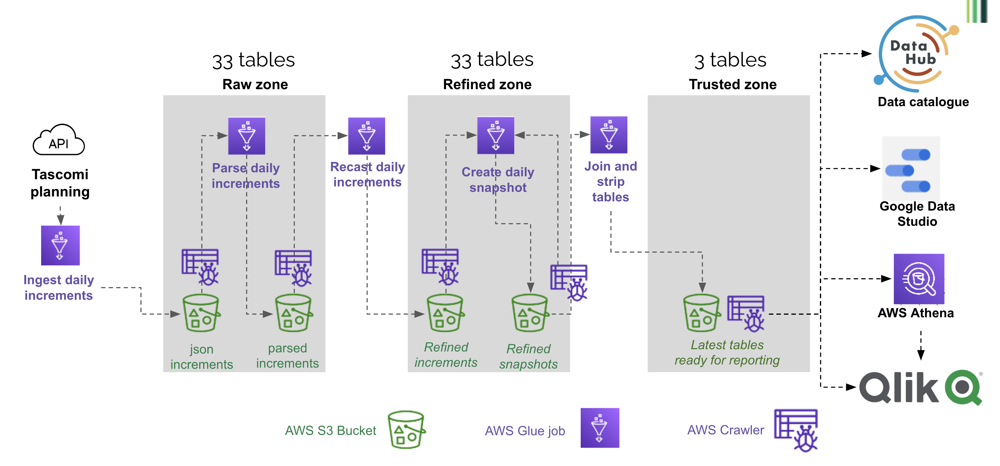

This section describes how Tascomi Planning data gets ingested and refined in the data platform. The process relies on [Tascomi API](https://hackney-planning.tascomi.com/rest/v1/documentation.html?public_key=dd95bcd473f46a4325a4021d54500c7d#available-resources) and is composed of the following steps:

- An initial full ingestion from Tascomi API (only once, happened in October 2021)
- A daily call to the Tascomi API to get latest updated records (increment)
- Parsing of the json data increment returned by the API
- Refinement of the parsed data to recast all columns to the right data type
- Creation of a full snapshot by applying the daily increment to the previous snapshot



## Details of individual steps

### Step 1 - Ingestion

This [process](https://github.com/LBHackney-IT/Data-Platform/blob/main/scripts/jobs/planning/tascomi_api_ingestion.py) queries one API endpoint (e.g. the applications endpoint) and writes the data into a table of the same name. This process writes into the raw zone bucket, with the 'api_response' prefix. The data is partitioned by `import_date`.

#### 1.1 - Initial full ingestion

This initial run imported the full Tascomi tables

#### 1.2 - Daily ingestion of latest updated records

The subsequent runs only ingest the records updated since the last import. The process relies on the `last_updated` column that is present on all Tascomi tables.

### Step 2 - Daily parsing of the json increments

This [process](https://github.com/LBHackney-IT/Data-Platform/blob/main/scripts/jobs/planning/tascomi_parse_tables_increments.py) uses job bookmarking to only process new increments. It also uses a pushdown predicate to only load the last 5 daily prtitions (it is quicker than loading the full dataset).
It processes all tables in a loop. For each table, the large json blob containing all the fields is exploded into separate textual columns.

This process writes into the raw zone bucket, with the 'planning/tascomi/parsed' prefix. The data is partitioned by `import_date`.

### Step 3 - Daily refinement of the parsed increments

This [process](https://github.com/LBHackney-IT/Data-Platform/blob/main/scripts/jobs/planning/tascomi_recast_tables_increments.py) uses job bookmarking to only process new increments.
It processes all tables in a loop. For each table, the text columns are converted into correct data types (dates, boolean etc.). It uses a [column type dictionary](https://github.com/LBHackney-IT/Data-Platform/blob/main/scripts/jobs/planning/tascomi-column-type-dictionary.json) saved in S3 in a separate json file. This dictionary was created semi-automatically with FME (an ETL tool used in the Data and Insight team), by converting the list of columns described in the [API endpoints documentation](https://hackney-planning.tascomi.com/rest/v1/documentation.html?public_key=dd95bcd473f46a4325a4021d54500c7d#available-resources).

This process writes into the refined zone bucket, with the 'planning/tascomi/increment' prefix. The data is partitioned by `import_date`.

### Step 4 - Creation of the daily snapshot

This [process](https://github.com/LBHackney-IT/Data-Platform/blob/main/scripts/jobs/planning/tascomi_create_daily_snapshot.py) combines the latest snapshot and all increments created since that day, to create a new snapshot. It uses pushdown predicate and job bookmarking to only process new increments. Like the 2 previous steps, it processes all tables in a loop. If several days increments need to be applied, the process first ensures that no duplicate records are present, by only keeping the latest updated one (for instance, if a planning application has changed status 2 times, it only keeps the record with the latest status). To apply the increments to the previous snapshot, we just replace pre-existing records with the newer version, using the unique id. A new column 'snapshot_date' is created and set to the current date.

This process writes into the refined zone bucket, with the 'planning/tascomi/snapshot' prefix. The data is partitioned by `snapshot_date`.

### Step 5 - Creation of latest tables in the Trusted zone

This steps takes latest snapshots of a few tables in the refined zone, simplifies them and joins them together to create a few tables in the trusted zone, ready for ingestion in Qlik and for use by Planning analysts. It is composed of 4 jobs: [applications to trusted](https://github.com/LBHackney-IT/Data-Platform/blob/main/scripts/jobs/planning/tascomi_applications_trusted.py), [locations to trusted](https://github.com/LBHackney-IT/Data-Platform/blob/main/scripts/jobs/planning/tascomi_locations_trusted.py), [subsidiary tables to trusted](https://github.com/LBHackney-IT/Data-Platform/blob/main/scripts/jobs/planning/tascomi_subsidiary_tables.py), [officers to trusted](https://github.com/LBHackney-IT/Data-Platform/blob/main/scripts/jobs/planning/tascomi_officers_trusted.py). These jobs always clear the target folder before writing, so the trusted zone only contains one partition corresponding to the latest date. 

In this zone we use a [csv dataset of bank holidays and Hackney non-working days] (https://github.com/LBHackney-IT/Data-Platform/blob/main/scripts/jobs/planning/hackney_bank_holiday.csv) to calculate time intervals used for performance reporting (e.g. in how many days an application reached the 'registered' state). The calculation method is in the helpers.

## Full workflow and scheduling

The full workflow is defined in the [glue-tascomi-data terraform script](https://github.com/LBHackney-IT/Data-Platform/blob/main/terraform/etl/24-aws-glue-tascomi-data.tf).
It defines a list of tables that needs updating everyday, and a list of static tables that are only updated weekly (these are the static tables like application types). The schedule is as follows:

- 2am GMT: as many jobs as tables to update are triggered. Each job queries one API endpoint for latest updated records. That's 25 jobs on Sundays (including static tables), about half of that on other days.
- 4am GMT: a crawler crawls the API responses bucket
  - the previous crawler triggers the **parsing** job and the crawling of its results
  - the crawler of the parsing job triggers the **recasting** job and the crawling of its results
  - the crawler of the recasting job triggers the **daily snapshot creation** job and the crawling of its results
  - the crawler of the snapshot creation job triggers the **applications to trusted** job which in turn triggers the other jobs of the trusted zone.

## Structure of the S3 buckets and Glue tables

The data created along the process (initial full load, increments and snapshots) is stored in S3 in the raw and refined zones, with one folder per table.

The ready-for-use data is in the refined zone bucket with the prefix /planning/tascomi/snapshot. The corresponding tables in the Glue catalog are simply called applications, appeals, etc. To get the latest data, the query must refer to the snapshot_date latest partition, for example

```
select * from "dataplatform-prod-tascomi-refined-zone"."applications" where snapshot_date = (select max(snapshot_date) from "dataplatform-prod-tascomi-refined-zone"."applications")
```

The refined increments are in the Refined zone Planning bucket, in the `increments` area. The tables are prefixed with `increment_`. To count the increment loaded on a specific day, you could use:

```
select count(*) from "dataplatform-prod-tascomi-refined-zone"."increment_applications" where import_date = '20211208'
```

The parsed increments are in the Raw zone Planning bucket, in the `parsed` area. The tables are not prefixed, and partitioned by `import_date` with. To count the increment loaded on a specific day, you could use:

```
select count(*) from "dataplatform-prod-tascomi-raw-zone"."applications" where import_date = '20211208'
```

The raw data returned by the API is in the Raw zone Planning bucket, in the `api_response` area. The tables are prefixed with `api_response_`, and partitioned by `import_date` with. To count the increment loaded on a specific day, you could use:

```
select count(*) from "dataplatform-prod-tascomi-raw-zone"."api_response_applications" where import_date = '20211208'
```

## How to add a table to the pipeline

Follow these steps to start ingesting data from a new endpoint available from the API. 

### Test the endpoint
You can use a Jupyter notebook on your local install to check that the endpoint is returning what you expect. It is hard to test with Postman because of the time-dependent token that the Tascomi API is using for authentication.

### Create and check out a new branch in the repository
All the changes below should be commited to this branch first.

### Add the table to the [column type dictionary](https://github.com/LBHackney-IT/Data-Platform/blob/main/scripts/jobs/planning/tascomi-column-type-dictionary.json)
This json dictionary supports the 'recast increment' step that converts string columns into their cortect data types. It looks like this:
```
        "long": {
            "applications": [
                "site_address_x",
                "site_address_y",
                "tree_location_x",
                "tree_location_y"
            ],
            "emails": [
                "last_updated",
                "submit_date",
                "ceased_date"
            ],
            "enforcements": [
                "complaint_location_x",
                "complaint_location_y"
            ],
            "dtf_locations": ["parent_uprn","uprn","usrn"],
            "users": ["mileage_rate"]
        },
        "double": {
            "applications": [
                "affordable_housing_balancing_sum",
                "height_of_proposed_development",
                "proposed_building_dimensions_breadth",
                "proposed_building_dimensions_eaves",
                "proposed_building_dimensions_length",
                "proposed_building_dimensions_ridge",
                "proposed_building_distance_from_proposal",
                "proposed_building_overall_ground_area",
                "proposed_fish_tank_cage_depth",
                "proposed_fish_tank_cage_height",
                "proposed_fish_tank_cage_length",
                "proposed_fish_tank_cage_width"
            ],
            "appeals": ["appeal_location_x","appeal_location_y"]
        }
```
To amend the catalogue semi-automatically you need to do the following (TODO: create a Python script to replace the FME process)
- Open the [Tascomi API resources page]( https://hackney-planning.tascomi.com/rest/v1/documentation.html?public_key=dd95bcd473f46a4325a4021d54500c7d#available-resources). Navigate to the table you're adding, select and copy its content.
- Open the [Tascomi column dictionary Google Sheet](https://docs.google.com/spreadsheets/d/1ZZwWHSoudBgN9j0jV6ZrNZKgXYMOm7ObWTWLT3Xg8Rw/edit?usp=sharing), create a new tab for the new table and paste the content you copied in the previous step. Only keep 2 columns: field and type.
- Launch FME desktop, open the Tascomi Dictionary workspace, refresh the feature types in the reader to see the new tab of the Google Sheet. Run the workspace for the new tab. You'll get fragments of json that you can copy and paste into the proper dictionary.

### Add the table to the [Terraform script](https://github.com/LBHackney-IT/Data-Platform/blob/main/terraform/etl/24-aws-glue-tascomi-data.tf).
Decide wether the new table should be ingested daily (in this case append it to the `tascomi_table_names` list) or weekly (in this case appen it to the `tascomi_static_tables` list).

### Add data quality tests in the relevant scripts
[Quality testing with PyDeequ](https://playbook.hackney.gov.uk/Data-Platform-Playbook/playbook/transforming-data/guides-to-testing-in-the-platform/data-quality-testing-guide) is parameterised inside each relevant script. At the moment, only the [parse table increment script](https://github.com/LBHackney-IT/Data-Platform/blob/main/scripts/jobs/planning/tascomi_parse_tables_increments.py) has tests implemented. For your new table to be quality-checked each day, you need to open this script and append a line in this section near the top: 
```
dq_params = {'appeals': {'unique': ['id', 'import_date'], 'complete': 'id'},
             'applications': {'unique': ['id', 'import_date'], 'complete': 'application_reference_number'},
             'appeal_decision': {'unique': ['id', 'import_date'], 'complete': 'id'}
             }
```
The last line means that, for the job to complete successfully, in the appeal_decision table increment, the combination (id, import_date) should be unique, and the id field should be complete. 
This is the only script you need to amend at present, but it would be useful to add quality testing to other bits of the process.

### Commit your changes in the new branch and open a pull request
Unit tests will run automatically when you push. At the moment, tests are implemented for all bits of the process except from the 'parse table increments' one.  

## How to reset all refined Tascomi data

If you suspect a problem in the increments or snapshots, you can delete and recreate them in their respective buckets.

### Reset the ingested increments:

- In S3 raw zone 'api_response' bucket, in each table repository, delete the data up to the last date you want to keep. _Do not delete the initial full load!_
- Run the api_response crawler
- Run the ingestion job
- Run the api_response crawler again.

As a result you should see in S3 a new partition with today's date. It contains all records updated since the last day you kept in the bucket.

### Reset the parsed increments:

- In S3 raw zone, empty the 'parsed' bucket
- Reset the job bookmark (In Glue, > job view > select the job and click on actions)
- Remove the pushdown predicate: open the job script and edit the line that sets the pushdown predicae to 0 days, then save:

`pushdown_predicate = create_pushdown_predicate(partitionDateColumn='import_date', daysBuffer=0)`

- Run the job
- Set back the pushdown predicate to its initial value, then save the script:

`pushdown_predicate = create_pushdown_predicate(partitionDateColumn='import_date', daysBuffer=5)`

- Run the parsed bucket crawler

### Reset the refined increments:

- In S3 refined zone, empty the 'increments' bucket
- Reset the job bookmark (In Glue, > job view > select the job and click on actions)
- Remove the pushdown predicate: open the job script and edit the line that sets the pushdown predicae to 0 days, then save:

`pushdown_predicate = create_pushdown_predicate(partitionDateColumn='import_date', daysBuffer=0)`

- Run the job
- Set back the pushdown predicate to its initial value, then save:

`pushdown_predicate = create_pushdown_predicate(partitionDateColumn='import_date', daysBuffer=5)`

- Run the refined increment crawler

### Reset the refined snapshot:

- In S3 refined zone, empty the 'snapshot' bucket
- Delete all the snapshot tables in the Glue catalogue
- Reset the job bookmark (In Glue, > job view > select the job and click on actions)
- Remove the pushdown predicate: open the job script and edit the line that sets the pushdown predicae to 0 days, then save:

`pushdown_predicate = create_pushdown_predicate(partitionDateColumn='snapshot_date', daysBuffer=0)`

- Run the job
- Set back the pushdown predicate to its initial value:

`pushdown_predicate = create_pushdown_predicate(partitionDateColumn='snapshot_date', daysBuffer=5)`

- Run the refined snapshot crawler.

As a resut you should only have today's snapshot in the snapshot bucket.

## How to rewind to a past state and recreate the snapshots from there

**This method uses the AWS CLI**
Follow these steps if a problem occured at a recent date and you don't want to reset the full history of snapshots. You will reset the bookmarks to a date prior to the problem, delete all the snapshots since that date in S3, and run the snapshot job again.

### Delete recent data in S3 and crawl
Say something wrong happened on 23/01/2022 and we are the 25th. You need to delete the snapshots dated 20220123, 20220124 and 20220125.
Do this in AWS CLI using:

```
aws s3 rm s3://dataplatform-prod-refined-zone/planning/tascomi/snapshot --recursive --exclude '*' --include '*20220123*'
```
and then
```
aws s3 rm s3://dataplatform-prod-refined-zone/planning/tascomi/snapshot --recursive --exclude '*' --include '*20220124*'
```
and then
```
aws s3 rm s3://dataplatform-prod-refined-zone/planning/tascomi/snapshot --recursive --exclude '*' --include '*20220125*'
```

If you also want to delete the refined increments, you can go one level up: 
```
aws s3 rm s3://dataplatform-prod-refined-zone/planning/tascomi/ --recursive --exclude '*' --include '*20220124*'
```
etc.

If you have AWS Vault configured with a profile called preprod, the command becomes: 
```
aws-vault exec preprod -- aws glue reset-job-bookmark --job-name 'prod tascomi_create_daily_snapshot_planning' --run-id jr_e6d6c7e66b27ff27929b3f46555ecdcd9f9e068675eaafaf231f4d338d04db33
```
Don't forget to run the refined snapshot crawler so the Glue catalogue sees the recent changes.

### Rewind the job bookmark to the last day everything was fine
We are using [this method](https://docs.aws.amazon.com/cli/latest/reference/glue/reset-job-bookmark.html) and running in the CLI:
```
get-job-bookmark
--job-name <value>
[--run-id <value>]
[--cli-input-json | --cli-input-yaml]
[--generate-cli-skeleton <value>]
```
You'll find the job-name and the run-id of the last successful run in the 'jobs' section of the Glue console. An example of full command is:
```
aws glue reset-job-bookmark --job-name 'prod tascomi_create_daily_snapshot_planning' --run-id jr_e6d6c7e66b27ff27929b3f46555ecdcd9f9e068675eaafaf231f4d338d04db33
```

### Extra steps needed depending on the scenario
- If you're going more than 5 days back, the pushdown predicate menas you won't be loading any older snapshot. You need to allow a larger daysbuffer in the pushdown predicate before running the job. Save the script.
- If you are going back to a point when one of the snapshots didn't exist (because the endpoint had not been used yet), you need to delete this snapshot table in the Glue catalogue before running the job.

### Run the daily snapshot job and crawl
Today's snapshot will be created. There won't be any snapshot between this one and the last day everything was fine. Don't forget to run the crawler to see the data in Athena.
