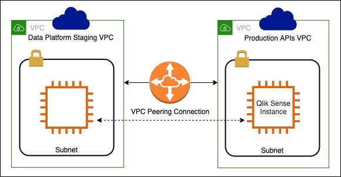

The VPC Peering connection is set up between the Data Platform Staging account VPC and the Production APIs account VPC. This will allow traffic to flow to and from these AWS accounts.

This enables Data and Insights Analysts to fulfil their analysis and reporting duties on housing and parking data with the Qlik Sense Business Intelligence tool as this data lives in the Data Platform account and the Qlik Sense instance lives in the Production APIs account.