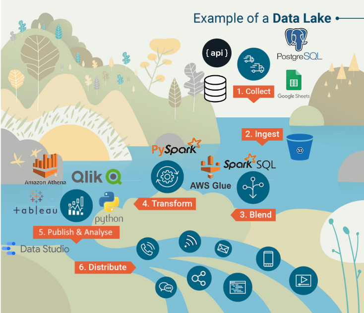

## What is a data platform?

A data platform is an integrated technology solution that allows data located in different data sources to be governed, accessed, and delivered to users, applications, or other technologies. Our data platform is composed of a number of different elements:

- **A Data Lake**: this is a centralised repository to store data all in one place, and a set of loosely coupled processes to ingest data into the lake, transform it, and publish/connect that data out to other tools.

- **A Data Catalogue**: this is a place to store documentation and metadata about the datasets within the data lake. It helps users discover what data exists, understand what the data mean, and find out who owns the data.

- **A Data Warehouse**: this is a store of 'gold standard' data that is ready for analysis or publication. It is the result of processes to ingest, clean and transform data in the data lake.

- **A Data Dictionary**: this defines domain-driven design entities and their relationships to one another at a high level. (For example, how a 'person' relates to a 'household', 'property', etc.)

- **This Playbook**: this playbook provides step-by-step guidance about how to use the platform, along with technical documentation about how the platform has been set up and decisions we've made.

## Why a data platform?

Our vision for Hackney's data platform is to ‘build back better’ for the future and deliver a secure, scalable, reusable cloud-based data infrastructure that brings together the council’s key data assets. This will enable us to democratise access to data (where appropriate), use technology to enable deeper insight, and derive greater value from our data to improve the lives of residents.

**We want to democratise data across the council:**

- People can find the data they need
- People know how to get access to the data they need
- People understand the content and context of the data
- People can access and manipulate data through a range of tools that meet their needs
- People have access to the skills, tools and learning resources they need
- Data is available to both people and systems to gain operational value
- Ownership of the platform is shared across the council

**We want our platform to be secure:**

- People can only access what they should
- People can request access to data through a central, governed process
- Information Asset Owners can make informed decisions about who gets access through a simple process
- Data is minimised, anonymised and segmented so that access can be as wide as possible
- The platform meets statutory requirements and best practice for storing and moving data

**We want reusable and scalable processes to promote stability and reduce duplication:**

- We use open technologies where possible to prevent vendor lock-in and widen the possibilities of reuse
- People can easily share and reuse each other's work
- Processes are automated wherever possible to enable people to focus on higher value tasks
- Processes are tested and dependable
- We apply consistent standards and conventions across datasets and processes

**We want the platform to enable deeper insight:**

- People have access to the tools they need to apply and productionse advanced analytics
- We can perform cross-cutting analysis to develop insight across services

## Processing data through the platform

There are a series of processes data will go through as it moves through the platform, illustrated in the diagram below. The starting point of your journey will depend on whether the data you need is already in the platform or not, and whether it's in the format you need.

### 1. **Ingesting data**

This is the process of bringing data from its original source (e.g. Google Sheet, database, API, etc.) into the data lake. The exact process will depend on the type of data source which are documented in this playbook in the [ingesting data section]. However for each process, the result will be that:

- The data is stored in [Amazon S3 storage](https://docs.aws.amazon.com/AmazonS3/latest/userguide/Welcome.html)
- Data is stored in a service bucket (e.g. 'Parking' or 'Council Tax') which can only be accessed by approved members of that service group
- Data is converted from its original format into [Apache Parquet format](https://parquet.apache.org/) which an efficient way of storing and querying data
- Data will be partitioned (stored in sections to help speed up querying) by the day it was ingested
- Optionally, the ingestion will run on a schedule so that the data will be loaded into the lake each day, week, etc.

### 2. **Transforming data**

Most often source data in its raw form is not ready for analysis and needs some kind of transformation to make it usable, for example:

- _Cleaning data_ for example removing inconsistent formats, populating missing values, removing duplicates, etc.
- _Denormalising data_ by joining together tables from a database
- _Joining or matching to other datasets_ by using unique identifiers or keys (e.g. Unique Property Reference Number) or 'fuzzy matching' (e.g. matching two sets of names which can account for some differences in spelling, special characters, etc.)
- _Adding features/attributes_ by applying logic or calculations to existing fields in the data. For example, you might want to create age bands using a date of birth field in your data.
- _Converting data_ from one format to another (e.g. from string to a date) or from system codes to more easily understood values
- _Aggregating data_ by grouping it together by time or geography, and producing statistics like a count, average, sum, minimum and/or maximimum for each group. For example, you might want to aggregate household-level data to get the average value for each ward

These transformations can be scripted in Spark SQL or PySpark (dialects of SQL and Python that run using [Apache Spark](https://spark.apache.org/)), and scheduled/triggered using [AWS Glue](https://spark.apache.org/). You can find more information about the tools and processes in the [transforming data] section of the playbook.

### 3. **Analysing data**

There are various ways to analyse data from the platform:

- Querying your data using SQL in [AWS Athena](https://aws.amazon.com/athena)
- Connecting your data to a Business Intelligence tool (e.g. Qlik, Google Data Studio, Tableau) using [AWS Redshift](https://aws.amazon.com/redshift/)
- Connecting your data to a notebooking tool (e.g. Jupyter) so that you can write scripts in a coding language (e.g. Python, R)
- Connecting your data to Earthlight for mapping and geographical analysis
