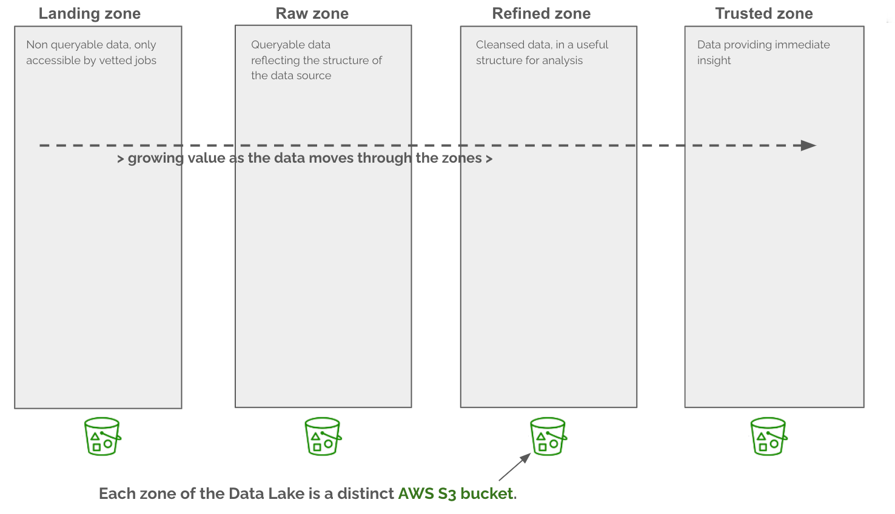
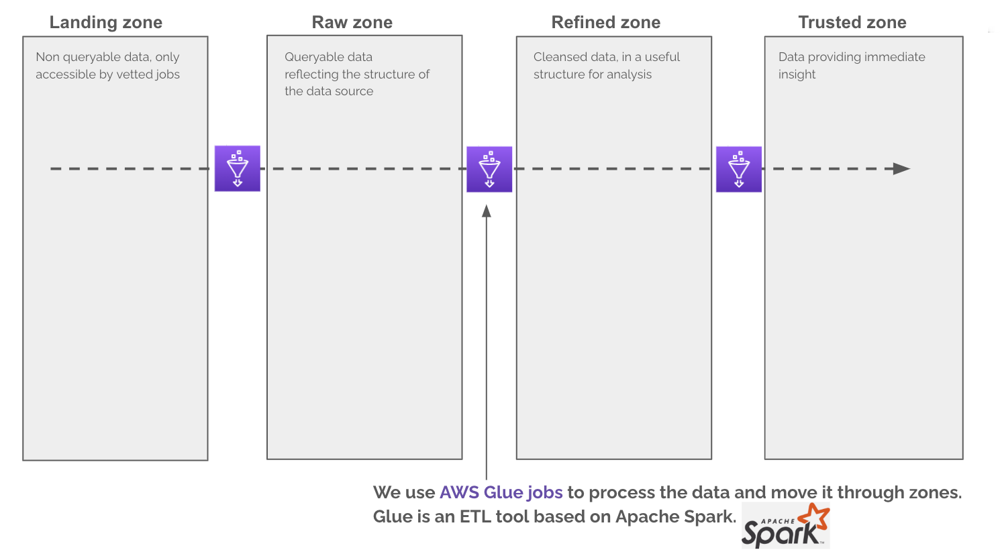
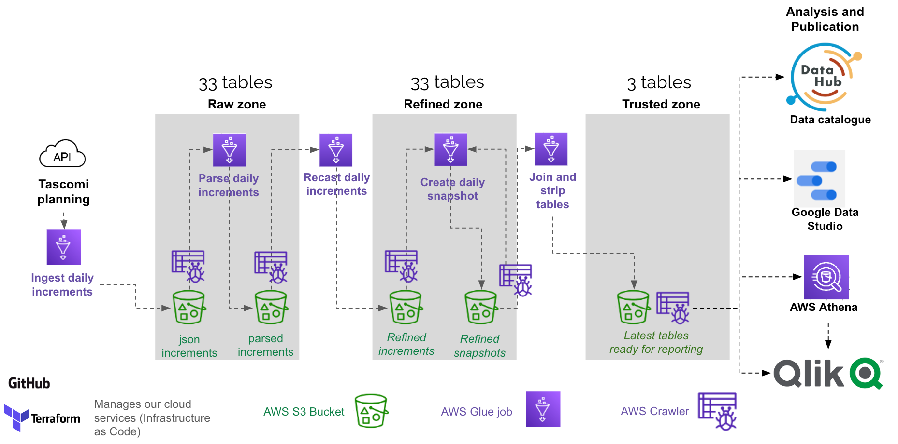
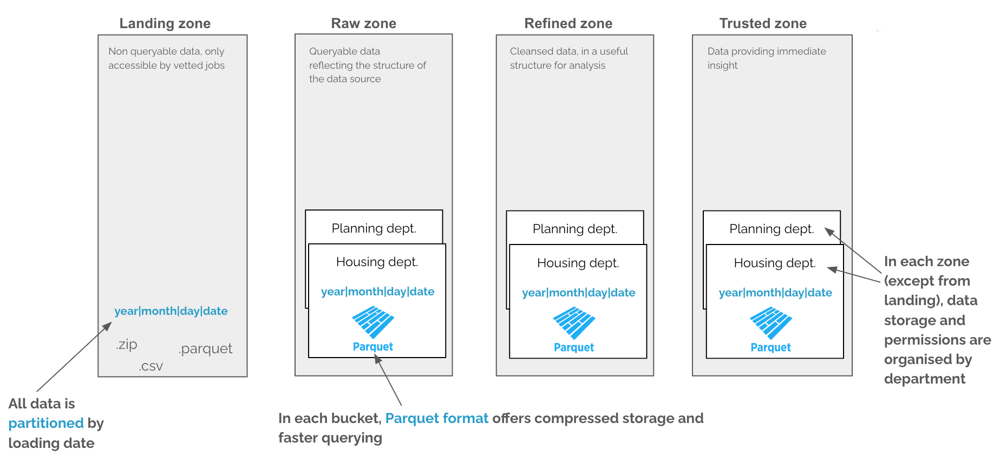
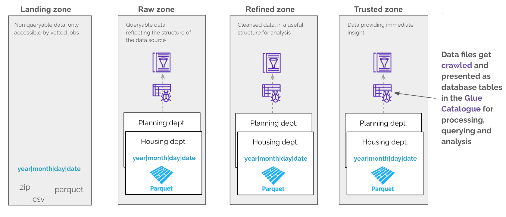

This is an overview of the data lake, its responsibilities and how data moves through the zones within the data lake

## Zones

## Moving data through zones with Glue

#### Planning example

## Data format

## Crawling data

