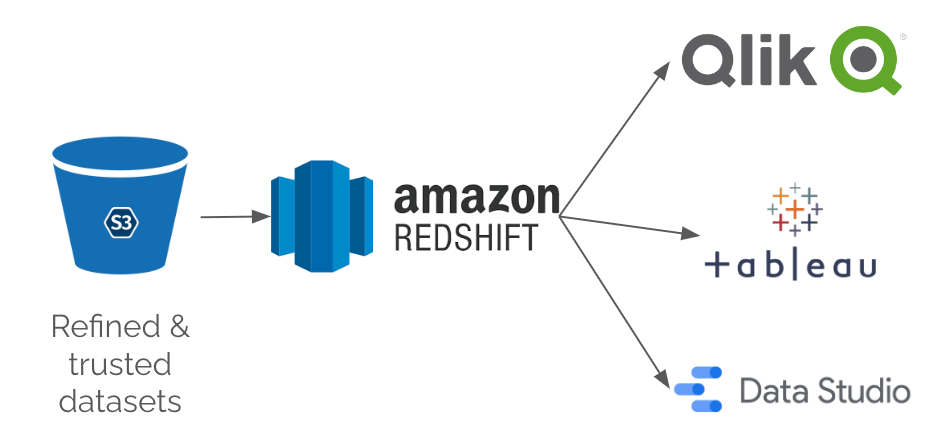

This is an overview of the data warehouse, its responsibilities and how data is served from within the Data Platform

## AWS Redshift

We're using AWS Redshift to serve selected datasets from the Refined and Trusted zones to our Business Intelligence Tools

