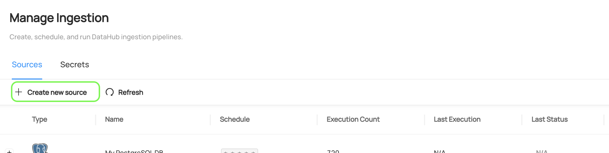
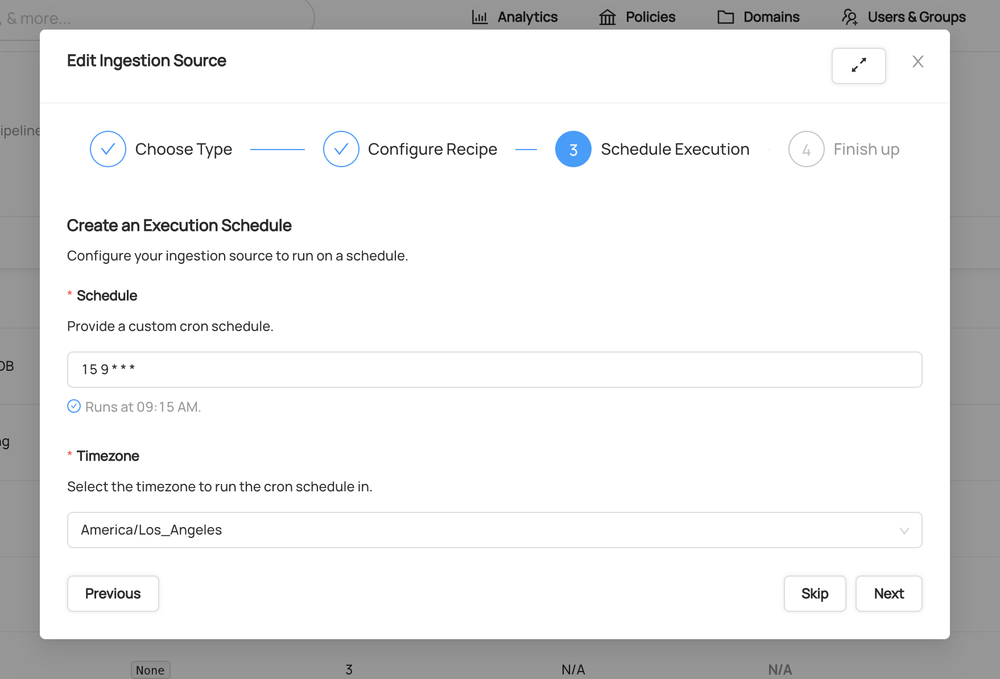
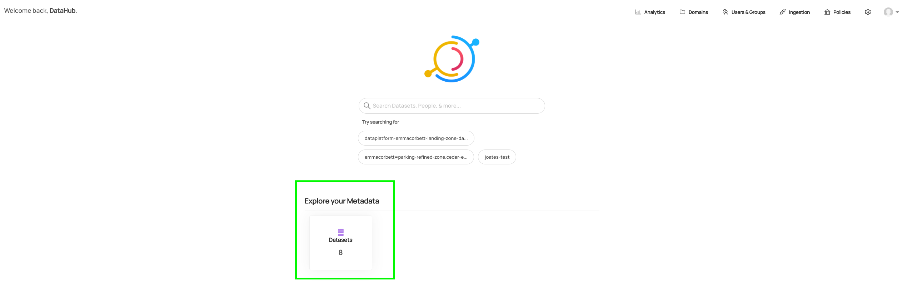
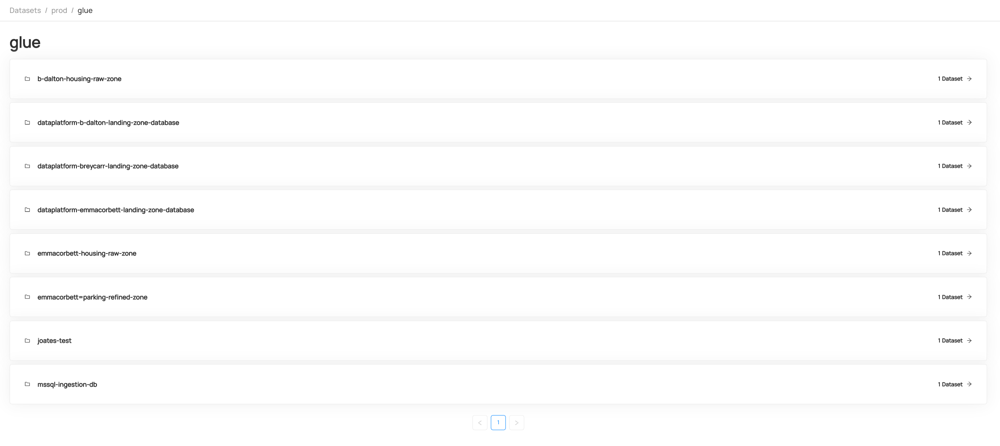

## What is a data catalogue?

A _data catalogue_ is a tool which provides an inventory of all data assets held within the data lake. It enables users to discover:

- what datasets are already in the data lake
- what fields and data types a dataset contains
- where to find the data within the lake
- who owns the data
- who uses the data

However, a data catalogue _isn't_:

- A data store or a data warehouse (e.g. London DataStore). The data is still stored within the lake, not the catalogue, so you won't be able to access or download the data directly from the catalogue.
- A way to search for specific data points. For example, you can search for datasets that contain a 'date of birth' field, but you cannot search a dataset for a specific date of birth. You'll need to get access to the data and query it from the lake or a BI tool for this.
- A way to access data without going through appropriate approval processes under GDPR. The catalogue will enable you to see datasets held by other services and who to request this from, but you will still need to complete a Privacy Impact Assessment and provide a legal basis for accessing and processing this data.

## How to use the data catalogue

### Ingesting datasets

Datahub ingests datasets from Glue, the Glue connection is set up via a Datahub "recipe".
A Datahub recipe is a yaml configuration file that instructs Datahub on where to pull data from. 
Please see below for a guide on how to configure the Glue recipe, this will only need to be done once when Datahub is setup

1. Navigate to the ```ingestion``` tab:
2. Click ```Create new source```: 
3. Choose Glue
4. Configure the recipe as follows (no need to change anything):
```
source:
  type: glue
  config:
    aws_region: '${AWS_DEFAULT_REGION}'
    aws_role: '${AWS_ROLE}'
    extract_transforms: '${GLUE_EXTRACT_TRANSFORMS}'
sink:
  type: datahub-rest
  config:
    server: '${GMS_URL}'
```
5. Configure an execution schedule. We recommend once a day for Glue: To learn more about the CRON scheduling format, check out the [Wikipedia](https://en.wikipedia.org/wiki/Cron) overview.
6. Click next and give the Ingestion Source a name of ```Glue```
7. Once you're happy with your changes, simply click ```Done``` to save.
8. Once you've created your Ingestion Source, you can run it by clicking ```Execute```. Shortly after, you should see the ```Last Status``` column of the ingestion source change from N/A to Running. This means that the request to execute ingestion has been successfully picked up by the DataHub ingestion executor.
9. If ingestion has executed successfully, you should see it's state shown in green as Succeeded.
10. A variety of things can cause an ingestion run to fail, if this happens please check [this guide](https://datahubproject.io/docs/ui-ingestion/#debugging-a-failed-ingestion-run) or contact the Data Platform team

### Browsing datasets

* Datasets can be found either by using the search or via the home screen
* Once a metadata ingestion recipe has been configured and executed, datasets should appear on the home screen:
* Each datasets can then be navigated through: 

### Searching datasets

Please see the official [Datahub Search Guide](https://datahubproject.io/docs/how/search)

### Viewing metadata for a dataset

### Tagging


Please see the official [Datahub Tags Guide](https://datahubproject.io/docs/tags) for more detail

### Domains
Domains can be used to organise datasets into departments, access can then be provided to users for specific domains they are interested in. 
Once you've created a Domain, you can use the search bar to find it
Please see the official [Datahub Domains Guide](https://datahubproject.io/docs/domains) which explains how to configure domains

### Adding/amending descriptions

### Adding/amending owners


### Understanding column statistics
