# Getting started with the local PySpark environment

## Introduction

### Why develop PySpark scripts on your local machine?

Prototyping your jobs on your local machine's IDE is the cheapest and quickest way to work. It has the following advantages:
- Seamless process: The script you're writing and testing locally is exactly the script that will end up in the repository. You won't need to copy/paste and transform code from Sagemaker or Glue Studio into GitHub. 
- Speed: you are able to test your script on a data sample and not the full data hosted in S3 pre-prod. Your local environment is also quicker to start than Glue.
- Cost: you are not consuming any AWS resource and compute power while prototyping your job.

### Who is this tutorial for?

People who need to prototype Glue jobs. If you just need to explore or analyse data on an ad-hoc basis, you should rather use a notebooking environment like Sagemaker.

### Pre-requisites

You should be familiar with Python, Git, and the use of an IDE like PyCharm or VS Code. This guide uses PyCharm.

**Windows or Mac**

This guide covers Windows and Mac setup. You'll need admin permissions.

**Data Platform Access?**

You don't need Data Platform access to use the local environment.

## Set up instructions for Mac

### Install prerequisites

#### Java
Spark needs Java. Check if you have Java installed by running 
`java --version` 
in your command prompt. If you do not have Java installed, then go to https://adoptopenjdk.net
Select OpenJDK 8 (LTS) & HotSpot
Choose x64 OSX version

#### Python
Check if you have Python3 installed by running
`python3 --version`
in your command prompt. If you do not have it, then go to https://www.python.org/downloads/ and install it.

#### Git
Check if you have Git installed by running
`git --version`
in your command prompt. If you do not have it, then get it from https://git-scm.com/book/en/v2/Getting-Started-Installing-Git.

#### PyCharm
Install the Community free version from https://www.jetbrains.com/pycharm/.

#### Additional Python packages 
For the Data Platform code to run, you need at least the packages boto3, pytest, pyspark and pydeequ. 
You can install them now by typing in your command line:
`python3 -m pip install --user  boto3 pytest pyspark pydeequ`.

Alternatively, these libraries can be installed inside PyCharm as shown below.

#### Glue libraries
We need these libraries to simulate the Glue environment.
Go to the project GitHub page: https://github.com/awslabs/aws-glue-libs and download the code (Code > Download zip). 
Unzip it and leave it there. We will move it in other step later.

### Create the Data Platform local environment using PyCharm

#### Install the project in PyCharm
Open PyCharm and clone the Data Platform project: https://github.com/LBHackney-IT/Data-Platform.

Alternatively, if you already have the project, pull the latest changes by running `git pull` in the PyCharm terminal window.

#### Set the Python interpreter for the project
Open the preferences > Project:Data_platform > Python Interpreter > Click on the setting icon > Add.

In this screen, set the python interpreter to the version you’ve installed.

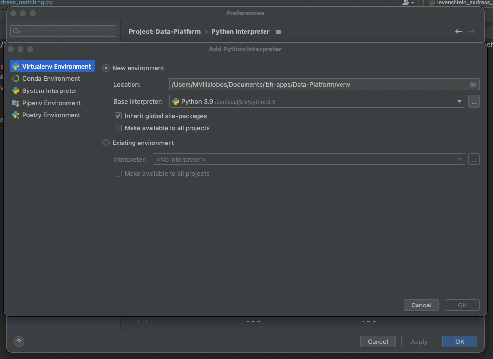

#### Add extra Python libraries
The following packages are necessary for unit tests. You can install them in the below window, or alternatively use `pip install`.
- gspread
- freezegun
- pytest-mock

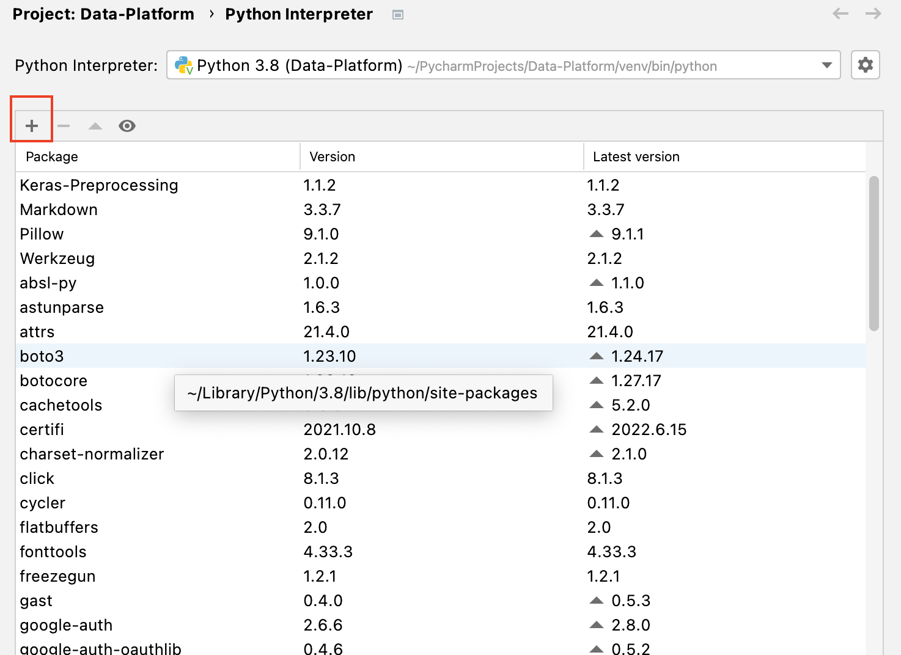

#### Import the Glue library as an external library 
Paste the full downloaded awsglue folder in `External Libraries > Python X.X > site-packages` as shown on the following screen.

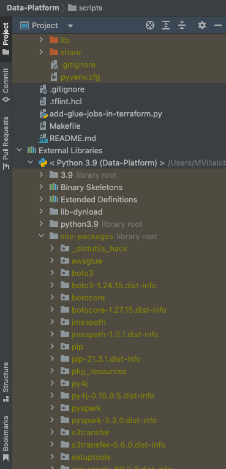

#### Check your environment
Open the file `scripts/jobs/env-context.py`. 

If you have installed all the dependencies, the imports at the top of this script should all be fine.

If some imports are underlined, try to close and reopen PyCharm. If you still have problems, you can try to re-import the packages you installed via `pip install` within the DP environment, from the Python packages tab.

When the script looks fine, go the section 'Test the Levenshtein address matching script'

## Set up instructions for Windows

### Install prerequisites

#### Java
Check if you have Java by running the command `java –version`. We want version 8.
If you have the wrong version, uninstall it from the start menu.
Install openjdk (version 8) form https://adoptopenjdk.net.
In the installer, activate the option to `set JAVA_HOME`.
After the install, the command `java –version` should return something.

#### Python
Install python from Windows store: it will set the right environment variables.
After the install, the command `python --version` should return something.

NB: For some Windows OS, python installation from python.org also works fine. If you chose to install yourself, the Python command will be the normal `py` command.

#### Hadoop
This is specific to windows and will help us with paths etc. Download the full project from https://github.com/steveloughran/winutils/blob/master/hadoop-3.0.0/bin/.
Unzip and locate the *2 files* we need: 
- winutils.exe 
- hadoop.dll

We will now place these files in different locations.
1. Create a bin folder for `winutils.exe` and save it there, e.g. `C:\winutils\bin` or `C:\users\sballey\winutils\bin`.
2. Create the environment variable `HADOOP_HOME` and set it to the path (omitting bin at the end), e.g. `C:\users\sballey\winutils`.
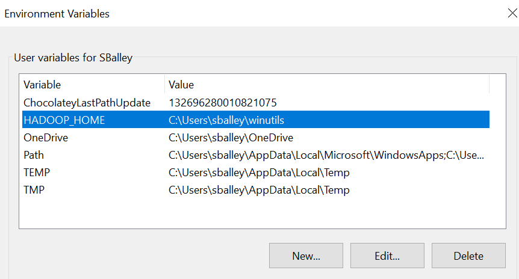.
3. Copy hadoop.dll in `C:\Windows\System32`.  
*NB: you can try without this step 3 – it is critical for some users (it was for a Hackney Lenovo Thinkpad running Windows 10) but it appears some others don’t need it. Everything you need should in theory be in winutils.exe.*

#### Python libraries
For the data platform we need at least:
- boto3 
- pytest
- pyspark
- pydeeq
- gspread
- freezegun
- pytest-mock

If you have installed Python through Windows store, you must use the command
`python -m pip install …`.
If not, the normal command is `py -m pip install ...`

It is recommended to install these packages 1 by 1 separately to be sure you see the execution of each
`python -m pip install boto3`
`python -m pip install pydeequ`
`python -m pip install pytest`
 
The most problematic package is pySpark:
`python -m pip install pyspark`

If this one fails and complains about a legacy install, it’s because it should rather be in the form of a wheel file. In this case, run the command
`python -m pip install wheel`

and then again
`python -m pip install pyspark`

NB: Alternatively, you can install Python libraries later in PyCharm at project level.

#### Glue libraries
We need these libraries to simulate the Glue environment. Download them as a zip from https://github.com/awslabs/aws-glue-libs. Unzip them anywhere, you will move them later.

### Create the Data Platform local environment using PyCharm

#### Install the project in PyCharm
Open PyCharm and clone the Data Platform project: https://github.com/LBHackney-IT/Data-Platform.

Alternatively, if you already have the project, pull the latest changes by running `git pull` in the PyCharm terminal window.

#### Set the Python interpreter for the project
In `file > settings`, choose your project in the left panel and set the python interpreter to the version you’ve installed.
Tick the ‘Inherit’ box but not the other box
Close the settings window.

#### Import the glue libraries
In the left panel, go to `external libraries - site packages` and paste the glue folder you’ve unzipped in the prerequisites step.

#### Check your environment
At this point, if you open the `scripts/jobs/env-context.py` script, you shouldn’t see any library highlighted in red.

If you open `file>settings`, you should see (after it loads) all the python libraries you’ve installed and are available for this project.
Click the + button to install more.
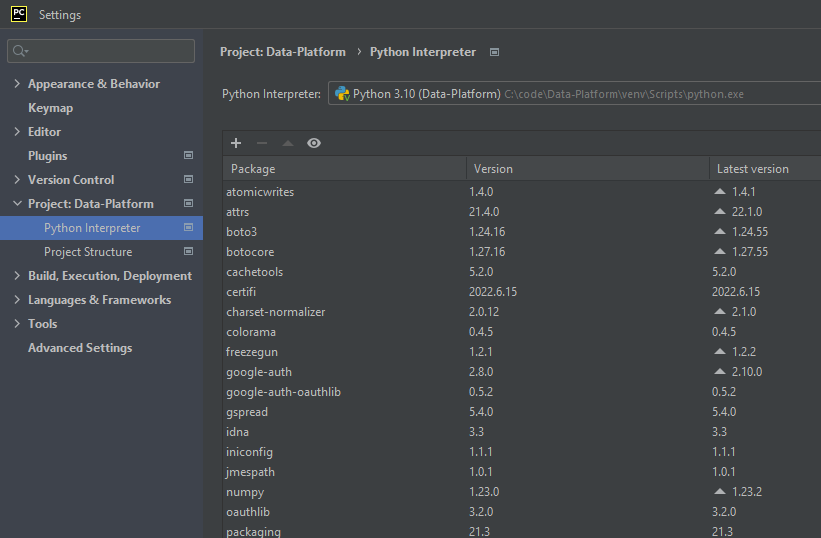

If you still have underlined imports, closing and reopening PyCharm may help, or even restarting your laptop.

When your installatin is complete, try to run a script by following the next section!

## Running a PySpark script (Mac and Windows)

### Running the Levenshtein address matching script
This is the first script that was converted for the local PySpark environment and can be considered as a model for other scripts. 

#### Get sample data
You'll need some [sample data] (https://drive.google.com/file/d/1a18qvDoJPGavNjfLNvnrY_jOmVTTWhY7/view?usp=sharing) (downloadable by Hackney only): some source addresses to match, and some target addresses from the address gazetteer to match against. These 2 datasets are in Parquet format and should be saved with a folder structure mirroring S3.

Example folder structure for source addresses
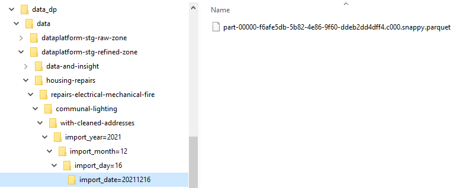

Example folder structure for target addresses
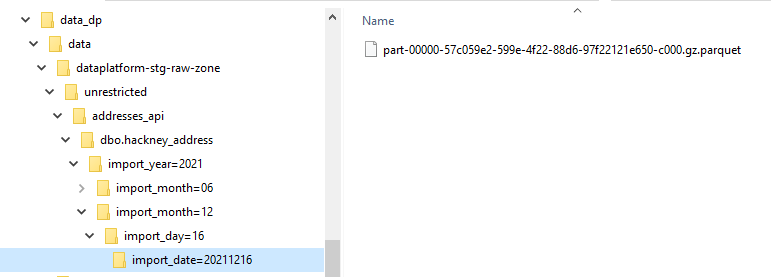

#### Set the script parameters
Open the file `scripts/jobs/levenshtein_address_matching.py`. Check that the imports are fine. 
If you run the script now, you will get an error message because we haven’t specified the parameters. 
Do this from the Configuration window that you can open from the drop down list just right from the green Run arrow.
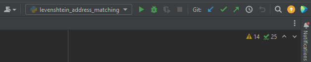
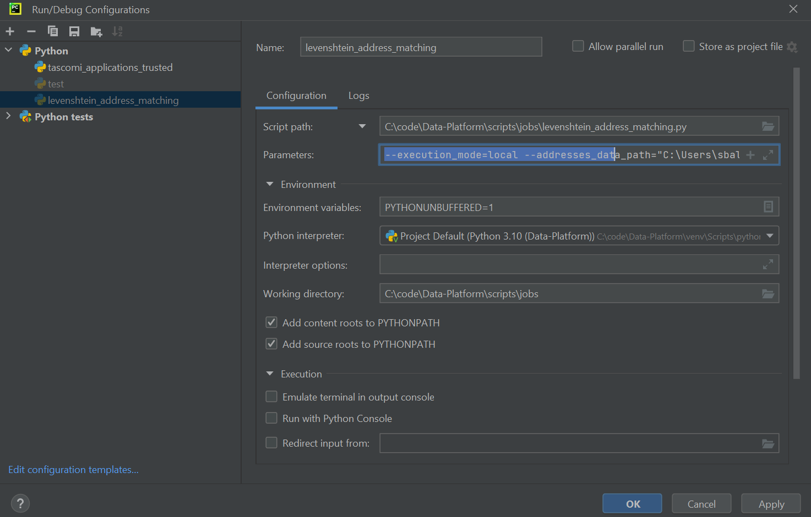

Here are the parameters values to add to the parameter text box:
```
--mode=local 
--addresses_data_path=”<your local path to>\dataplatform-stg-raw-zone\unrestricted\addresses_api\dbo.hackney_address” 
--source_data_path=”<your local path to>\dataplatform-stg-refined-zone\housing-repairs\repairs-electrical-mechanical-fire\communal-lighting\with-cleaned-addresses” 
--target_destination=”<your local path to>\output\levenshtein” --match_to_property_shell=forbid
```

You can now run the job, see its progress in the console, and find the result file in the output folder. 

### A minimal test script
If you are blocked with the Levenshtein address matching script, here is a minimal script that you can save as `test.py` (do not commit to the DP repository!). This creates a Spark data frame and then another one from a csv file. It is useful to troubleshoot basic issues.

Note for Windows users: the file paths inside the code need double backslash.

```
from pyspark.sql import SparkSession
spark = SparkSession.builder.master("local[*]").appName("LocalTest").getOrCreate()
print(spark)

address_data_raw = spark.createDataFrame(
   [(2022, "06", "01"), (2022, "6", "01"), (2022, "07", "01")])
address_data_raw.show()
address_data_raw = spark.read.csv(
   "<your local path \\ to a folder \\containing a csv file>")
address_data_raw.show()
```

### Running the unit tests
Running the unit tests of the Data Platform project is another way to test your configuration. To do this, navigate and right-click on the scripts/test folder. It gives you the option to modify the Run Configuration of this folder. Rename this configuration to 'Run all tests' and make sure the settings are as below.

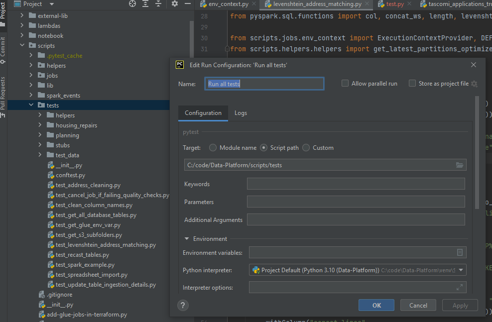

## Troubleshooting
These are solutions to random problems related to the local environment.

**Issue**: After a system upgrade, scripts wouldn’t run in PyCharm because python.exe was not found.

**Environment**: Windows

**Solution**: From the start menu, Launch ‘Manage Apps Execution aliases’
Make sure aliases for Python are on but not for the Python App installer.

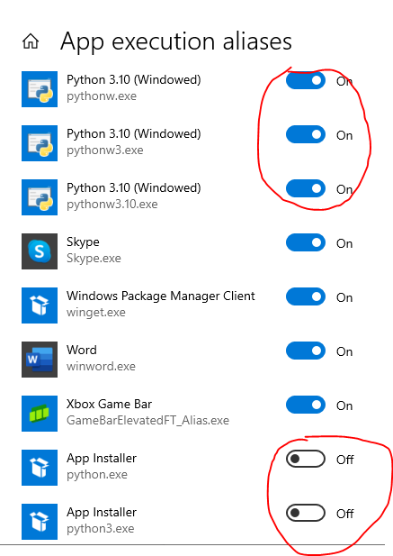
