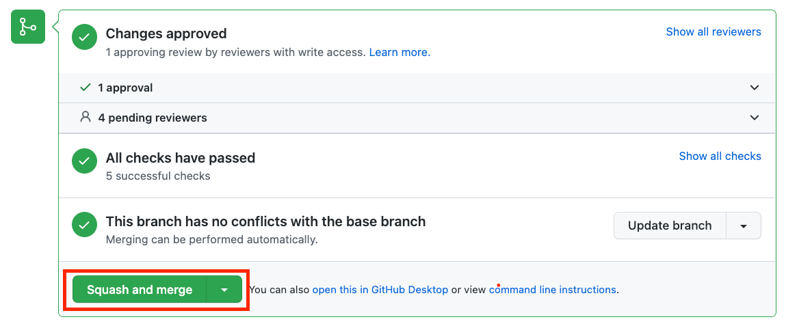

## Objective of this article

To provide general guidance and assist you in performing common tasks in GitHub.

## What is GitHub used for?

GitHub is a repository which stores the code for the data platform's infrastructure and processes (including the code for this playbook). It enables us to track and test any changes in the code before they reach the platform. Many of the processes within this playbook require you to make changes to code in GitHub in order to see them in the data platform, for example [ingesting data from Google Sheets](https://playbook.hackney.gov.uk/Data-Platform-Playbook/playbook/ingesting-data/google-sheets-import) or [creating Glue jobs to transform your data](https://playbook.hackney.gov.uk/Data-Platform-Playbook/playbook/transforming-data/using-aws-glue/deploy-glue-jobs).

## Getting access to GitHub

You'll need to [create a GitHub account](https://github.com/signup) if you don't already have one, using your Hackney email. You'll also need to [set up 2 factor authentication](https://docs.github.com/en/authentication/securing-your-account-with-two-factor-authentication-2fa/configuring-two-factor-authentication) in your GitHub account.

Once you've done this, you'll need to ask Rashmi Shetty (Development Manager) to add you to the 'LBHackney-IT' team. This will enable you to contribute to the Data Platform projects in the team account.

There are two ways to use GitHub:

1. Using the GitHub web browser interface (simply at [github.com](https://github.com/)). This is the easiest to use and enables you to make simple changes through a user interface.
2. Using the [GitHub app](https://desktop.github.com/). This is a more advanced tool which requires more configuration and coding.

### Committing your changes to the Data Platform Project

1. Navigate to the `Commit new file` or `Commit changes` section at the bottom of the page.
2. Provide a short sentence in the first field and then an optional description in the field below to explain what you've changed.
3. Select the option to create a `new branch` for this commit (i.e. the code you've changed).
  You can just use the suggested name for your branch.
4. Once you click `Commit new file` or `Commit changes` you'll have the opportunity to add even more detail if needed before submitting it for review.
5. Click `Create Pull Request` when finished.
6. The pull request will require 1 approval. This approval can be from a member of the data platform team or another colleague familiar with the platform. At this point please reach out to the Data Platform team or colleague in order to obtain a review 
7. You'll receive an email to confirm when your changes have been approved or if any comments have been added to your Pull Request.
8. After the pull request you created has been approved you will then have the ability to merge the pull request, Please click `Squash and merge` to complete this step
  
9. Once you have merged the pull request you will be able to view the progress of the staging deployment by navigating to the [Actions][actions-tab] tab of the Github repository
 - 1. The workflow for the deployment will contain the following text under the workflow title: ```Data-Platform #xxx: Commit xxxx pushed by xxxxx```
10. When the staging deployment has finished you should be able to see that the Data Platform pre-production environment has updated to reflect the changes you made in the code, and you can now perform some testing to ensure your change is working as expected
11. By this point you will have received a notification email to approve the deployment of your change to production:
 - 1. If you are happy with how your change is performing in pre-production then please follow the links in the email you have received to progress your change to production. 
 - 2. If the change did not work as expected in pre-production then please decline the deployment of your change to production and repeat the steps above in order to fix any issues you have found in pre-production
 - 3. If you did not receive an email regarding deployment of your change to production and you are ready to do so then please reach out the Data Platform team
12. If you wish to explore the deployment process in more detail please see the [CD Process](../../docs/CD-process.md) section of the playbook


[prerequisites]: ./index.md
[github_signup]: https://github.com/signup
[actions-tab]: https://github.com/LBHackney-IT/Data-Platform/actions
