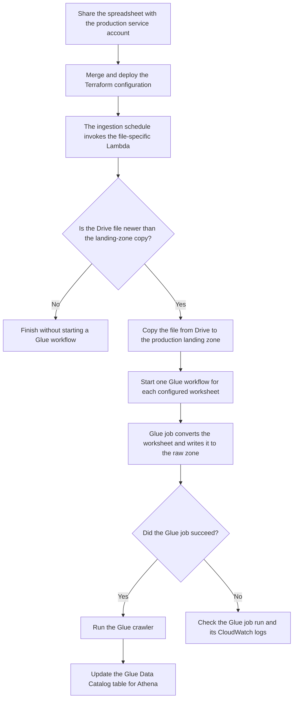

## Prerequisites

- You have a Github account, you can [create one][github_signup] yourself using your Hackney email.
- You have been added to the 'LBHackney-IT' team, you can request this from Rashmi Shetty.
- You have a Data Platform service account email address for your relevant domain or service area. A service account would look something like this: dataplatform-prod-service_area@dataplatform-prod.iam.gserviceaccount.com. If you don't know which service account you should use, you can request this from the Data Platform team.

## Permitted spreadsheet file types

- .xlsx
- .csv

## Ingestion workflow



The scheduled ingestion runs daily. The Lambda only copies and processes the file when the version in Google Drive is newer than the copy already in the landing zone.

## Preparing the spreadsheet for ingestion

- Please follow this guide for each spreadsheet file you wish to ingest onto the platform
- Check that your file is in the list of allowed file types for this process
- Ensure that all columns in your file have headers. Columns without headers will be lost.
- If your spreadsheet file is stored on your local device, [upload it to google drive](https://www.howtogeek.com/398570/how-to-import-an-excel-document-into-google-sheets/).
- If the document is unnamed, name it
- You now need to share this file with the service account you've been provided. One way to do this is to open the spreadsheet you would like to ingest from Google drive and view it as if it were a Google Sheet. Once you've opened the document, click `Share` in the top right corner of the sheet. If your spreadsheet file is very large and you're having trouble opening the file in Sheets, you can right-click the file listed in Drive and click `Share`.
- Paste in the service account email address you have been provided into the email box
- Ensure the suggested email matches the service account email and select it
- On the new window, choose from the dropdown on the right hand side and select `Viewer`
- Uncheck the `Notify people` checkbox
- Click `Share`
- You will be asked to confirm sharing outside the organisation, click `share anyway` (Note that these service accounts are Hackney accounts, but aren't recognised by Google the same way that individual user accounts are recognised as being within Hackney.)
- Your spreadsheet is now ready to ingest

## Getting spreadsheet detail

- You will need to obtain the document ID from the URL.
  You can view the document URL by right-clicking the file and selecting `Get link`.
  The document ID is the portion of the URL between `https://docs.google.com/file/d/` and `/edit#gid=0`. See example below

  

- **For `.xlsx` files only** - You will also need to obtain the worksheet name(s) that you wish to ingest.
  The worksheet name is located at the bottom left of the screen and unless it has been changed or other worksheets added, it will be called `Sheet1`

## Setting up AWS Glue job

- Open the [Data Platform Project](https://github.com/LBHackney-IT/data-platform) repository in Github. If you don't have the correct permissions, you'll get a '404' error (see [prerequisites](#prerequisites)).
- Navigate to the `terraform/etl` directory, and open `09-spreadsheet-imports-from-g-drive.tf`
- Switch to 'edit mode' (using edit button on top right)
- Copy one of the modules above, paste at the bottom of the file and update the following fields:

  - Update the **module** name to something unique using the name convention: `"<department_name>_<dataset_name>"`

    For example:

    ```
    "parking_pcn_permit_nlpg_llpg_matching_via_athena_20220516"
    ```

    _Note: Only use underscores (`_`) to separate words, do not use hyphens (`-`) or spaces\_

  - **department** (required): This will be `module.department_<YOUR_DEPARTMENT_NAME>`
    For example:

    ```
    department = module.department_parking
    ```

    _Note: the department name must be all lowercase and separated by underscores
    e.g. `module.department_housing_repairs`_

  - **google_sheets_document_id** (required): Your document id - see the **Getting spreadsheet detail** section above
  - **glue_job_name** (required): Name that will be displayed in the Data Platform Glue Studio Console prefixed by `"Spreadsheet Import Job"` followed by your department name.
    _Note: Ensure this name is unique to other Glue job names by appending the date to the name._

    For example:

    ```
    glue_job_name = "PCN Permits VRM NLPG LLPG - 20220516"
    ```

  - **output_folder_name** (required): Name of the folder where this data will be exported to.
  - **input_file_name** (required): The name of the file you are ingesting from.
    This should be the same as the file name in Google Drive.

  - **worksheets** (required):
    The name of the worksheet(s) to import. It will also be the name(s) of the resulting table(s) in the Glue catalogue.

    - _If the sheet you are ingesting is an **`.xlsx`** file type:_

      - List out each worksheet that needs to be ingested in a map containing the `header_row_number`, and the `worksheet_name` - see the **Getting spreadsheet detail** section above (if unsure on how to set this, refer to a previous module block and use as an example).
      - The worksheet name needs to match exactly (including any spaces or punctuation, but excluding any slashes `/`), so you may want to copy and paste the name directly from your worksheet.
        If you need to add more sheets, you can copy and paste this section and continue numbering (e.g. `sheet1`, `sheet2` etc).
        Remove any worksheet sections you don't need.

      For example:

      ```
      worksheets = {
        sheet1 : {
          header_row_number = 1
          worksheet_name    = "Sheet 1"
        }
        sheet2 : {
          header_row_number = 1
          worksheet_name    = "Sheet 2"
        }
      }
      ```

    - _If the sheet you are ingesting is a **`.csv`** file type:_

      - Set the `header_row_number` to `0` and `worksheet_name` to the name of dataset that the data relates to. Remember this will also be the name of the table in the Glue catalogue.

        For example, if the file name is:
        `Voucher Import.csv`
        then it would look something like:

        ```
        worksheets = {
          sheet1 : {
            header_row_number = 0
            worksheet_name    = "Visitor_Voucher_Forecast"
          }
        }
        ```

- Submit your changes by referring to the [Committing changes][committing-changes] section of the **Using Github** guide.
  - The Data Platform team needs to approve any changes to the code, so your change won't happen automatically.
  - Once your code has been approved and deployed, your sheet will be available in your respective department's raw zone area (S3 and Athena - Glue Catalog Database) by 8am the following morning.

## Manually trigger ingestion in production

You need permission to invoke Lambda functions in the production AWS account. Before triggering the ingestion, make sure the spreadsheet has been saved in Google Drive and is still shared with the production service account.

1. Open [Lambda in the production AWS account][aws_lambda_functions] and confirm that the region is **Europe (London) (`eu-west-2`)**.
2. Search for the file-specific function. Its name starts with `g-drive-` followed by the normalised `glue_job_name` from `09-spreadsheet-imports-from-g-drive.tf`. For example, `PCN Permits VRM NLPG LLPG - 20220516` becomes `g-drive-pcn-permits-vrm-nlpg-llpg-20220516`.
3. Open the function and select the **Test** tab.
4. Create a test event with `{}` as the event JSON. The function does not use the event contents, so no other values are required.
5. Select **Test** to invoke the function.
6. Check the execution result, then use the function's **Monitor** tab to open its CloudWatch logs. When the Drive file is newer, the logs show the download progress and the Lambda starts the Glue workflows.
7. Open [AWS Glue workflows][aws_glue_workflows] and [AWS Glue jobs][aws_glue_jobs] to confirm that the worksheet workflows and jobs have run successfully. After each job succeeds, its crawler runs and updates the corresponding table in the Glue Data Catalog.

If the Drive file has not changed since the last successful copy, invoking the Lambda completes without starting the Glue workflows. To deliberately reprocess the existing file already in the landing zone, open [AWS Glue workflows][aws_glue_workflows] and search for the workflow. There is one workflow per worksheet, named from the department identifier, normalised worksheet name and `output_folder_name`, for example `parking-sheet-1-permits`. Select the workflow, then select **Actions** and **Run**. This reprocesses the landing-zone copy; it does not download the file from Google Drive again.

[aws_cron_expressions]: https://docs.aws.amazon.com/AmazonCloudWatch/latest/events/ScheduledEvents.html#CronExpressions
[aws_lambda_functions]: https://eu-west-2.console.aws.amazon.com/lambda/home?region=eu-west-2#/functions
[aws_glue_workflows]: https://eu-west-2.console.aws.amazon.com/gluestudio/home?region=eu-west-2#/etl-configuration/workflows
[aws_glue_jobs]: https://eu-west-2.console.aws.amazon.com/gluestudio/home?region=eu-west-2#/editor
[github_signup]: https://github.com/signup
[committing-changes]: ../getting-set-up/using-github#committing-your-changes-to-the-data-platform-project
