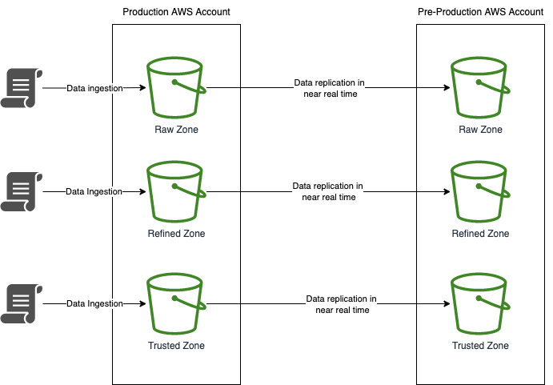
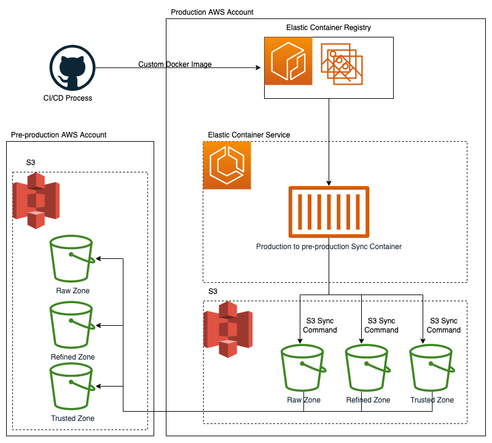

This section explains the process used to copy data from the data platform production environment into pre-production

## Architecture

### Production to pre-production sync:

### Clean up of data older than 90 days:

## Process

### Production to pre-production sync:
1. Data is ingested via any means into the production zones
2. The data is replicated across to the equivalent pre-production zone in near real time.

Important points:
* Only new or updated files are replicated to pre-production at the point they are added or modified in production
* AWS guarantees 99.9% of files/data is replicated to pre-production within 15 minutes but in reality it is much quicker than this
* There is no deletion or overwriting of data in pre-production via this method
* This sync process does not update the glue catalogs in pre-production it only syncs across the raw data files. To make the data visible through Athena the relevant Glue crawler will need to be triggered manually in pre-production

### Clean up of data older than 90 days:
1. When the CI/CD pipeline runs in Github a custom Docker image is built and pushed to the Elastic Container Registry in the Data Platform Production environment.
2. One Elastic Container Service for each zone is then created by Terraform in the form of Fargate tasks. These three tasks are configured by Terraform to run on a schedule. At the time of writing this schedule is once a day at 11pm.
4. The script then deletes any data in the pre-production bucket that is older than the configured period
5. At the time of writing this configurable period is 90 days
