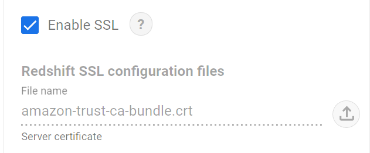

## Intro

This guide will step you through how to connect to Redshift, on the Data Platform, from Google Data Studio. You will then be able to access the data stored on the platform from Data Studio.

## Prerequisites

- You have access to your department's credentials listed [here](#department-specific-credentials) or you have had credentials shared with you by the platform team.

## Steps

First, download the bundle certificate you will need to connect to the Redshift cluster here:

https://s3.amazonaws.com/redshift-downloads/amazon-trust-ca-bundle.crt

Then, when adding a data source in [Google Data Studio][google_data_studio]

1.  Select "Amazon Redshift".
2.  If this is the first time you've made a connection, you may need to select "Authorise".
3.  Ensure "Basic" is selected to the left of 'Database authentication' (not JDBC URL).
4.  Retrieve your credentials from AWS using the links below for [department specific credentials](#department-specific-credentials). Once on the AWS Secrets Manager page, scroll down to the "Secret Value" box and click "Retrieve secret value" to reveal the credentials (e.g. Database, Host Name or IP etc). Alternatively, use the credentials shared with you by the data platform team.
5.  Copy and paste these credentials into the corresponding fields in Google Data Studio.
6.  Tick the "Enable SSL" box.
7.  Upload the _amazon-trust-ca-bundle.crt_ file you previously downloaded:



10.  Click "Authenticate".
11.  To the right of the 'Database authentication' panel, you should see options for TABLES or CUSTOM QUERY; select CUSTOM QUERY and provide a PostgreSQL query for the data you want. (Note: The TABLES option will not list out the available tables even when your connection is successful.) An example could be:
    ```sql
    SELECT * FROM liberator_refined_zone.denormalised_pcns where import_date = (
        SELECT max(import_date) from liberator_refined_zone.denormalised_pcns
    ) limit 100;
    ```
    This query can only return a maximum of 150,000 rows as specified in [Googles Documentation](https://support.google.com/datastudio/answer/11377200#zippy=%2Cin-this-article). It might be helpful to test your query in [AWS Athena][aws_athena] first to check there aren't too many rows.
12. Click "Add" (if adding data directly to a report) or "Connect" (if creating a new data source), this bit might take a little while. To improve the query performance you may also want to [create a data extract][data extract].

### Department specific credentials

1. Log into the [AWS Console][aws_sso_link] for the DataPlatform-Production or DataPlatform-Pre-Production account depending on which you wish to connect to.

1. Go to the AWS Secrets Manager secret for your department
   
| Production                                                            | Pre-production                                                            |
| --------------------------------------------------------------------- | ------------------------------------------------------------------------- |
| [Parking Credentials][parking_user_secret_production]                 | [Parking Credentials][parking_user_secret_pre_production]                 |
| [Planning Credentials][planning_user_secret_production]               | [Planning Credentials][planning_user_secret_pre_production]               |
| [Housing Repairs Credentials][housing_repairs_user_secret_production] | [Housing Repairs Credentials][housing_repairs_user_secret_pre_production] |

   If you click the link above before logging into the relevant Data Platform account you will be presented with an
   AWS login screen.

   If your department is not listed above but exists with the platform, you should be able to find the credentials by searching for 'YOUR DEPARTMENT/redshift' in Secrets Manager. 

3. Scroll down to the "Secret value" section and select "Retrieve secret value".

[server_certificate]: https://s3.amazonaws.com/redshift-downloads/redshift-ca-bundle.crt

[aws_sso_link]: https://hackney.awsapps.com/start/#/

[parking_user_secret_production]: https://eu-west-2.console.aws.amazon.com/secretsmanager/home?region=eu-west-2#!/secret?name=dataplatform-prod%2Fparking%2Fredshift-cluster-user2021112314531694280000002d

[planning_user_secret_production]: https://eu-west-2.console.aws.amazon.com/secretsmanager/home?region=eu-west-2#!/secret?name=dataplatform-prod%2Fplanning%2Fredshift-cluster-user2021112314531441430000002b

[housing_repairs_user_secret_production]: https://eu-west-2.console.aws.amazon.com/secretsmanager/home?region=eu-west-2#!/secret?name=dataplatform-prod%2Fhousing-repairs%2Fredshift-cluster-user20211123145318429300000031

[parking_user_secret_pre_production]: https://eu-west-2.console.aws.amazon.com/secretsmanager/home?region=eu-west-2#!/secret?name=dataplatform-prod%2Fparking%2Fredshift-cluster-user2021112314531694280000002d

[planning_user_secret_pre_production]: https://eu-west-2.console.aws.amazon.com/secretsmanager/secret?name=dataplatform-stg%2Fplanning%2Fredshift-cluster-user20211116150112018900000006

[housing_repairs_user_secret_pre_production]: https://eu-west-2.console.aws.amazon.com/secretsmanager/home?region=eu-west-2#!/secret?name=dataplatform-prod%2Fhousing-repairs%2Fredshift-cluster-user20211123145318429300000031

[google_data_studio]: https://datastudio.google.com/u/0/datasources/create/

[aws_athena]: https://eu-west-2.console.aws.amazon.com/athena/home?region=eu-west-2#query

[data extract]: https://lbhackney-it.github.io/Data-Platform-Playbook/playbook/querying-and-analysing-data/create_a_data_extract_in_GDS/
