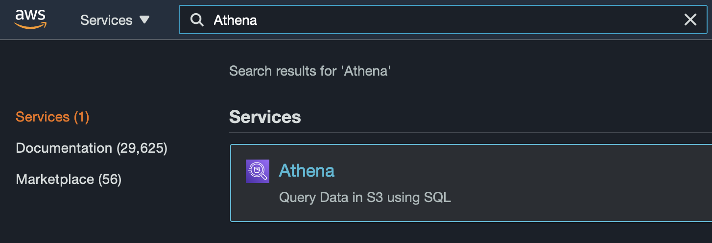
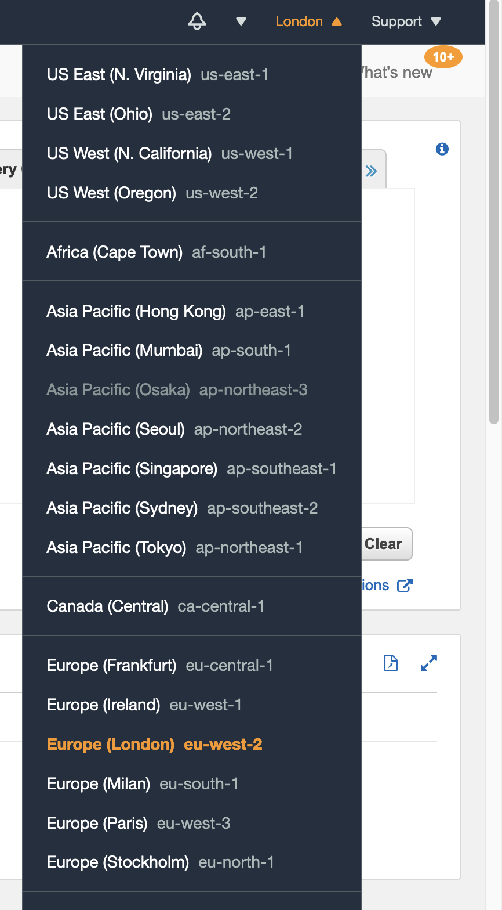
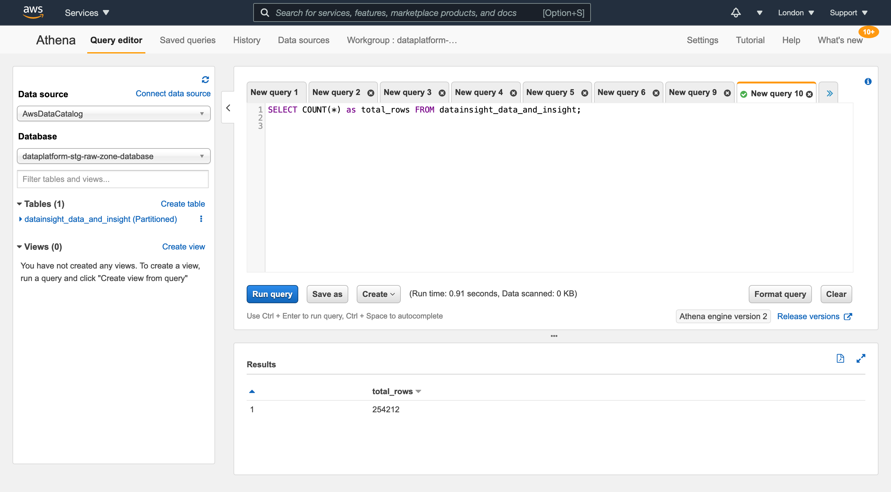

## Intro

The Data Platform provides AWS Athena as the tool to execute SQL queries against the data within the platform.

AWS Athena is built on top of Presto, and we're using Athena engine version 2.
AWS provide [documenation on what functions][sql_functions] they make available as part of their [SQL reference][sql_reference].

[sql_reference]:https://docs.aws.amazon.com/athena/latest/ug/ddl-sql-reference.html
[sql_functions]: https://docs.aws.amazon.com/athena/latest/ug/presto-functions.html

## Logging into Athena

After logging into the Data Platform AWS account, navigate to Athena using the AWS console.

You'll want to make sure that your region is currently set to London, in AWS this is achieved using the region selector as shown below.

Then you'll want to ensure that you are switched to the Athena Workgroup for your department.
You can check your current workgroup by hovering over the workgroup tab displayed at the top of the Athena page.
If the workgroup isn't correct then [switch your workgroup][switch_workgroup] to the one you were given before proceeding.

[switch_workgroup]: https://docs.aws.amazon.com/athena/latest/ug/workgroups-create-update-delete.html#switching-workgroups

## Running queries

From the "Query editor" you should have access to a number of tables, from which you can construct and execute queries.

