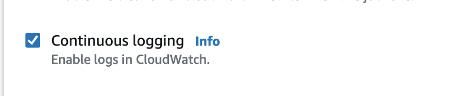
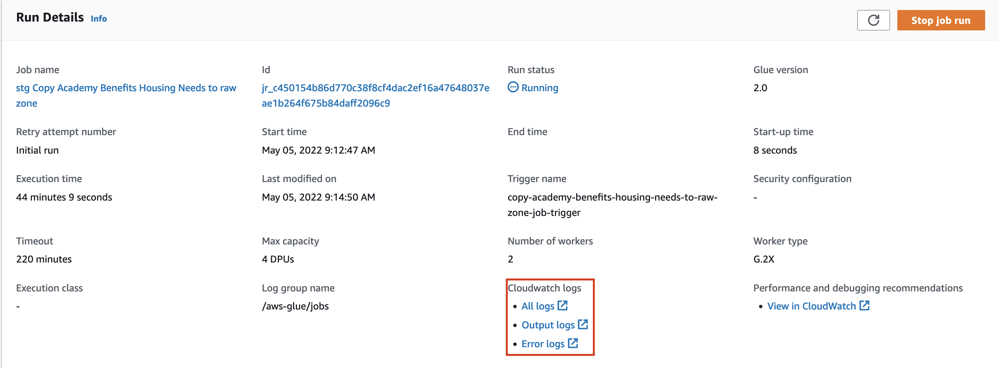
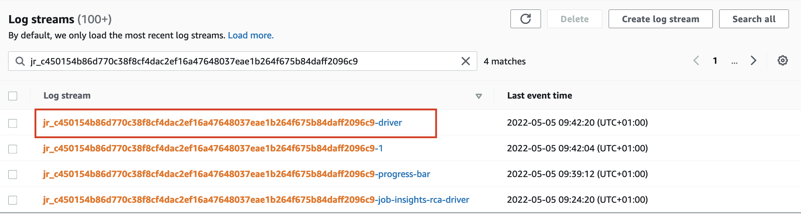

## Using AWS Glue Studio to create ETL processes

:::important
The aim of this guide is to help you get started in creating and testing your Glue jobs.

Once your Glue job is ready and working as expected, you can refer to [this guide][deploy-glue-jobs]
to deploy your Glue job to the Data Platform Production environment. You should keep your original Glue job (which was created in Glue Studio) should you need to make further improvements to it in the future
and refer to the note at the bottom of [section 1][updating-job-script] of **Deploying Glue jobs to the Data Platform**, to re-deploy the new version to the Data Platform Production environment.
:::

[AWS Glue Studio][aws-glue-studio] is a new graphical interface that makes it easy to create, run, and monitor extract, transform, and load (ETL) jobs in AWS Glue.

To use AWS Glue Studio the job needs to be created manually. This guide includes the steps needed to create an editable job in Glue Studio. Templates may have already been created and existing jobs can be duplicated to make it easier to get started with Glue Studio. Dynamically created scripts using [terraform][terraform] (the infrastructure as code tool Hackney use) will not have the ability to use the visual editor.

Note: If a job has already been created manually you can select the job using the radio button and in the job _Actions_ mennu, select **Clone job**.

## Creating a new Glue job

Note: The instructions below assume an S3 Data Source and Target Location.

1. Log in to AWS Management Console.
1. Select the **AWS Glue** service from the services menu (or search field).
1. From the AWS Glue menu ETL section, select **AWS Glue Studio**.
1. From the AWS Glue Studio main page, choose the **Create and manage jobs** option.
1. Within the _Create Job_ section, select **Source and target added to the graph** and select desired Source and Target values.
1. Click the **Create** button.
1. In the Visual editor that is now displayed, click on the _Data Source - S3_ box and in the _Data source properties - S3_ tab to set _S3 source type_ to **S3 location** and set the _S3 URL_ for the source data. To reduce the time your job takes to run, you can follow [these steps][pushdown-predicates] to pre-filter the source data passed to your transformation step.
1. Also _Data Target - S3_ box and in the _Data target properties - S3_ tab set the _S3 URL_ for the data target, usually your department folder in the Data Platform account.
   _NB: You can add additional folders at this point for your new data within your department folder. Each department has an unrestricted directory within each zone where unrestricted datasets can be stored, in order to add further cross-department insights and maintain datasets. There is also an unrestricted department which allows users to maintain datasets which don't have access restrictions across each zone_
   **Data source and data target (amongst other operations) must be set to be able to save the job. You can also apply _Transformations_ specific to your job via the Visual tab. See the [AWS Glue Studio Documentation][aws-glue-studio-documentation]**.
1. To complete the set up you need to select the **Job details** tab.
1. Complete the _Name_ and optional _Description_ fields. You may use this job as a template for repeat use, so a generic name to use as a template might be useful to begin with.
1. Select **dataplatform-{environment}-glue-role** where environment is either 'stg' or 'prod'; as the _IAM Role_ for the job.
1. The remaining standard fields default values are usually fine to use. The programming language Glue Studio creates can be Scala or Python.
1. In _Advanced properties_ check the _Script filename_ refers to the task being carried out.
1. Set the _Script path_ to the central scripts S3 bucket: `s3://dataplatform-{environment}-glue-scripts/custom/` where environment is either 'stg' or 'prod' - you can create new folders or specify existing folders in the S3 bucket like this: `s3://dataplatform-{environment}-glue-scripts/custom/YOUR_FOLDER_NAME/`.
1. Set the _Temporary path_ to the central temp storage S3 bucket: `s3://dataplatform-{environment}-glue-temp-storage/` where environment is either 'stg' or 'prod'.
1. In _Security configuration_ select the appropriate security configuration for your target bucket location (for example for the Raw Zone, use **glue-job-security-configuration-to-raw**).
1. Ensure the _Server-side encryption_ option is **not checked**, so that it uses the buckets default encryption configuration.
1. In the _Tags_ section, add the key `PlatformDepartment` and set the value as the name of your department.
   This should be the same name which was used to set up the department on the [Data Platform][data-platform].
1. Add any further libraries or parameters you need in the _Advanced properties_ section.

### Note: Exporting Data

When exporting data from your Glue Job it is important that you follow the Data Platforms partitioning stratagy. To do this, exports must be exported with the partitions import_year, import_month, import_day & import_date at a minimum. To accomplish this using AWS Glue Studio use the `Add a partition` key option at the bottom of the Data target node. It is important to further note, that inorder to add these attributes as partitions, they must exist within the dataset as fields.

## Clone and edit an existing Glue job

1. In the _Your jobs_ sections, select the radio button of the job you would like to clone.
2. In the _Actions_ dropdown, select _Clone job_. If there is an information banner with a message _Your job was created outside of Glue Studio and has no DAG available_ (see screenshot below) there will not be a Visual tab and therefore you will not have an interface to edit your job. Instead you will need to edit your job in the python job script. To do this navigate to the _Script_ tab. If you prefer to use the interface, then select another job which has a Visual tab or create a new job as instructed in the _Creating a new Glue job_ section above.
   
3. In the Job Details tab, update the _Name_ for your new job and check the _Creating a new Glue job_ seciton above to ensure the configuration suits your needs.
4. To save your job, select the **_Save_** button.

## Pre-filter your source data for a glue job

By default, AWS glue will load all source data for a job before running the transformation steps.
If the transformation is only interested in a subset of the data partitions, you can use a pushdown predicate to tell the glue job only to consider these partitions.
If you have a large data set, this could have substantial performance benefits for your glue jobs (i.e. it will reduce the time it takes them to run).

Follow these steps to set this in Glue Studio.

1. Navigate to the visual tab when viewing your glue job in glue studio.
1. Select a "Data source" node.
1. Staying in the "Data source properties - S3" tab, you should see the field "Partition predicate - optional", enter your predicate expression here.

The predicate must be Spark SQL syntax; Glue Studio provides an example of a predicate in the UI.
Here is an example that only keeps records where the import_date (a standard partition used within the Data Platform) is within the last seven days.

```sql
  to_date(import_date, 'yyyyMMdd') >= date_sub(current_date, 7)
```

For further reading around pushdown predicates and partitioned data in Glue jobs, AWS have some [documentation][aws-managing-partitions-docs] on their use in AWS Glue ETL's and a [blog post about working with partitioned data][aws-partitions-blog-post].

## Monitoring a glue job run

We recommend that you enable continuous logging on your glue jobs, you can read more about this in [AWS's documentation][aws-docs-continuous-logging].
Enabling continuous logging will allow you to [view logs][aws-docs-viewing-logs] after your glue job has started. 

### Continuous logging

#### Enabling continuous logging

To enable continous logging you need to check the "Continuous logging" box in the "Advanced properties" section of the job details.


#### Viewing logs with continuous logging enabled

To view the logs, navigate to the `Runs` tab and click on "All logs" under "Cloudwatch logs" in the run details, highlighted in the image below. 

This will take you to the list of logs streams for that job run.
There will be one for each executor of the job, including the driver, most of the time the driver logs will hold the most helpful information.
The driver logs are in the stream postfixed by -driver, like in the screenshot below.

You can click on this log stream to see the logs. 

### When a glue job errors

Even without continuous logging you can still view the full error output after a glue job has failed.
On the run details page it will only show a truncated version of the error message, often hiding the underlying error.

#### Viewing error logs

To view the error logs click on "Error logs" under "Cloudwatch logs" in the run details, highlighted in the [image above](#viewing-logs-with-continuous-logging-enabled).
This will take you to a list of logs streams for that job run.
There will be one for each executor of the job, including the driver, most of the time the driver logs will hold the most helpful information.
You can open up the logs for the driver by selecting the log stream which isn't postfixed by a second identifier.
The driver log stream is highlighted in the sreenshot below.

You may need to expand the log stream column size in order to see this.
Click on the driver logs to see the full error output and stack trace.

#### Finding the error in the error logs

There will be a lot of logs, most will be be for information, marked "INFO", you should looks at the ones marked with "ERROR".
There may still be a couple marked "ERROR" so you should consider them all when looking for the error that caused your glue job to fail.

For an example, if you [login to the pre-production AWS account][hackney-sso] then navigate to [these logs][example-failed-glue-job].
Looking from the bottom of the logs you first come accross an ERROR log that is mentioning an S3 Access Denied error (you can click the little arrow on the left to expand the message).
This is an error with pushing the logs and isn't the reason the glue job failed.
If you then scroll up a bit to the next ERROR, it contains a message that mentions "Error from Python:Traceback " and then follows on to give the stacktrace for the SQL error "DataType varchar is not supported.(line 54, pos 45)".
This is the error which has failed the glue job.

## Receive email notifications when Glue jobs fail

Each time a Glue job fails, an email notification with details of the error message is sent to the respective department, and their subscribed members.

The message will include:

- Name of the Glue job
- Error message
- Time of failure
- Job start time
- Job end time
- Job last modified time
- A link to log in to Hackney SSO and view the Job run details

In order to receive email notifications, you will need to ensure that you are subscribed to receive emails from your department's [Google group][google-groups] and that you have confirmed your subscription to receive AWS Notifications when prompted.

Additionally, Spark Web UI is used to monitior and debug the glue jobs. Every 30 seconds, AWS Glue flushes the Spark event logs to an S3 bucket titled Spark UI Bucket.

:::important
Ensure the **PlatformDepartment** tag is correctly set in the _Advanced details_ section in the Glue job's _Job Details_ (see [Creating a new Glue job](#creating-a-new-glue-job) section above).
:::

[google-groups]: https://groups.google.com/my-groups
[data-platform]: https://github.com/LBHackney-IT/Data-Platform/blob/main/terraform/05-departments.tf
[aws-glue-studio]: https://docs.aws.amazon.com/glue/latest/ug/what-is-glue-studio.html
[terraform]: https://www.terraform.io/
[aws-glue-studio-documentation]: https://docs.aws.amazon.com/glue/latest/ug/edit-nodes-chapter.html
[using-glue-studio]: https://playbook.hackney.gov.uk/Data-Platform-Playbook/playbook/using-glue-studio
[deploy-glue-jobs]: ./deploy-glue-jobs
[updating-job-script]: ./deploy-glue-jobs#1-add-your-script-to-the-data-platform-project-using-the-github-ui
[pushdown-predicates]: #pre-filter-your-source-data-for-a-glue-job
[aws-partitions-blog-post]: https://aws.amazon.com/blogs/big-data/work-with-partitioned-data-in-aws-glue/
[aws-managing-partitions-docs]: https://docs.aws.amazon.com/glue/latest/dg/aws-glue-programming-etl-partitions.html
[aws-docs-continuous-logging]: https://docs.aws.amazon.com/glue/latest/dg/monitor-continuous-logging.html
[aws-docs-viewing-logs]: https://docs.aws.amazon.com/glue/latest/dg/monitor-continuous-logging-view.html
[example-failed-glue-job]: https://eu-west-2.console.aws.amazon.com/cloudwatch/home?region=eu-west-2#logsV2:log-groups/log-group/$252Faws-glue$252Fjobs$252Fdataplatform-stg-config-to-refined-role$252Fdataplatform-stg-glue-parking$252Ferror/log-events/jr_e7713ac7cf766da842d6e2e84479d508bda6013b28dc409344a77e6af796aa5b_attempt_1
[hackney-sso]: https://hackney.awsapps.com/start#/