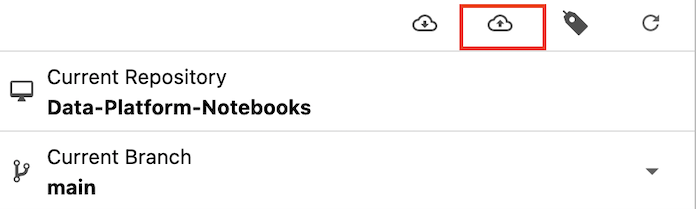

## Prototyping glue jobs in a Jupyter notebook

This guide explains how to connect to a notebook instance using AWS Sagemaker and also some tips for using the notebook.
We use notebooks to prototype transformation scripts before they are run and scheduled in AWS Glue.

### To start up a notebook

1. Login to AWS using the [Hackney SSO portal][hackney_sso].
2. Search "Amazon SageMaker" and then navigate to the [Notebook Instances][sagemaker_console_nb] under the **Notebook** section in the left-hand panel of the Amazon SageMaker console.
3. Find the notebook appended by your department name, for example `sagemaker-notebook-parking`.
If you can't see a notebook for your department then please contact the Data Platform team to request one.
4. If the Status of the notebook is `InService`, go on the step 5.
If not, click `Start` under the **Actions** column. 
The notebook will then go to `Pending` status, if this is the first time the notebook has been used that day it will take around 10 minutes to start up.
5. Once the Status of the notebook has changed to `InService`, click the [JupyterLab][jupyter_lab_docs] link in the **Actions** column to open up the notebook.

### Using a notebook

There is a [Github repository][notebooks_github] which will be preloaded into the notebook.
This is where we store any notebooks scripts that we want to keep.
If you want to keep the changes you have made to any scripts you must commit the changes to this repository otherwise you may lose your work.

- You should work in the folder **"Data-Platform-Notebooks/notebooks"**, where all the notebooks are stored. 
  Click into this folder if you aren't already in there.

  

- Always start by pulling any latest changes from this repository. 
  To do this, click on the Github icon on the left panel and then select the icon to pull the latest changes, as shown below.

  

- There are a few templates in the **templates** folder that you can copy and paste into your departments folder and then use as a starting point.
- Commit your changes by following the next section when you have finished working, so you don't lose your work.

## Saving changes to the notebook scripts

1. To authenticate with your Github account you need to create a personal access token.
These are needed when two factor authentication is enabled, which the Hackney Github organisation enforces.
To create your personal access token you can follow [this Github guide][create_a_pat_code].
Once you have created it, you can store somewhere securely and keep re using for as long as the expiration period that you set up.
1. Before commiting, you need to ensure all the outputs from any scripts you've edited have been cleared. This is to prevent any data being stored in Github. 
To do so you need to open each script you've been working on, then click on "Edit" then "Clear all Outputs".
1. To add changes to the commit, navigate to the Github tab on the left panel.
There you will see a list of changed files & untracked files.
The changed files are any that you have changed since the last commit and the untracked files are files which have been added since the last commit.
You can add any files you want to commit by hovering over the file and clicking on the plus sign.
When you do this the file will move to the Staged section, this lists all the changes that will be commiting. 
1. When you have added all the files you want to commit to staged you can write a Summary & Description then click "Commit". You will then be promted for your name and email address, fill these in using your Hackney email.
1. The push your changes by clicking on the small cloud icon with an up arrow, as shown below.
You'll be prompted to enter your github username and a password.  
In the password box you should paste in the personal access token created in the first step.

  

## Helpful resources

- [JupyterLab documentation][jupyter_lab_docs] 
- [Jupyter documentation][jupyter_nb_docs]
- The sparkmagic pyspark kernel that we use in the notebook has a few [helpful functions.][pyspark_kernel_helpful_things]

[create_a_pat_code]: https://docs.github.com/en/authentication/keeping-your-account-and-data-secure/creating-a-personal-access-token#creating-a-token
[hackney_sso]: https://hackney.awsapps.com/start/#/
[sagemaker_console_nb]: https://eu-west-2.console.aws.amazon.com/sagemaker/home?region=eu-west-2#/notebook-instances
[jupyter_lab_docs]: https://jupyterlab.readthedocs.io/en/stable/
[jupyter_nb_docs]: https://jupyter-notebook.readthedocs.io/en/latest/
[pyspark_kernel_helpful_things]: https://github.com/jupyter-incubator/sparkmagic/blob/master/examples/Pyspark%20Kernel.ipynb
[notebooks_github]: https://github.com/LBHackney-IT/Data-Platform-Notebooks
